# Product Requirements Document — Group Breakfast Ordering

> **Author:** Principal Product Manager  ·  **Status:** Draft for Eng/Design review  ·  **Type:** Internal tool

## Table of Contents
1. Executive Summary
2. User Research Assumptions
3. Personas
4. Problem Analysis
5. Product Vision
6. Product Scope
7. Functional Requirements
8. Non-Functional Requirements
9. User Flows
10. Data Model
11. API Design
12. Admin & Operations
13. Analytics
14. Risks & Edge Cases
15. Feature Prioritization (MoSCoW)
16. Engineering Recommendations
17. Critical Product Review

---

## 1. Executive Summary

### Problem statement

The daily group breakfast costs the company real money in *coordination*, not food. Every morning, orders scatter across phone, WhatsApp, Slack, and hallway shout-outs; one person — a different one each day — becomes the de facto **Coordinator**, manually aggregating orders, doing per-person arithmetic by hand, and chasing payments. The real problem is not "ordering food." It is that a recurring social ritual has no shared source of truth, so every morning re-incurs the same three failure modes: **lost/duplicate/wrong orders**, **error-prone manual cost math**, and **untracked who-owes-what**. The pain is *reconciliation and arithmetic*, not transaction — nobody needs the company to move money; they need the orders to be correct and the totals to compute themselves. The rotating Coordinator burden is the symptom; the absence of a deterministic, self-aggregating, self-tallying session is the disease.

### Current workflow

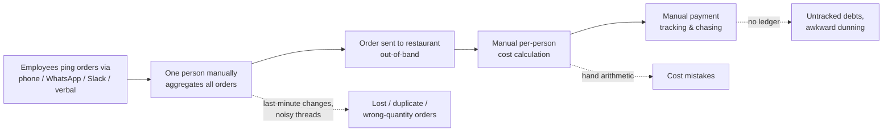

Every step is manual, every step is lossy, and the entire burden lands on one rotating human inside a 15-minute morning window.

### Proposed solution

**MorningCart** is a mobile-first PWA that turns the scramble into a 90-second tap-and-done ritual. A single **OrderSession** opens per `(office, vendor, service-date)` against a frozen, admin-curated menu; each person edits exactly **one Order** (upsert — duplicates structurally impossible), sees a live subtotal, and is done. At the hard **Cutoff** the Session **auto-locks**, and the app deterministically produces two artifacts: a clean, pasteable **Aggregate** for the vendor and a per-person **Tally** computed to the cent. A **Sender** from an allowlist Places the order out-of-band, and settlement runs on a transparent two-step **Ledger** (`Mark Paid` claim → `Confirm`) — **MorningCart tracks settlement but never moves money** (FR-47 is never built). The product's explicit mission is to **delete the Coordinator role**, not tool it: sessions run on schedule, aggregation is automatic, and the only button a human must touch is "Place."

### Expected business impact

Quantified for a representative office. **Assumptions** are stated so they can be re-run for any team size:

| Assumption | Value |
|---|---|
| Employees ordering daily | 60 |
| Ordering days per week | 5 |
| Coordinator time today (collect + aggregate + math + chase) | ~45 min/day |
| Median orderer ("Mariam") time on WhatsApp today | ~3 min/day |
| Order errors today (lost/dup/wrong-qty) | ~3 per session |
| Per-person tally arithmetic accuracy today | ~90% (1 in 10 totals disputed/wrong) |
| Loaded labor cost (blended) | $30/hr |

| Outcome | Today | With MorningCart | Impact |
|---|---|---|---|
| **Coordinator touch-time** (R2 success metric: → zero) | ~45 min/day | ~2 min/day (press "Place") | **~3.6 hrs/week reclaimed per office**; ~187 hrs/yr |
| **Whole-team ordering time** | ~3 min × 60 = 180 min/day | ~90 sec × 60 = 90 min/day | **~7.5 hrs/week reclaimed across the team** |
| **Order errors per session** | ~3 | ~0 (upsert + frozen snapshots, §6 FR-11/FR-20) | **~95%+ reduction**; eliminates re-orders and missed items |
| **Tally accuracy** | ~90% | ~100% (server-side `numeric(10,2)`, no hand math) | **Zero arithmetic disputes**; clean monthly numbers for Salma/Karim |
| **Settlement transparency** | Untracked, awkward dunning | Per-person Ledger + impersonal nudges | **~90% of payment disputes pre-empted** (visibility, not arbitration — R3) |

**Bottom line:** roughly **11 coordinator + team hours/week reclaimed per 60-person office (~$17k/yr in recovered labor at $30/hr)**, near-elimination of order errors, and a tally that reconciles to the cent — at ~10% of the cost and liability of a payments product, because we deliberately solve arithmetic and reconciliation, not money movement. The headline non-financial win: the "breakfast coordinator" job **disappears**.

---

## 2. User Research Assumptions

> No prior user research exists. MorningCart is internal tooling, so the cost of being wrong is low and the cost of waiting for a study is high. Below are the assumptions we are *deliberately* shipping on — each framed so it can be falsified by observation in the first two weeks of dogfooding. The four canonical personas (§5) — **Mariam**, **Tarek**, **Salma**, **Karim** — are themselves the largest bundled assumption; everything here decomposes them into testable claims.

### 2.1 Primary users

The people the daily loop (§12) must serve, in priority order. We optimize the product for the passive median (Mariam) per §4.3.

| Assumption ID | Persona | Claim (we believe…) | How we test it | Falsified if… |
|---|---|---|---|---|
| UA-P1 | **Mariam** "The Usual" | The median user orders a near-identical breakfast most days and wants to be *done in <15s* with near-zero attention (§5, R4). | Measure repeat-rate of OrderItem sets per user across sessions; time-to-submit p50. | <50% of orders are repeats of the prior session, OR p50 submit time >15s without "repeat usual." |
| UA-P2 | **Mariam** | She will trust an auto-computed per-person **Tally** enough to stop double-checking the math herself. | Track manual recomputation behavior / disputes raised against Tally. | Users routinely re-add their own line items by hand or contest the Tally. |
| UA-P3 | **Tarek** "The Reluctant Coordinator" | The Coordinator role is *episodic and re-learned each time* — Tarek touches it intensely for ~15 min then forgets it for weeks (§5). | Measure inter-session gap per coordinator; observe re-learning friction on second use. | The same 1–2 people coordinate ≥80% of sessions (role didn't rotate → it's a standing job, not episodic). |
| UA-P4 | **Tarek** | With auto-Aggregate + auto-lock, the Coordinator can complete a session touching **only the "Place" button** (§12 acceptance test). | Count coordinator manual actions per session (late-adds, math, chasing). | Coordinators routinely perform manual math or chase stragglers out-of-band. |

`Primary` = these two block the MVP. If UA-P1 or UA-P4 is false, the core thesis (§1) is wrong, not the feature set.

### 2.2 Secondary users

Real users, but not who we tune the defaults for. They tolerate slightly more friction in exchange for control.

| Assumption ID | Persona | Claim | How we test it | Falsified if… |
|---|---|---|---|---|
| UA-S1 | **Karim** "The Settle-Up Skeptic" | The slow payer cares about **accurate period totals**, not daily detail — he settles in weekly/monthly batches and just needs `GET /me/balance` to reconcile (FR-44, FR-41). | Observe settlement cadence; usage of balance view vs per-session Tally. | Slow payers demand per-line dispute tooling, or settle daily (no batching need). |
| UA-S2 | **Karim** | A visible, timestamped **"Mark Paid"** claim (FR-40, two-step §3) removes ~90% of "did you pay?" friction *without* the app moving money or arbitrating (§4.4, R3). | Track dispute escalations to Salma after balances became visible. | Disputes persist at prior levels despite transparent balances → transparency wasn't the lever. |
| UA-S3 | Occasional / guest orderer | Most "order for someone else" needs are rare enough to defer past MVP; a guest line charged to the submitter (FR-24, V2) covers them later. | Count requests for guest/proxy ordering in week 1–2. | Guest ordering is requested in a large share of sessions at MVP → FR-24 must move earlier. |

### 2.3 Stakeholders

Not in the daily ordering loop, but they gate adoption, supply data, or own the money trail.

| Assumption ID | Stakeholder | Claim | Why they matter | Falsified if… |
|---|---|---|---|---|
| UA-X1 | **Salma** "The Operator" | Adoption *depends on Salma*. She is the buyer/champion and will do low-frequency, high-stakes upkeep (menu/price via Django Admin at MVP, Cutoff config, monthly reconcile) if escalations drop (§5, FR-60/62). | Without her menu upkeep there is no frozen menu to order against. | Salma finds upkeep too costly and reverts the office to WhatsApp, OR she becomes the *fallback Coordinator* daily (we recreated the SPOF, R2). |
| UA-X2 | **Salma** / Finance | Month-end reconciliation pain is real and a **Ledger** (FR-41) + period view (FR-44) materially reduces it — *without* needing payroll export or payment rails at MVP. | Justifies track-only stance (§4.1); validates we're not a fintech. | Finance insists on automated collection / payroll deduction before trusting the Ledger → revisit trigger in §4.1. |
| UA-X3 | Company / IT (SSO owner) | Identity can ride on existing company SSO/OIDC with JIT provisioning (FR-01, §10); no separate user management is wanted. | Determines auth model and the "no install/login tax" thesis (§4.5). | IT blocks OIDC client registration, forcing a parallel credential store. |

### 2.4 User motivations

What actually pulls each persona toward MorningCart instead of the WhatsApp status quo. These are *pull* assumptions — if the pull is weaker than the switching cost, adoption fails (R4).

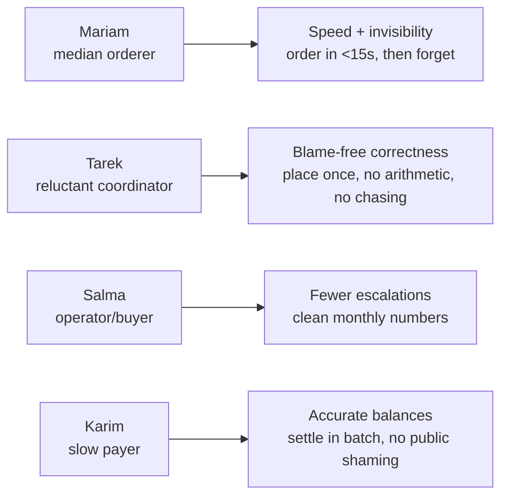

| Assumption ID | Persona | Core motivation we're betting on |
|---|---|---|
| UA-M1 | Mariam | Reclaim attention: ordering should cost *no thought*, not just less time. "Repeat my usual" (FR-26) is the eventual hook; speed is the MVP hook. |
| UA-M2 | Tarek | Be un-blameable: a single correct **Place** + auto-**Aggregate** means he's never the cause of a wrong order, and front-cash is recoverable via the Ledger. |
| UA-M3 | Salma | Operational calm: a system that auto-opens/auto-locks and self-reconciles means fewer "where's my order" / "who owes what" pings landing on her desk. |
| UA-M4 | Karim | Dignity in settlement: clear a tab on his own schedule via impersonal, automated nudges (FR-55, V3) — never personally dunned by a colleague. |

### 2.5 User frustrations

The status-quo pains we assume are *severe enough to drive a switch*. Each maps to a Bible-defined kill mechanism. If the frustration isn't actually painful, the corresponding feature is over-built.

| Assumption ID | Persona | Frustration (today's pain) | We assume it's killed by |
|---|---|---|---|
| UA-F1 | Mariam | Order lost in a noisy WhatsApp thread; duplicate/wrong quantity. | One editable **Order** per user (upsert), `unique(session,user)`, live subtotal (FR-21/23). Duplicates structurally impossible (§11). |
| UA-F2 | Mariam / Karim | Awkward "you still owe 45" pings between colleagues. | Transparent **Ledger** + impersonal automated nudges; no human dunning (§4.4). |
| UA-F3 | Tarek | Being the human deadline; doing per-person arithmetic; chasing stragglers. | Hard **Cutoff** auto-lock (FR-12), auto-**Tally** (FR-31), targeted non-orderer nudge (FR-53, V2). |
| UA-F4 | Tarek | Re-learning the coordination flow after weeks of dormancy. | Near-zero-learning Place flow; any allowlisted **Sender** can place (§4.2, R2). |
| UA-F5 | Salma | Manual price updates; becoming fallback coordinator; month-end cash reconciliation. | Admin menu CRUD (FR-60/62), scheduled auto-open (FR-15, V2), period Ledger view (FR-44). |
| UA-F6 | Karim | Manual ledgers that don't reconcile; being personally chased. | Deterministic per-person **Tally** + running **Balance** (FR-31/41); snapshots prevent money drift (§6.6). |

### 2.6 Riskiest assumption (flagged)

> **UA-P1 / R4 — "Submit is faster and lower-friction than WhatsApp, and Mariam will switch for it."**

This is the assumption the entire product lives or dies on, and it is the one we have *zero* evidence for pre-dogfood.

- **Why it's the riskiest:** Every other assumption (auto-Tally, track-only Ledger, episodic Coordinator) only matters *if people order in the app at all*. WhatsApp has zero install cost and is already open on everyone's phone. If MorningCart's submit isn't unmistakably faster than typing "same as yesterday" into a chat, the median user never switches — and a breakfast tool with 40% participation is worse than the WhatsApp thread it replaced, because now coordination is split across two channels.
- **Why it's fragile:** §12 explicitly cuts "repeat my usual" (FR-26) and recurring auto-open (FR-15) from week 1. The MVP therefore asks Mariam to *re-pick her items every morning from a menu* — the slowest possible version of the exact loop we're claiming is faster than WhatsApp. The thesis is most vulnerable precisely where we trimmed scope.
- **Leading indicator to watch:** per-session participation rate among habitual orderers, and time-to-submit p50, in the first 10 sessions.
- **Kill / pivot trigger:** if habitual-orderer participation stays <60% after 2 weeks of dogfooding, fast-track FR-26 ("repeat my usual") and FR-15 (auto-open) *out of order* before adding any other feature — do not blame adoption on "change management."
- **Cheapest pre-build test:** instrument a one-session paper/Typeform race — same group orders once via WhatsApp and once via a clickable prototype; compare wall-clock submit time and error count. One morning of data de-risks the whole roadmap.

---

## 3. Personas

Four personas. We optimize the product for **Mariam** — the passive median orderer. Every other persona's needs are real but subordinate: if a design choice helps Mariam tap "repeat usual" in <15s, it wins.

---

### Mariam — "The Usual" *(optimize for her)*

> Software engineer. The median daily orderer who wants breakfast handled without a single moment of thought.

**Goals**
- Submit an Order in **under 15 seconds** without deciding anything (FR-26 "repeat my usual," FR-23 live subtotal).
- Settle her tab without being nagged or having to nag — quiet, impersonal balance nudges (FR-55), never a colleague DM.
- Trust that what she tapped is what arrives and what she's charged is correct (price snapshots, FR-31 Tally).

**Frustrations**
- Her order dropped in a noisy WhatsApp thread; the coordinator missed it.
- The awkward "you still owe 45" ping from a colleague.
- Re-typing the same egg sandwich every morning into a different surface.

**Usage pattern**
- **When:** Opens at ~09:05 on the **session-open notification** (FR-50), inside the AM concurrency spike.
- **How:** One tap on "repeat yesterday," glance at subtotal, done. **~90% passive** — most days she touches nothing but a confirm. Never opens the Aggregate or settlement board.
- **Device:** Phone, one-handed, in the hallway. Mobile-first PWA (FR-80). She is the reason ≤2 taps to add an item is law.

---

### Tarek — "The Reluctant Coordinator"

> Account manager. Today's rotating session **Coordinator** — a per-session role, not a job title — who just wants to place the order once and not be blamed.

**Goals**
- **Place** the order correctly *once* and never become the human deadline (Cutoff auto-lock, FR-12, does the deadline-enforcing for him).
- Get reimbursed if he fronts cash — visible balances and **Confirm** on incoming payments (FR-40, FR-42).
- Touch as little as possible: open, let it auto-aggregate (FR-30), press **Place** (FR-52).

**Frustrations**
- Chasing stragglers and being the person who has to say "orders close now."
- Doing per-person arithmetic by hand — exactly what the deterministic Tally (FR-31) kills.
- Being blamed for a missed or wrong order he didn't actually fumble.

**Usage pattern**
- **When:** A high-intensity ~15-minute window, then **dormant for weeks** until rotation comes back to him.
- **How:** Because he's always re-learning, the coordinator flow must be **near-zero learning curve** — no manual, no math, no chasing. Ideal day: he touches nothing but the **Place** button (the §12 acceptance test).
- **Device:** Phone during the spike; may glance at the **coordinator-only** Aggregate / settlement board (FR-30, FR-40) on a laptop if he's at his desk.

---

### Salma — "The Operator" *(the buyer / champion)*

> Office manager. Owns vendor, menu, and rotation. Adoption lives or dies on her — she is the buyer.

**Goals**
- Reliable daily breakfast with **minimal escalations** — sessions that auto-open and auto-lock without her babysitting.
- Clean monthly numbers: per-period balances and spend reporting (FR-44, FR-73) that reconcile without a spreadsheet.
- Keep the menu and prices current with low effort (Menu management, FR-62; at MVP this is Django Admin per §12).

**Frustrations**
- Getting dragged in as the **fallback coordinator** when no one else opens or places.
- Manually updating prices and re-keying a menu every time the vendor changes something.
- Month-end cash reconciliation that never ties out.

**Usage pattern**
- **When:** Weekly menu/price upkeep; sets the **Cutoff** (`default_cutoff_time` on Office); monthly reconciliation pass.
- **How:** **Power user, low frequency, high stakes.** She rarely orders but configures the spine — vendor, menu, rotation, Cutoff. She is who `POST /sessions/{id}/reconcile` and the audit trail (FR-82) exist for.
- **Device:** Laptop for admin/menu/reconciliation; phone for spot-checks. Not in the AM ordering spike — she's behind it.

---

### Karim — "The Settle-Up Skeptic"

> Finance analyst and the archetypal slow payer. Cares about accurate **totals**, not daily detail, and dreads being publicly chased.

**Goals**
- Accurate, reconcilable **Balances** with no disputes (FR-41 Ledger, FR-44 period view).
- Clear a tab in a batch without public shaming — **Mark Paid** as a private, timestamped claim (FR-40, FR-42).
- Easy monthly reconciliation; eventually a tagged settlement method (FR-43) or payroll CSV (FR-46).

**Frustrations**
- Manual ledgers that never reconcile.
- Being personally chased by a colleague for a few dollars — the social friction we designed away with impersonal nudges (FR-55).

**Usage pattern**
- **When:** Glances at his balance occasionally; **settles in a batch weekly or monthly**, not per-session.
- **How:** Lives almost entirely in **`GET /me/balance`** and the period view. Doesn't care about today's Aggregate or item-level detail — he cares whether the running total is right. Two-step settlement (his **Mark Paid** → coordinator **Confirm**) gives him non-repudiation without anyone moving money.
- **Device:** Phone for the occasional balance glance; laptop when he does the monthly batch reconcile.

---

## 4. Problem Analysis

The "current process" is a daily human-orchestrated relay across four chat surfaces with a single volunteer holding the state in their head and a spreadsheet. Mapped step by step, every handoff is a place where orders, money, or goodwill leaks.

| # | Step | Friction points | Failure points | Time waste | Human errors |
|---|------|-----------------|----------------|------------|--------------|
| 1 | **Someone volunteers to coordinate today** | No schedule; relies on a person noticing it's their turn; rotating burden lands unevenly | Nobody volunteers → no breakfast; two people start → split/duplicate threads | 5–10 min of "who's doing it today?" back-and-forth | Wrong person assumed; turn skipped or doubled |
| 2 | **Coordinator announces "ordering now" across channels** | Broadcast fragments over WhatsApp, Slack, phone, verbal hallway asks | People on the wrong channel never see it; out-of-office/late arrivals miss the window | Re-pinging the same people in three places | Group left out; announcement buried in noise |
| 3 | **Employees send orders back (free-form text/voice)** | No menu reference; prices unknown; "the usual" is ambiguous; replies interleave with chatter | Order posted but never read; sent to wrong thread; verbal order forgotten | Each person re-types/re-explains; coordinator re-reads scrollback | Misheard items, wrong size, ambiguous "same as yesterday" |
| 4 | **Coordinator aggregates orders by hand** | Mental/spreadsheet roll-up across channels; must dedupe and count quantities manually | An order is dropped; counted twice; quantity miscounted | 10–20 min of scrolling, tallying, transcribing | Wrong totals per item; missing person; duplicate line |
| 5 | **Last-minute changes / additions / cancels** | Edits arrive after aggregation; "actually make it two"; "I'm out today" | Change applied to the tally but not the vendor order, or vice-versa | Re-aggregating from scratch; chasing what changed | Stale quantities; ghost orders for absent people |
| 6 | **Coordinator places order with vendor (phone/WhatsApp)** | Vendor is phone/WhatsApp-only; readback is verbal; no confirmation artifact | Vendor mishears; coordinator forgets a line; minimum-order surprise | Slow dictation; waiting on hold; clarifying with vendor | Item omitted at the vendor; wrong quantity ordered |
| 7 | **Coordinator computes per-person cost** | Manual arithmetic; delivery fee split ad hoc; rounding handled by gut | Math error; fee allocated inconsistently; leftover cents lost | 5–15 min with a calculator/spreadsheet | Per-person total wrong; fee double-charged or dropped |
| 8 | **Coordinator collects/fronts the money** | Often fronts cash personally; chases each person individually | Coordinator out-of-pocket; some never pay; awkward to ask | Walking around collecting; repeated reminders | Cash miscounted; wrong change |
| 9 | **Coordinator tracks who paid** | State lives in their head or a notes app; no shared source of truth | "I already paid you" disputes; balance lost between days | Reconciling memory vs. cash | Marked paid when unpaid (or vice-versa); forgotten debts |
| 10 | **Delivery arrives — partial/wrong items** | No record of what was promised vs. delivered | Missing item still charged to someone; no clean adjustment path | Re-litigating the tally at the table | Person charged for food they never got |
| 11 | **Month-end reconciliation (Operator)** | Office manager becomes fallback bookkeeper across weeks of cash | Numbers don't reconcile; no audit trail of who-owed-what | Hours reconstructing a month of breakfasts | Accumulated drift; unexplainable balance |

### Where it breaks worst

Three points carry the leverage; fix these and ~90% of the pain disappears.

1. **The Coordinator as a human relay (Steps 1–2, 4, 6–9).** Every failure mode routes through one volunteer holding state in their head — this is the single point of failure and the rotating burden the brief names. **Tarek** re-learns the job every time he's tapped, and **Salma** absorbs the fallback. The fix is structural, not better tooling for the coordinator: one shared **Session** that auto-opens and hard-auto-locks at **Cutoff**, an auto-built **Aggregate** and **Tally**, and a sender allowlist so anyone can **Place**. Coordinator touch-time trends toward zero.

2. **Order capture and aggregation across fragmented channels (Steps 3–5).** Orders scattered over WhatsApp/Slack/voice are where things get dropped, duplicated, and miscounted. Collapsing this into a single editable **Order** per user per **Session** (upsert, one-per-user) against a frozen, priced menu kills lost/duplicate/wrong-quantity orders *at the schema level* via `unique(session_id, user_id)` and price snapshots — not in someone's head. For **Mariam** this also turns a noisy thread reply into a <15s tap.

3. **Manual money math and paid-tracking (Steps 7–9, 11).** Arithmetic errors and "did you pay me?" ambiguity erode trust and dump a monthly reconciliation chore on the Operator. A deterministic per-person **Tally** plus a transparent **Ledger** with two-step **Mark Paid** → **Confirm** settlement makes balances self-evident and disputes self-resolving — for **Karim**, accurate totals with no public dunning. Note we fix the *arithmetic and reconciliation*, not the transaction: no money moves through the app.

The remaining steps (6, 10) are vendor-side variance we can only *contain*, not eliminate: a clean pasteable Aggregate reduces mis-dictation, and the post-delivery "not received" adjustment (FR-84) is the one sanctioned money-edit after Place.

---

## 5. Product Vision

**Vision (one line):** Turn the daily breakfast scramble into a 90-second tap-and-done ritual — one shared **Session**, a frozen menu, automatic per-person **Tally**, a self-settling social **Ledger**, and **zero Coordinator burden.**

**The full statement:** Every morning the team eats together without anyone losing time, money, or goodwill to logistics. A **Session** opens on schedule, people add their usual against a price-frozen menu, the order auto-**Lock**s at **Cutoff**, the **Aggregate** and **Tally** compute themselves to the cent, and who-owes-what is transparent and self-settling. **MorningCart** is invisible infrastructure for a social ritual — not a marketplace, not a fintech app. We measure success by what disappears: the **Coordinator** role shrinks toward zero, and the median user (**Mariam**) does nothing but tap "repeat."

### Guiding principles (these constrain scope)

| # | Principle | What it forbids | What it forces |
|---|---|---|---|
| 1 | **Boring and reliable beats clever** | No ML recommendations, no allergen taxonomy, no native apps, no vendor API. Django + Postgres + PWA, full stop. | The core loop (open → submit → **Lock** → **Aggregate** + **Tally** → **Place**) is *boringly correct* before any optimization. Snapshot every money-touching field; let three DB constraints — `unique(office,vendor,date)`, `unique(session,user)`, price snapshots — kill duplicates and money drift at the schema level. |
| 2 | **Respect the morning time-box** | No multi-step flows, no install/login tax for the daily task, no notification spam. | Submit must beat WhatsApp: **<15s, ≤2 taps** to add an item. **Mariam** taps "repeat yesterday" (FR-26) and is done. Optimize for the passive median user, not power users. The only load window that matters is the 9am spike. |
| 3 | **Delete the Coordinator — don't tool it** | No required human to open a Session, no human doing mental math, no human chasing stragglers. If a person still does logistics, **we failed.** | Sessions auto-open on schedule (FR-15) and auto-**Lock** at **Cutoff** (FR-12). Aggregation is automatic (FR-30). Any allowlisted **Sender** can **Place**. **Coordinator** is a per-session role, never a standing job. |
| 4 | **Never make money awkward between colleagues** | No in-app payments, wallet, escrow, or card-on-file (FR-47, **Won't**, any tier). We never hold, move, or process money. We never arbitrate disputes. | The app is the source of truth for *what was ordered and owed* — not for whether cash changed hands. **Ledger** is transparent; "**Mark Paid**" is a timestamped self-serve claim, two-step settlement (claim → **Confirm**) gives non-repudiation. Impersonal automated nudges mean no colleague ever personally duns another. |

**The line we will not cross:** the moment this becomes a payments company, a vendor marketplace, or a job for one "breakfast coordinator," we have lost. A correct **Ledger** kills ~90% of the pain at ~10% of the cost — we ship that, and nothing that drags in PCI, KYC, or a role nobody wants.

---

## 6. Product Scope

Scope is sequenced against one law: the **core loop must be boringly correct before any optimization** (§12). Each tier earns its place only after the prior tier's loop holds. Feature IDs and tiers are taken verbatim from the canonical feature list (§6 of the bible); nothing here invents or re-tiers a feature.

### MVP — the one-week cut

MVP contains **only** what makes the core loop work end-to-end: `open Session → everyone submits one Order against a frozen menu → hard Cutoff auto-locks → Aggregate + per-person Tally → Sender Places → balances visible → "Mark Paid" claim`. If a feature doesn't move that loop, it is not in MVP.

| ID | Feature | Why it's in MVP (one phrase) |
|---|---|---|
| FR-01 | Simple auth / SSO login | Orders must attribute to a real person — no money trust without identity |
| FR-02 | Employee directory | Names on orders and the Tally; zero manual roster |
| FR-10 | Create a Session | No spine, no loop — everything hangs off the Session |
| FR-11 | One active Session per office/vendor/day | `unique(office,vendor,date)` kills duplicate sessions at the schema level |
| FR-12 | Hard Cutoff auto-lock | Removes the human deadline — the core anti-coordinator move |
| FR-13 | Manual "close now" override | Sender's escape hatch when the vendor needs the order early |
| FR-14 | Session status visible to all | Everyone sees Open / Closing soon / Locked / Placed without asking |
| FR-20 | Add items to my Order | The actual ordering action |
| FR-21 | Edit/remove my items before Cutoff | Last-minute changes stop being chaos |
| FR-22 | Per-item free-text note | "no sugar," "oat milk" rides to the Aggregate — honest dietary handling (§4.8) |
| FR-23 | Live "my Order + subtotal" | Self-catches fat-finger quantities; makes <15s submit feel safe |
| FR-30 | Auto-aggregate kitchen order | The pasteable vendor artifact — kills manual aggregation |
| FR-31 | Deterministic per-person Tally | Kills manual cost arithmetic, the #1 mistake source |
| FR-32 | Live grand-total preview | Sender sees the bill forming; no end-of-window surprise |
| FR-33 | Delivery/service fee field | Real orders carry a fee; the Tally must account for it |
| FR-40 | Manual "Mark Paid" per person | Timestamped claim — the settlement primitive |
| FR-41 | Per-person running Ledger/Balance | Replaces the paper IOU list; Karim's monthly reconciliation source |
| FR-42 | Self-serve "I paid" toggle | Payer marks own — no coordinator chasing |
| FR-50 | Session-open notification | The group needs to know the window opened |
| FR-51 | "Deadline approaching" reminder | T-minus nudge so nobody misses breakfast |
| FR-52 | Session-closed / order-sent confirmation | Closes the loop: people know it's locked and sent |
| FR-60 | Pre-loaded menu with prices | Frozen prices = correct Tally; entered via Django Admin |
| FR-61 | Mark items unavailable / sold out | Sold-out toggle so people don't order what's gone |
| FR-70 | Past sessions list (read-only) | Cheap history for "what did we owe last Tuesday" |
| FR-80 | Mobile-first responsive PWA | A 9am hallway task lives on the phone, no install tax |
| FR-81 | Near-real-time session sync | SSE keeps the AM concurrency window coherent |
| FR-82 | Audit trail of changes | Append-only AuditEvent — the money-trust backbone |
| FR-83 | Concurrency-safe deadline edits | An edit at T-0 is deterministically in or out |
| FR-84 | Post-delivery "not received" adjustment | The **only** money-edit after Place — drops undelivered items |

**Defaults baked into MVP (no toggle):** equal-per-head fee split (`fee_split=equal`), single vendor, Django Admin for all menu/vendor CRUD.

**Deliberately deferred out of MVP — and why now would be premature:**

- **Any payment movement (FR-47 — never; FR-45 deep-link, FR-43 method tag, FR-46 payroll CSV — later):** the pain is reconciliation and arithmetic, not the transaction (§4.1). A correct Ledger first.
- **Convenience reorder (FR-26 repeat usual, FR-27 repeat session, FR-72 favorites):** speed optimizations for a loop that must first be *correct*. Mariam gets her one-tap usual in V2.
- **Recurring auto-open (FR-15) and Presence (FR-18):** start sessions manually until the manual loop is trusted; clever calendar logic is the wrong week-1 risk (§11).
- **Multi-vendor (FR-63), concurrent sessions (FR-17), modifiers (FR-25), guest lines (FR-24):** single vendor, single session, single-person orders prove the spine first.
- **Fee/rounding sophistication (FR-34 proportional, FR-35 remainder policy, FR-36 split items, FR-37 tax):** equal split with deterministic creator-owns-the-cent is enough until someone complains.
- **Targeted nudges (FR-53), Slack routing (FR-54), settlement reminders (FR-55):** webhook fire-and-forget covers the three notifications that matter.
- **Menu CRUD UI (FR-62), vendor export artifact (FR-64), analytics/reporting (FR-71, FR-73, FR-74):** Django Admin and a copy-pasteable Aggregate cost nothing and ship day one.

### V2 — make the median user passive and the operator self-sufficient

Once the loop is correct, V2 optimizes for **Mariam's near-zero effort** and gives **Salma** her own admin surface so she stops escalating to engineering.

| ID | Feature | Tier intent |
|---|---|---|
| FR-15 | Recurring/templated auto-open | Session opens on the weekday schedule — coordinator touch-time drops |
| FR-16 | "Reopen for 5 min" grace window | Humane post-lock escape hatch, coordinator-triggered |
| FR-18 | Daily Presence (in/out) | Default from habit; skip the "are you eating today" ask |
| FR-24 | "Order for someone else" / guest line | Guest line charged to submitter — no guest accounts |
| FR-25 | Structured item modifiers/options | Size / add-ons via `options_schema` jsonb |
| FR-26 | One-tap "repeat my usual" / favorites | **Mariam's <15s path** — tap and done |
| FR-27 | "Repeat yesterday's whole session order" | Coordinator-level bulk repeat |
| FR-34 | Fee allocation policy | Equal vs proportional fee split |
| FR-35 | Rounding & remainder policy | Deterministic leftover-cent ownership, shown |
| FR-43 | Settlement-method tag | cash / transfer / payroll — metadata only, no money moves |
| FR-44 | Period balance view | "This week you owe the pool $X" — Karim's batch view |
| FR-53 | Personalized "you haven't ordered" nudge | Targeted reminder to non-orderers |
| FR-61 | (matured) sold-out flows | Swap-or-drop UX on top of the MVP toggle |
| FR-62 | Menu management UI (CRUD) | **Must for V2** — Salma edits menu/prices without Django Admin |
| FR-63 | Multiple vendors in catalog | Choose one vendor per session |
| FR-71 | Personal order history | My past orders |
| FR-72 | Favorites / saved usual orders | Backs FR-26 |
| FR-73 | Spend report per person/period | Personal spend reporting |

### V3 — scale across offices, vendors, and finance integration

V3 generalizes from one office / one daily session to **multiple offices, parallel vendors, and finance-grade exports** — only once the single-office loop is proven and adopted.

| ID | Feature | Tier intent |
|---|---|---|
| FR-03 | Lightweight roles | `admin`, vendor-liaison standing roles |
| FR-04 | Per-office/team scoping | Sessions & directory scoped by office |
| FR-17 | Multiple concurrent sessions/vendors per day | Parallel sessions per office |
| FR-28 | Group/split shared item | One platter split N ways |
| FR-36 | Fair-split math for shared items | Split-item cost engine |
| FR-37 | Tax handling | If the vendor invoices tax |
| FR-45 | Deep-link to external payment-request rail | Prefilled Instapay/Venmo/UPI link — **no funds held** (§4.1 trigger) |
| FR-54 | Slack/Teams notification integration | Route notifications to chat |
| FR-55 | Settlement reminder ("you owe $X") | Impersonal automated balance nudge — no colleague duns another |
| FR-64 | Vendor contact + export order | WhatsApp / print / PDF pasteable artifact |
| FR-74 | Team analytics | Popular items, spend trends, vendor reliability |

### Future Vision — explicitly parked

Beyond V3. Mostly finance plumbing and integrations that only earn their place after multi-office scale and a demonstrated, repeated request.

| ID | Feature | Status / intent |
|---|---|---|
| FR-46 | Payroll-deduction CSV export | Finance-grade export once payroll integration is demanded |
| FR-65 | Vendor-facing confirmation / API | Only if a vendor ever offers an API — export beats integration until then |
| FR-75 | Accounting/finance export | General finance export for month-end |

**Never built — at any tier (see §7):**

| ID | Feature | Hard line |
|---|---|---|
| FR-47 | In-app payment processing / wallet / card | **Won't, ever.** PCI/PSP/KYC/chargeback liability for a $4 sandwich among trusting colleagues. The defining over-engineering trap. The Ledger solves the pain. |

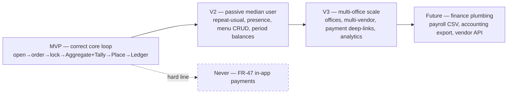

---

## 7. Functional Requirements

This section specifies the **core lifecycle features** of MorningCart — the MVP-tier features from the Canonical Feature List (§6) that constitute the boringly-correct loop described in §12: open a Session → submit/edit one Order against a frozen menu → hard Cutoff auto-locks → produce a vendor Aggregate + per-person Tally → Sender Places → balances visible with self-serve Mark Paid. Everything here must ship in week 1 and must be correct before any optimization.

Each feature is specified in the format: **Description** / **User story** / **Acceptance criteria** / **Edge cases**. Acceptance criteria are numbered and testable, using Given/When/Then where it adds clarity. All terms (Session, Order, OrderItem, Cutoff, Lock, Aggregate, Tally, Coordinator, Sender, Mark Paid, Confirm) are used exactly as defined in §3, and all entity/field names match §8.

---

### FR-01 — Simple auth / SSO login

**Description**
Users are identified via company SSO (OIDC Auth-Code + PKCE) or workspace email. On first login a shadow `User` is JIT-provisioned from the OIDC `sub` and email. The session is carried in an HttpOnly/Secure/SameSite=Lax cookie. No passwords are stored in MorningCart; there is no separate signup. Identity is the precondition for every other endpoint — orders, balances, and the settlement board are all attributed to a real person and default-private.

**User story**
As **Mariam** (the median daily orderer), I want to land in the app already signed in via my company identity, so that I never pay an install/login tax on a 90-second task.

**Acceptance criteria**
1. Given a user authenticated by the company IdP, When they hit any `/api/v1` endpoint without a session, Then they are redirected through the OIDC Auth-Code + PKCE flow and returned to their original destination.
2. Given a successful OIDC callback for an `sso_subject` not seen before, When the callback is processed, Then a `User` is JIT-provisioned with `sso_subject` (= OIDC `sub`, unique), `email` (citext, unique), `display_name`, `role=member`, and `default_office_id`.
3. Given a returning user with the same `sso_subject`, When they authenticate, Then the existing `User` is reused (no duplicate row) and `display_name`/`email` are refreshed from claims.
4. Given a successful login, When the session cookie is issued, Then it is `HttpOnly`, `Secure`, `SameSite=Lax`, and `GET /me` returns the current user, `role`, and default office.
5. Given any cookie-authenticated mutation, When it is submitted, Then CSRF protection is enforced; a missing/invalid CSRF token is rejected `403`.
6. Given a `User` with `is_active=false`, When they attempt to authenticate, Then access is denied.
7. All requests are TLS-only; non-TLS requests are refused/redirected.

**Edge cases**
- **Same person, new IdP `sub`** (IdP migration): match falls back to `email` (citext) to avoid a duplicate shadow profile; log an `AuditEvent`.
- **Email-only workspace (no full SSO):** workspace-email identity path provisions the same `User` shape; no second code path for orders.
- **Deprovisioned employee:** IdP rejects the login; their historical orders/balances remain (see FR-41 / "employee leaves before paying").
- **Cookie expiry mid-order:** the next mutation returns `401`; the PWA re-auths silently and the optimistic order draft is preserved (never a false success).
- **No `default_office_id` derivable from claims:** assign the company's single default office (MVP is one/few offices); never block login.

---

### FR-02 — Employee directory

**Description**
An auto-populated directory of provisioned `User`s, used to attribute orders and render names on the Aggregate, Tally, and settlement board. No manual invite/CRUD flow at MVP — the directory is a read view over JIT-provisioned users. `display_name` is the single label shown everywhere a person appears.

**User story**
As **Tarek** (today's reluctant Coordinator), I want every order line to carry a real name, so that I never have to decode "the usual from the guy in finance" when I Place the order.

**Acceptance criteria**
1. Given users have logged in at least once, When the directory is read, Then it lists active `User`s with `display_name` and default office, scoped to the company.
2. Given any `Order`, When it is shown to a Coordinator, Then it is attributed to the orderer's `display_name` from the directory (never a raw email or UUID in UI).
3. Given a `User` with `is_active=false`, When the directory is rendered for new sessions, Then they are excluded from active lists but remain resolvable for historical orders/balances.
4. The directory is **not** member-editable; it is a projection of provisioned identities (no add/remove UI at MVP).

**Edge cases**
- **Two people, same `display_name`:** both render with the identical label; disambiguation is out of scope at MVP (email is unique at the data layer if ever needed).
- **User never logged in:** absent from the directory — you cannot order on behalf of a non-provisioned person except via the V2 guest line (FR-24, out of week 1).
- **Name change in IdP:** `display_name` refreshes on next login; historical OrderItems already carry `name_snapshot` of items, not of people, so display can update freely.

---

### FR-10 — Create a Session

**Description**
Any authenticated user can open an `OrderSession` for an `(office, vendor, service_date)`, setting the `cutoff_at` (defaulting from the office's `default_cutoff_time` in the office's IANA timezone). The opener becomes the per-session `coordinator_id`. Prices are frozen at open: the Session pins the current menu so later price edits cannot drift the Tally. This is deliberately a low-ceremony action — opening a Session must not become a coordinator job.

**User story**
As **Tarek**, I want to open today's breakfast Session in two taps, so that the group can start ordering without me chasing anyone or doing setup work.

**Acceptance criteria**
1. Given an authenticated user, When they `POST /sessions` with `office_id`, `vendor_id`, and optional `cutoff_at`, Then an `OrderSession` is created with `status=open`, `coordinator_id` = the creator, and `service_date` derived from the office-local "today."
2. Given no explicit `cutoff_at`, When the Session is created, Then `cutoff_at` is computed from `Office.default_cutoff_time` in `Office.timezone`.
3. Given the Session is opened, When it is persisted, Then the active menu (`MenuItem.price`, `name`) is treated as frozen for this Session — subsequent price/menu edits do not change any price already snapshotted by OrderItems in this Session (per FR-06 stance: snapshot everything money-touching).
4. Given a `vendor` with a `min_order_total`, When the Session is created, Then that threshold is recorded/visible so the solo-order warning (FR-14 / edge cases) can fire later.
5. Given a successful create, When it returns, Then an `AuditEvent` with `action=session.open` is written (actor, after-state).
6. Creating a Session emits the session-open notification (FR-50) and the Session immediately appears in `GET /sessions/today`.

**Edge cases**
- **Duplicate `(office, vendor, service_date)`:** rejected `409` by the `unique(office_id, vendor_id, service_date)` constraint — see FR-11. The client surfaces "A session for this vendor already exists today — join it."
- **Weekend/holiday:** allowed but never auto-created at MVP; manual start only (no clever calendar logic — §11).
- **Cutoff already in the past / within minutes of now:** allowed (opener's call) but the UI warns; the auto-lock (FR-12) will fire promptly.
- **Timezone correctness:** `service_date` and `cutoff_at` are always computed in `Office.timezone`, not the device's — a traveler opening from another zone still lands on the office's "today."

---

### FR-11 — One active Session per office/vendor/day

**Description**
A database-level `unique(office_id, vendor_id, service_date)` constraint guarantees at most one Session per office per vendor per service-date. This kills duplicate sessions structurally — not in app code — so two people tapping "Open" at 9:00 cannot fork the order into two competing rounds.

**User story**
As **Salma** (the Operator), I want it to be impossible to accidentally run two parallel sessions for the same vendor, so that orders and money never split across duplicate rounds.

**Acceptance criteria**
1. Given an open Session for `(office, vendor, service_date)`, When a second `POST /sessions` arrives for the same triple, Then it fails the unique constraint and the API returns `409 Conflict`.
2. Given a `409`, When the client receives it, Then it surfaces the existing Session (deep-link to join), not an error dead-end.
3. The uniqueness is enforced by the DB constraint, not by an application-level check-then-insert (no TOCTOU race under AM concurrency).
4. Given a Session in `status=cancelled`, When a new Session is opened for the same triple later that day, Then it is permitted (cancelled sessions do not block a fresh round) — implemented per the constraint's treatment of the cancelled state.

**Edge cases**
- **Two simultaneous opens (race):** exactly one wins; the loser receives `409` and is routed to join — both users converge on one Session.
- **Same vendor, two offices:** allowed (the triple differs by `office_id`).
- **Two different vendors, same office, same day:** blocked at MVP scope — multiple concurrent vendors per office is FR-17 (V3), out of week 1.

---

### FR-12 — Hard Cutoff auto-lock

**Description**
At `cutoff_at` the Session auto-transitions `open → locked` via the async worker — no human action required. After Lock, all member orders are read-only; this is the single most important guarantee in the product because it removes the human-as-deadline burden. The lock is atomic at the Cutoff boundary: an edit arriving at T-0 is deterministically either in or out, never partially applied.

**User story**
As **Mariam**, I want ordering to close itself exactly on time, so that no colleague has to nag me and nobody can sneak an order in after the kitchen list is finalized.

**Acceptance criteria**
1. Given a Session with `status=open` and `cutoff_at` reached, When the worker fires, Then `status` becomes `locked`, `Order.amount_due`-relevant totals are snapshotted, and an `AuditEvent` `action=session.lock` is written.
2. Given a Session is `locked`, When a member attempts `PUT /sessions/{id}/orders/me` or `submit`, Then the API returns `422` ("Order closed") — no late writes.
3. Given an in-flight order mutation racing the lock, When the lock commits, Then the mutation is deterministically ordered relative to the lock (atomic boundary): it is either fully accepted before lock or rejected `422` after — never a partial write (FR-83).
4. Given the lock fires, When it completes, Then `amount_due` is frozen on each `Payment` from `order.total` at lock (§8 Payment rule) and the per-person Tally is final.
5. Lock is idempotent: re-running the lock job on an already-`locked` Session is a no-op (no double AuditEvent, no recomputed totals).
6. On lock, the session-closed notification (FR-52) fires and the Aggregate (FR-30) and Tally (FR-31) become available to the Coordinator/Sender.

**Edge cases**
- **Cutoff with zero orders:** auto-cancel the Session (`status=cancelled`), notify all, send no order (§11).
- **Cutoff with exactly one order:** lock and proceed, but warn the solo orderer that `vendor.min_order_total` may not be met — do **not** auto-cancel.
- **Worker delay/outage at Cutoff:** the lock is enforced on read/write too — any order mutation after `cutoff_at` is rejected even if the worker hasn't run yet (Cutoff is authoritative, the job is just the materializer).
- **Clock/timezone skew:** `cutoff_at` is an absolute `timestamptz`; comparison is server-side UTC, display is office-local.
- **Manual early close already happened:** if `status` is already `locked` via FR-13, the scheduled job is a no-op (idempotent).

---

### FR-13 — Manual "close now" override

**Description**
The Coordinator (or an allowlisted Sender) can Lock the Session early via `POST /sessions/{id}/lock` before `cutoff_at` — e.g., everyone's in and the kitchen wants the list early. It produces exactly the same locked state as the automatic Cutoff lock; there is one lock path, not two.

**User story**
As **Tarek**, I want to close ordering the moment the team is done, so that I can send the order early without waiting out the clock.

**Acceptance criteria**
1. Given a Coordinator and an `open` Session, When they `POST /sessions/{id}/lock`, Then `status` becomes `locked` and the same snapshot/Tally/notification flow as FR-12 runs.
2. Given a non-coordinator, non-allowlisted member, When they call lock, Then it is rejected `403` (object-level authz).
3. Lock is idempotent: calling it on an already-`locked` Session returns success with no state change and no duplicate AuditEvent.
4. Given a manual lock, When it commits, Then the scheduled auto-lock job for that Session becomes a no-op.
5. An `AuditEvent` `action=session.lock` records the actor and that it was a manual close.

**Edge cases**
- **Race: manual lock vs auto-lock at Cutoff:** whichever commits first wins; the other is a no-op (idempotent).
- **Member mid-edit when Coordinator closes early:** that member's in-flight write is subject to the same atomic boundary as FR-12 — in if it committed before lock, else `422`.
- **Lock then "oops, too early":** there is no member reopen at MVP; "Reopen for 5 min" (FR-16) is V2. The escape hatch is the Coordinator's manual late-add (per §11), owned by the Sender.

---

### FR-14 — Session status visible to all

**Description**
Every participant sees the live Session status: **Open** / **Closing soon** / **Locked** / **Placed**. Status is pushed near-real-time over SSE (FR-81) so the AM window has a single shared truth — no "is it still open?" pings. "Closing soon" is a derived UI state as `cutoff_at` approaches.

**User story**
As **Mariam**, I want to glance and instantly know whether I can still order, so that I don't waste taps on a closed Session or miss a window I thought was open.

**Acceptance criteria**
1. Given any participant on the Session, When `status` changes (`open→locked→placed`, or `→cancelled`), Then the new state is delivered over SSE in < 1s and reflected in the UI.
2. Given `cutoff_at` is within the "closing soon" threshold, When the client renders, Then it shows **Closing soon** with the time remaining (derived; not a stored status).
3. Given `status=locked`, When a member views their Order, Then it is read-only with a clear "Order closed" badge.
4. Given `status=placed`, When any member views the Session, Then it shows "Sent to vendor — locked" (no edits, per §11).
5. State labels never rely on color alone — each carries an icon + text (WCAG 2.1 AA, §10).
6. The canonical status enum is `open | locked | placed | reconciled | cancelled` (§8); "Closing soon" is purely presentational.

**Edge cases**
- **SSE disconnect (flaky wifi):** client falls back to polling `GET /sessions/{id}`; status is eventually consistent and never shows a stale "Open" through a mutation attempt (mutations re-validate server-side).
- **Cancelled mid-view:** members see "Session cancelled — no order placed"; all orders voided (§11).
- **Reconciled:** shown as a terminal, settled state in history (FR-70).

---

### FR-20 — Add items to my Order

**Description**
A member builds their single `Order` for the Session by adding `MenuItem`s from the frozen Session menu. Each add creates/updates an `OrderItem` that snapshots `name_snapshot` and `unit_price_snapshot` at order time. There is exactly **one Order per user per Session** (upsert, never append), enforced by `unique(session_id, user_id) where status != 'cancelled'`. Adding items goes through the whole-order upsert (`PUT /sessions/{id}/orders/me`) — there is no `/order-items` CRUD.

**User story**
As **Mariam**, I want to tap items off the menu into my order in under 15 seconds, so that ordering is faster than typing it into WhatsApp.

**Acceptance criteria**
1. Given an `open` Session, When a member adds a `MenuItem`, Then an `OrderItem` is created with `menu_item_id`, `name_snapshot`, `unit_price_snapshot` (= current `MenuItem.price`), `quantity ≥ 1`, and `line_total = unit_price_snapshot × quantity`.
2. Given a member adds items, When the Order is upserted via `PUT /sessions/{id}/orders/me`, Then at most one `Order` exists for that `(session, user)` — a second logical "create" updates the same row (upsert), never a duplicate.
3. Given the PUT is retried (double-tap/flaky network), When it is re-sent with the same payload, Then the result is idempotent — last-write-wins on the single Order record, no duplicate items.
4. Given an item is added, When the subtotal is computed, Then it is computed server-side from snapshots (never client-trusted) and returned for the live subtotal (FR-23).
5. Adding to the menu is ≤ 2 taps per item (§10 mobile target).
6. Only `MenuItem`s with `is_available=true` for this Session are addable (FR-61).

**Edge cases**
- **Add an item that just went sold-out (FR-61):** rejected at submit/upsert with "swap or drop"; the snapshot already taken is discarded for unavailable lines.
- **Quantity fat-finger:** stepper caps at a sane max (1–10); a quantity > 5 of one item triggers a confirm (§11).
- **Add after Cutoff/lock:** `422` "Order closed" (FR-12).
- **Price changed since Session open:** ignored — the OrderItem keeps the snapshot from order time; reconcile next day (§11).
- **Same item added twice:** represented as one `OrderItem` with `quantity=2` (or two lines if notes differ) — the upsert defines the canonical basket; no silent duplicate rows.

---

### FR-21 — Edit/remove my items before Cutoff

**Description**
While the Session is `open`, a member can mutate their own Order freely — change quantities, add/remove lines, edit notes — by re-sending the whole-order upsert. Edits are last-write-wins on the single Order record. After Lock, the Order is read-only.

**User story**
As **Mariam**, I want to change my mind about my order right up until the deadline, so that a last-second "actually, make it two" doesn't require pinging anyone.

**Acceptance criteria**
1. Given an `open` Session and an existing Order, When the member `PUT`s a modified order, Then the Order's items are replaced/updated to match the payload (upsert semantics), totals recomputed server-side, and an `AuditEvent` `action=order.submit`/update is written.
2. Given the member removes all items and `PUT`s an empty order (or `DELETE /sessions/{id}/orders/me`), When the Session is still `open`, Then their Order is cancelled (`status=cancelled`) and they are treated as not ordering.
3. Given two devices editing the same user's Order, When both write, Then last-write-wins on the single record; the UI shows "updated Ns ago" (per-person isolation means no cross-user conflict — §11).
4. Given the Session is `locked` or `placed`, When the member attempts any edit/remove, Then it is rejected `422` (read-only).
5. Edits never create a second Order row (the unique constraint holds across edits).

**Edge cases**
- **Edit lands exactly at Cutoff:** atomic boundary (FR-83) — committed-before-lock wins, else `422`.
- **Concurrent edit + sold-out:** if a line's item became unavailable, that line is dropped on upsert with a "swap or drop" prompt.
- **Network failure on edit:** optimistic UI + explicit "Not submitted — retry"; never a false success (§11).
- **Remove last item vs cancel:** an empty Order is cancelled, not left as a zero-total ghost on the Tally.

---

### FR-22 — Per-item free-text note

**Description**
Each `OrderItem` carries an optional free-text `note` ("no sugar," "oat milk," "no nuts"). Notes ride through to the Aggregate so the kitchen sees them per line. Deliberately **free-text only** — no allergen taxonomy, no structured dietary engine (§4.8, §7). The product makes no safety guarantee; the note is honest about exactly what we can pass along.

**User story**
As **Mariam**, I want to scribble "oat milk, no sugar" on my latte, so that the kitchen makes it the way I want without a side WhatsApp message.

**Acceptance criteria**
1. Given a member adds/edits an `OrderItem`, When they include a `note`, Then it is stored on that line and returned with the Order.
2. Given the Session locks, When the Aggregate is produced (FR-30), Then each line's `note` appears under/next to its item so the vendor message carries it verbatim.
3. Notes are per-line, not per-order (one item can say "oat milk," another "no sugar").
4. The note field accepts free text up to a sane length cap; it is never parsed into an allergen/dietary structure.
5. The UI presents notes plainly with a disclaimer-by-design: MorningCart is **not** a medical/allergen-safe system (§11 R5).

**Edge cases**
- **Allergy-critical note ("severe nut allergy"):** stored and passed through, but the app makes no guarantee and surfaces no false assurance — liability framing per §7.
- **Identical items, different notes:** kept as separate `OrderItem` lines (cannot be merged), so each note survives to the Aggregate.
- **Very long / emoji / RTL note:** stored as-is (free text), truncated only at the cap; rendered safely (escaped) in the pasteable Aggregate.
- **Note on a sold-out item:** discarded with the dropped line.

---

### FR-23 — Live "my Order + subtotal"

**Description**
As a member adds/edits items, they see their running Order with a live, server-authoritative `subtotal` (and, once known, their `fee_share` and `total`). The subtotal is always computed from snapshots server-side; the client may show an optimistic value but the source of truth is the server response. This is the "self-catches a fat-finger" surface — the number moving as you tap is the correctness feedback loop.

**User story**
As **Mariam**, I want to see my subtotal update as I add items, so that I catch a wrong quantity or a surprise price before the deadline, not on the Tally.

**Acceptance criteria**
1. Given a member adds/edits/removes an item, When the upsert returns, Then `Order.subtotal` is recomputed server-side (Σ `line_total`) and shown immediately.
2. Given a delivery fee is set on the Session (FR-33) and split policy is known, When the member views their Order, Then their `fee_share` and `total` (= `subtotal + fee_share`) are shown (or clearly marked "fee added at close" if not yet allocable).
3. All money is `numeric(10,2)`, never float; the displayed subtotal equals the server value to the cent.
4. Given optimistic UI, When the server response differs from the optimistic estimate, Then the UI reconciles to the server value (never a false subtotal).
5. Subtotal read latency target p95 < 200ms (§10).

**Edge cases**
- **Fee split is `proportional` (V2) — not at MVP:** at MVP the default `equal` split means `fee_share` may only be final at lock; pre-lock UI shows subtotal certainly, fee as "added at close."
- **Empty order:** subtotal `0.00`; the member is treated as not ordering (see FR-21).
- **Quantity > 5 confirm:** the live subtotal jump is the visual cue that pairs with the confirm prompt (§11 fat-finger).
- **Stale SSE:** subtotal is re-fetched on focus/submit; never trusts a stale pushed value for money.

---

### FR-30 — Auto-aggregate kitchen order

**Description**
On Lock, MorningCart automatically produces the **Aggregate**: the kitchen-facing roll-up of every `OrderItem` grouped by item × total quantity, with per-line notes and the grand total — as a clean, pasteable vendor message. This is the artifact the Sender pastes into WhatsApp/reads over the phone. It replaces the human who used to hand-tally the group order. Exposed only to the Coordinator/Sender via `GET /sessions/{id}/aggregate`.

**User story**
As **Tarek**, I want a clean, copy-paste-ready order summary the instant ordering closes, so that I send the kitchen one correct message and never hand-add quantities again.

**Acceptance criteria**
1. Given a `locked` Session, When the Aggregate is requested, Then it lists each ordered `MenuItem` (by `name_snapshot`) with the **summed quantity** across all submitted Orders, the associated per-line notes, and the grand total.
2. Given identical items with different notes, When aggregated, Then quantities roll up but distinct notes are preserved (e.g., "Latte ×4 — 2× oat milk, 1× no sugar").
3. Given the Aggregate, When the Sender views it, Then a single pasteable text block (vendor message) is available to copy verbatim (FR-30 is the Aggregate; export-to-PDF/WhatsApp is FR-64, V3).
4. The Aggregate is **coordinator-only** (object-level authz); members may see at most non-attributed aggregate counts, never others' itemized orders (§10 authz).
5. Aggregate roll-up latency p95 < 400ms, cached and invalidated on any order change (§10).
6. Cancelled Orders and dropped/sold-out lines are excluded from the Aggregate.

**Edge cases**
- **Live preview before lock:** the Aggregate may be previewed during `open` (counts shift over SSE), but it is authoritative only at Lock.
- **Vendor `min_order_total` not met:** the Aggregate header flags "below vendor minimum" so the Sender can decide (does not auto-block).
- **Post-delivery "not received" (FR-84):** after Place, the Aggregate's money view reflects dropped items via the not-received adjustment — the only post-Place money-edit.
- **Zero orders at lock:** no Aggregate; Session auto-cancelled (FR-12 edge case).
- **Very large session:** roll-up stays server-side and cached; the pasteable block is grouped by `MenuCategory.sort_order` for legibility.

---

### FR-31 — Deterministic per-person Tally

**Description**
On Lock, MorningCart computes the **Tally**: each person's itemized cost (their `subtotal` + allocated `fee_share` = `total`) plus the session grand total, fully deterministic and reproducible to the cent. The Tally is the input to the Ledger/Payment records. Fee split per order is computed and stored so totals are explainable — "show the math," never a black box.

**User story**
As **Karim** (the settle-up skeptic), I want a per-person breakdown that reconciles exactly to the grand total, so that I trust what I owe without re-checking anyone's arithmetic.

**Acceptance criteria**
1. Given a `locked` Session, When the Tally is computed, Then for each submitting user it shows itemized lines, `subtotal`, `fee_share`, and `total`, and Σ(`total`) equals the session grand total (`Σ subtotal + delivery_fee`) exactly.
2. Given the default split, When `fee_split=equal`, Then `delivery_fee` is divided equally per submitting head, with the remainder cent assigned deterministically (e.g., to the session creator) and shown — never silently dropped (§11 rounding).
3. Given the Tally is computed, When each `Order.total` is finalized, Then it is snapshotted into the corresponding `Payment.amount_due` at lock (§8) — the owed amount never drifts afterward.
4. All arithmetic is server-side `numeric(10,2)`; the per-order `fee_share` is stored, making the split reproducible (§10 auditability).
5. The Tally excludes cancelled Orders and reflects only submitted Orders at lock.
6. Given the same locked Session, When the Tally is recomputed, Then it is byte-for-byte identical (determinism).

**Edge cases**
- **Solo order:** Tally has one person owing the full `subtotal + delivery_fee`; solo-minimum warning surfaced (FR-12).
- **Remainder cent on equal split:** assigned to a fixed, named owner (session creator) and visible in the math, so totals reconcile.
- **Proportional split (FR-34) / fair-split shared items (FR-36):** out of week 1 — MVP is `equal` only; the engine must not assume them.
- **Post-delivery "not received" (FR-84):** drops a person's undelivered item from their Tally line and reduces their `amount_due` — the only post-Place money-edit; recorded in AuditEvent.
- **Fee but zero non-fee items for a head (ordered only nothing):** a cancelled/empty Order is not a head and bears no `fee_share`.

---

### FR-32 — Live grand-total preview

**Description**
During the `open` window, the Coordinator/Sender sees a running grand total as Orders arrive, updated near-real-time over SSE. It is a preview for situational awareness (are we near the vendor minimum? is this a big day?); the authoritative grand total is fixed at Lock by the Tally (FR-31).

**User story**
As **Tarek**, I want to watch the group total climb as people order, so that I know whether we'll clear the vendor minimum before the deadline.

**Acceptance criteria**
1. Given an `open` Session, When Orders are added/edited, Then the Coordinator's grand-total preview updates over SSE in < 1s.
2. Given the preview, When `vendor.min_order_total` is set, Then the UI indicates whether the current running total meets it.
3. The preview is computed server-side from current snapshots; it is explicitly labeled non-final until Lock.
4. At Lock, the grand total equals the Tally's Σ(`total`) (FR-31) exactly — preview and final reconcile.
5. Grand-total preview is part of the coordinator view; members see at most non-attributed counts (§10).

**Edge cases**
- **Orders churning at the deadline:** the preview may jump as last-second edits land; only the Lock value is authoritative.
- **SSE lag:** preview is eventually consistent; never used to compute owed amounts (that's Tally-at-lock only).
- **Below minimum at Cutoff:** lock still proceeds with a flag (FR-30 edge case); the preview's job is to give the Sender warning time, not to block.

---

### FR-33 — Delivery/service fee field

**Description**
The Session carries an optional `delivery_fee` (numeric, default `0`) and a `fee_split` policy (`equal` default at MVP; `proportional`/`none` are later tiers). The fee is allocated across submitting heads and folded into each person's `total` and `Payment.amount_due` at Lock. This captures the real-world delivery/service charge the vendor adds, so the Tally reconciles to what's actually paid out.

**User story**
As **Salma**, I want to enter the delivery fee on the Session, so that it's split fairly and the per-person totals match the real bill with no manual fix-ups.

**Acceptance criteria**
1. Given a Coordinator on a Session, When they set `delivery_fee`, Then it is stored as `numeric(10,2)` on the `OrderSession` and included in the grand total.
2. Given `fee_split=equal` (MVP default), When the Session locks, Then `delivery_fee` is split equally per submitting head into each `Order.fee_share`, remainder cent assigned deterministically (FR-31).
3. Given `delivery_fee=0`, When the Tally computes, Then `fee_share=0` for everyone and `total=subtotal`.
4. The stored `fee_split` enum is `equal | proportional | none`; only `equal` (and trivially `none`/zero) is exercised at MVP — `proportional` is FR-34 (V2).
5. Changing `delivery_fee` while `open` re-previews totals; at Lock the fee is frozen into `amount_due`.

**Edge cases**
- **Fee set after some orders already placed:** fine — split is computed at Lock against final heads, not at order time.
- **Fee but zero orders:** Session auto-cancels at Cutoff (FR-12); no fee allocated.
- **Fee changed after Lock:** blocked — money is frozen at Lock; the only post-Place money-edit is FR-84 (not-received), which adjusts items, not the fee.
- **`proportional` selected at MVP:** treat as out-of-scope/disabled; do not silently fall back without surfacing that MVP supports `equal` only.

---

### FR-40 — Manual "Mark Paid" per person

**Description**
Settlement is **track-only** — MorningCart never moves money (§4.1, FR-47 Won't). A payer (or the Coordinator) records a **Mark Paid** claim against a `Payment`: a timestamped assertion of who paid, by whom — not proof of funds. This is step one of two-step settlement (Mark Paid → Confirm, FR-xx Confirm), giving non-repudiation without a payment rail.

**User story**
As **Mariam**, I want to tap "I paid" once I've sent the cash, so that I clear my tab without anyone personally chasing me.

**Acceptance criteria**
1. Given a `Payment` with `status=unpaid`, When `POST /payments/{id}/mark-paid` is called, Then `status` becomes `marked_paid`, `marked_paid_at` is set, and an `AuditEvent` `action=payment.mark_paid` records the actor.
2. Given object-level authz, When a member calls `mark-paid`, Then they may only mark **their own** `Payment` (self only); the Coordinator may mark on a payer's behalf — both are audited with the true actor.
3. Mark Paid is a **claim**, not a money movement: no funds are held, moved, or processed at any point (§4.1).
4. Given an optional `method` (`cash | bank_transfer | wallet | other`), When provided, Then it is stored as informational metadata only (FR-43 settlement-method tag is the richer V2 form).
5. The `mark-paid` endpoint is rate-limited (§10) and idempotent (re-marking an already-`marked_paid` Payment is a no-op).
6. Paid/unpaid state is shown with icon + text, never color alone (WCAG 2.1 AA).

**Edge cases**
- **Payment dispute ("I paid" / "no you didn't"):** MorningCart does not arbitrate (§4.4); the timestamped claim + actor is the visible record that kills ~90% of disputes (§11).
- **Mark Paid then dispute resolution:** the Coordinator can decline to `Confirm` (next step) or `waive` — no money logic, just settlement state.
- **Employee leaves before paying:** balance stays visible; no "block ordering until paid" (too punitive — §11).
- **Double-tap / retry:** idempotent; one `marked_paid` transition, one AuditEvent.
- **Mark Paid before Place:** allowed (the debt exists at Lock via `amount_due`); settlement state is independent of vendor placement.

---

### FR-15 — Recurring / templated auto-open

**Description**
Auto-open an `OrderSession` on a per-office weekday schedule so no human has to remember to start breakfast. The scheduler reads the office's `timezone` and `default_cutoff_time`, materializes a Session at the configured open-time with the office's default Vendor, and fires FR-50 (session-open notification). This is the mechanical heart of "delete the Coordinator role" (§4.2): the keystone failure (Tarek/Salma forgets to open) becomes structurally impossible.

**User story**
As Salma the Operator, I configure a Mon–Fri schedule once, so that breakfast opens itself every morning and I stop being the fallback who-opens-it-today human.

**Acceptance criteria**
1. A schedule is defined per (Office, Vendor) with a set of weekday flags and an open-time (local) plus the office `default_cutoff_time`.
2. The async worker (Celery/RQ/Django-Q per §10) materializes exactly one Session at open-time; `unique(office_id, vendor_id, service_date)` (FR-11) guarantees idempotency even if the worker double-fires.
3. The auto-opened Session has `coordinator_id` set per the rotation/allowlist; if no human is assigned, it still opens (sender allowlist covers Place — R2).
4. Open-time and `cutoff_at` are computed in office-local time honoring the IANA `timezone` field; DST transitions never shift the visible local open/cutoff.
5. Weekends and holidays are **opt-in only** — default schedule is Mon–Fri, no auto-open on unconfigured days (per §11 weekend/holiday rule). No clever calendar/holiday API.
6. Manual `POST /sessions` still works on any day; an auto-open never blocks a manual start (the unique constraint just 409s the duplicate).

**Edge cases**

| Case | Handling |
|---|---|
| Worker fires twice (retry/deploy) | Second insert hits `unique(office,vendor,date)` → no-op, idempotent. |
| Office DST spring-forward | Open/cutoff resolved against IANA tz; local wall-clock time is preserved, not UTC offset. |
| Holiday with no manual override | No session (opt-in only). Better a missing session than a wrong one — manual start beats calendar logic. |
| Vendor marked `is_active=false` at open-time | Skip auto-open, alert admin; do not open a Session against a dead Vendor. |

---

### FR-16 — "Reopen for 5 min" grace window

**Description**
A short, coordinator-triggered post-`Lock` grace window. After a Session auto-locks at Cutoff (FR-12), the Coordinator may grant one bounded re-open (default 5 min) to absorb the "I was 30 seconds late" straggler without dissolving the hard-deadline contract. Distinct from FR-13 (close *early*); this is a deliberate, audited *late* exception, not a soft deadline.

**User story**
As Tarek the Reluctant Coordinator, I can re-open ordering for 5 minutes when two people just missed Cutoff, so that I absorb stragglers on my terms instead of the deadline being meaningless.

**Acceptance criteria**
1. Only the Session's `coordinator_id` (or sender allowlist) can trigger reopen; members cannot. Object-level authz server-side.
2. Reopen sets `status` back to `open` with a worker-scheduled re-Lock at `now + grace_minutes` (default 5); the new re-lock is concurrency-safe (FR-83).
3. Reopen is blocked once `status = placed` — you cannot reopen an order already sent to the Vendor (consistent with "order edit after Place → blocked," §11).
4. Every reopen writes an `AuditEvent` (`session.reopen`, actor, before/after status, grace duration).
5. Reopen re-fires only a *targeted* notification, not a full group blast (avoid AM spam, R9).

**Edge cases**

| Case | Handling |
|---|---|
| Repeated reopens to dodge the deadline | Allowed but fully audited; visibility is the deterrent — we don't hard-cap. Opinionated: log it, don't police it. |
| Reopen after Place | Hard-blocked; use FR-84 not-received adjustment for any post-Place money change. |
| Amount-due already snapshotted at first Lock | Re-Lock re-snapshots `amount_due` for any orders changed during grace; unchanged orders keep their snapshot. |

---

### FR-17 — Multiple concurrent sessions / vendors per day

**Description**
Allow parallel `OrderSession`s in the same office on the same `service_date` — e.g., a sandwich vendor and a coffee cart running side by side. Enabled purely by the `unique(office_id, vendor_id, service_date)` constraint: uniqueness is per-Vendor, so two Vendors coexist with zero schema change.

**User story**
As Mariam, I order coffee from the cart *and* a sandwich from the deli in the same morning, so that I'm not forced into one Vendor per day.

**Acceptance criteria**
1. Two Sessions with the same `(office, service_date)` but different `vendor_id` open without violating the unique constraint.
2. `GET /sessions/today` returns a *list*; the UI shows all open Sessions for the office, each with its own Cutoff and status.
3. Each Session keeps an independent Order, Aggregate, Tally, and Cutoff — no cross-Vendor bleed.
4. Per-Session Coordinator/Sender allowlists are independent.

**Edge cases**

| Case | Handling |
|---|---|
| Same Vendor twice in a day | Blocked by unique constraint — second attempt 409s. One Session per Vendor per day. |
| User orders in both Sessions | Two separate Orders → two separate Payments/balances; never merged into one tab. |
| Ledger view spans Vendors | `GET /me/balance` aggregates across all Sessions regardless of Vendor — one running balance per person. |

---

### FR-18 — Daily Presence (in / out)

**Description**
A lightweight per-person, per-day "am I eating today?" flag, defaulted from habit. Presence drives targeted nudges (FR-53) — we only chase people who are *in* but haven't ordered — and seeds "repeat my usual" (FR-26). Presence is **not** an order; being "in" with an empty Order at Cutoff still means no order placed.

**User story**
As Mariam, I tap "I'm out today" once, so that I stop getting "you haven't ordered" nudges on the days I'm working from home.

**Acceptance criteria**
1. Each user can set Presence `in`/`out` for a given Session/`service_date`; default derives from recent habit (e.g., last N service-days).
2. Presence `out` suppresses the personalized "you haven't ordered" nudge (FR-53) for that user/Session.
3. Presence is advisory only — it never auto-creates, auto-submits, or blocks an Order.
4. Presence state is visible in the Coordinator's view as a headcount signal (in / out / no-response).

**Edge cases**

| Case | Handling |
|---|---|
| Marked `in` but never orders | Eligible for nudge; at Cutoff, still counts as no order. Presence ≠ Order. |
| Marked `out` then orders anyway | Order wins; placing an Order implicitly flips Presence to `in`. |
| No habit history (new joiner) | Default to no-presence (no assumption); nudge once, learn from response. |

---

### FR-24 — "Order for someone else" / guest line

**Description**
Let a user add line items on behalf of a guest or a colleague who isn't in the app, as extra `OrderItem`s on **their own** Order with an optional `"for: [name]"` label. All cost is charged to the submitter — **no guest accounts, no guest auth** (§11: "all charged to submitter"). This is a label, not an identity.

**User story**
As Tarek, I add a croissant "for: visiting client," so that the guest is fed and the cost lands cleanly on my tab without inventing a user record for a one-off visitor.

**Acceptance criteria**
1. A user can add N line items to their Order with a free-text `for:` label per line (stored in `OrderItem.note` or `selected_options`).
2. The guest line's `line_total` rolls into the submitter's `subtotal`/`total` and Payment `amount_due` — entirely the submitter's debt.
3. Guest lines appear in the Aggregate (FR-30) as ordinary quantity — the Vendor sees only items, never the `for:` label distinction unless it's a note.
4. No guest `User` row is created; directory (FR-02) is untouched.

**Edge cases**

| Case | Handling |
|---|---|
| Guest later "should pay me back" | Out of scope — settle out-of-band. The ledger only knows the submitter owes the pool. |
| Two users both add for the same guest | Both charged independently; we don't dedupe across people's guest labels. |
| `for:` label left blank | Treated as the submitter's own extra item — fine, no validation friction. |

---

### FR-25 — Structured item modifiers / options

**Description**
Lightweight, non-relational item options (size, milk type, add-ons) driven by `MenuItem.options_schema` (jsonb) and captured in `OrderItem.selected_options` (jsonb). **Not** a relational option tree (§8 rule) — a flat, admin-authored schema per item. Selected options may carry a price delta that flows into `unit_price_snapshot`.

**User story**
As Mariam, I pick "Large / oat milk" on my latte from a couple of taps, so that my exact order rides to the kitchen without me typing it as a free-text note every day.

**Acceptance criteria**
1. `MenuItem.options_schema` defines option groups (e.g., size, milk) with allowed values and optional price deltas; admin-authored via Django Admin (MVP) / FR-62 (V2).
2. Selecting options writes `OrderItem.selected_options`; any price delta is folded into `unit_price_snapshot` **at order time** and snapshotted (money correctness, §6).
3. Selected options render in the Aggregate (FR-30) so the kitchen sees "Latte (L, oat) ×3."
4. Options are optional — an item with no `options_schema` behaves exactly as today (FR-20).

**Edge cases**

| Case | Handling |
|---|---|
| Admin edits `options_schema` after orders exist | Existing `OrderItem.selected_options` + price snapshot are immutable; edit only affects new selections. |
| Invalid option combo submitted | Server validates against the snapshot of the schema; reject with 422, never silently coerce. |
| Free-text note + structured option both used | Both ride to Aggregate; note (FR-22) is for what the schema can't express. |

---

### FR-26 — One-tap "repeat my usual" / favorites · FR-72 — Save usual orders

**Description**
Let the passive median user (Mariam, §5) recreate yesterday's-style order in one tap. A saved "usual" (FR-72) is a stored template of `OrderItem`s (item refs + qty + options + note); "repeat my usual" (FR-26) materializes it into today's Order against the **current** menu via the standard `PUT /sessions/{id}/orders/me` upsert. This is *the* feature that hits the <15s submit bar (R4) for ~90% of users.

**User story**
As Mariam "The Usual," I open the Session and tap "repeat my usual," so that I'm done in under 5 seconds without rebuilding the same order every morning.

**Acceptance criteria**
1. A user can save the current Order as a named usual (FR-72); a user may hold more than one usual.
2. "Repeat my usual" populates today's draft Order via the upsert endpoint, re-pricing each line from the **current** `MenuItem.price` and re-snapshotting at submit (never reuses stale snapshots).
3. Repeat is a one-tap action from `GET /sessions/today`; resulting Order is still editable before Cutoff (FR-21).
4. Repeat respects current availability (FR-61): sold-out lines are flagged "swap or drop," not silently dropped.

**Edge cases**

| Case | Handling |
|---|---|
| Saved item no longer on menu | Line flagged unavailable; user prompted to swap/remove. Never auto-substitute. |
| Saved item price changed | Re-priced to current price at repeat time; user sees new subtotal before submit. |
| Repeat into an already-locked Session | Blocked (422, past Cutoff) — same as any submit after Lock. |

---

### FR-27 — "Repeat yesterday's whole session order"

**Description**
A Coordinator-level convenience: seed today's Session from the prior service-date's Session for the same (office, vendor) — re-materializing the *set* of per-user Orders as drafts, re-priced against the current menu. Reduces the whole team's friction on a high-repeat ritual. Drafts only — **never auto-submits** on anyone's behalf.

**User story**
As Tarek, I tap "repeat yesterday's order" when the team eats the same thing daily, so that everyone starts from their last order and only the changes need touching.

**Acceptance criteria**
1. Coordinator/sender can seed the current Session's per-user Orders from the most recent prior Session (same office+vendor) as `draft` Orders.
2. Each seeded Order is re-priced and re-snapshotted against the current menu; no stale prices.
3. Seeded Orders are `draft` and require each user's own submit (or auto-submit only if that user opted in via Presence/usual) — the Coordinator can never submit-on-behalf silently.
4. Users not present yesterday get no seeded Order; new joiners are unaffected.

**Edge cases**

| Case | Handling |
|---|---|
| User already started today's Order | Their existing Order wins; seed skips them (no overwrite). |
| Yesterday's item now unavailable | Seeded line flagged "swap or drop" per user (FR-61). |
| Vendor changed vs yesterday | No seed — repeat is per (office, vendor); different Vendor = fresh Session. |

---

### FR-28 / FR-36 — Group / split a shared item (fair-split math)

**Description**
Split one shared `OrderItem` (a platter, a box of pastries) across N people with deterministic fair-split math (FR-36 is the cost engine behind FR-28). The split cost flows into each participant's `fee_share`/`total` and Payment `amount_due`. Money math is server-side, `numeric(10,2)`, with the leftover-cent rule from §11.

**User story**
As Tarek, I split a 90-EGP mezze platter across 4 of us, so that each person's Tally shows their fair share and nobody does napkin math.

**Acceptance criteria**
1. A shared item is assigned to a participant set; its `line_total` is divided evenly across participants by default.
2. Each participant's share is stored on their Order (computed and stored per-order, §10) so totals are explainable and reproducible.
3. Rounding follows FR-35: leftover cents assigned deterministically (e.g., to the session creator), never silently dropped; the math is shown.
4. Removing a participant before Cutoff re-splits among the remainder; after Lock, splits are frozen with `amount_due`.

**Edge cases**

| Case | Handling |
|---|---|
| Indivisible amount (90.00 / 7) | Even split + deterministic remainder-cent owner (FR-35). Show the breakdown. |
| Participant leaves the Session | Re-split before Lock; frozen after. |
| Shared item not received | FR-84 not-received adjustment drops it and re-credits each participant's share. |

---

### FR-34 — Fee allocation policy

**Description**
Choose how `OrderSession.delivery_fee` (FR-33) is spread across orderers: `equal` (per-head, default), `proportional` (by `subtotal`), or `none`. Stored as `OrderSession.fee_split`; each Order's resulting `fee_share` is computed and **stored per-order** (§10) so the Tally is reproducible.

**User story**
As Salma, I set delivery fee to split proportionally on big-ticket days, so that the person who ordered one coffee isn't subsidizing the person who ordered a feast.

**Acceptance criteria**
1. `fee_split` is one of `equal` | `proportional` | `none`; default `equal` (§8 default).
2. `equal`: `delivery_fee / N` orderers; `proportional`: weighted by each Order's `subtotal`; `none`: fee not allocated to members.
3. Each Order's `fee_share` is persisted (not recomputed at read) and rolls into `total` → Payment `amount_due` at Lock.
4. Remainder cents from any split follow FR-35 (deterministic owner, shown).

**Edge cases**

| Case | Handling |
|---|---|
| One orderer, `equal` split | Whole fee on that person; solo-order warning (§11) still applies for vendor minimum. |
| `proportional` with a zero-subtotal Order | Zero weight → zero fee share; never divide-by-zero. |
| Fee changed after Lock | Blocked — fee frozen at Lock with `amount_due`; corrections via next-day reconcile. |

---

### FR-35 — Rounding & remainder policy

**Description**
The single deterministic rule for leftover cents across *every* split in the product (per-head fee, proportional fee, shared-item split). Even split first; assign any residual cent(s) to a fixed, named owner (default: session creator/`coordinator_id`); never silently drop or absorb. The math is always shown in the Tally.

**User story**
As Karim "The Settle-Up Skeptic," I see exactly who eats the leftover cent, so that the grand total reconciles to the penny and there's nothing to dispute.

**Acceptance criteria**
1. All money split server-side in `numeric(10,2)`; never float (§8).
2. Sum of allocated shares **always equals** the source amount — residual cents are assigned, never dropped.
3. Residual owner is deterministic and documented (default `coordinator_id`); identical inputs always yield identical allocation.
4. The Tally surfaces the remainder assignment line so it's transparent, not hidden (§11: "show the math").

**Edge cases**

| Case | Handling |
|---|---|
| Negative remainder after FR-84 credit | Same deterministic rule applied to the credit; balances reconcile. |
| Residual owner not eating today | Falls to next deterministic actor (sender, then admin) — never unassigned. |

---

### FR-43 — Settlement-method tag

**Description**
Informational-only metadata on a `Payment`: how the debt was settled — `cash` | `bank_transfer` | `wallet` | `other`. **No money moves** (§4.1); this is a label on a claim, set alongside "Mark Paid." Aids Karim's/Salma's month-end reconciliation, nothing more.

**User story**
As Karim, I tag my settlement "bank_transfer," so that month-end reconciliation matches app records against my actual transfers.

**Acceptance criteria**
1. `Payment.method` is optional, one of the enum values; settable when marking paid or confirming.
2. Method is purely informational — it never triggers, validates, or implies an actual transaction.
3. Method appears on the settlement board (FR-41) and in any spend/finance export (FR-73/FR-75).

**Edge cases**

| Case | Handling |
|---|---|
| Method set but payment later disputed | Method is metadata on a claim, not proof — disputes handled per §11 (we don't arbitrate). |
| Method changed after confirm | Allowed, audited (`payment.method_change`); it's a label, not a ledger entry. |

---

### FR-44 — Period balance view

**Description**
A roll-up of a user's outstanding/settled balance across Sessions over a range ("this week you owe the pool $X"), served by `GET /me/balance?range=`. Karim cares about *totals*, not daily detail (§5) — this is his primary surface.

**User story**
As Karim, I glance at "this week you owe 240 EGP," so that I settle in one batch instead of tracking every breakfast.

**Acceptance criteria**
1. `GET /me/balance?range=` returns outstanding + settled totals across all the user's Sessions in the range.
2. Balance aggregates across Vendors and Sessions (one running tab per person, per FR-17 edge case).
3. Members see **only their own** balance; never others' (§10 authz: members don't see who-owes-what).
4. Totals derive from snapshotted `amount_due` and `Payment.status` — reproducible, penny-exact.

**Edge cases**

| Case | Handling |
|---|---|
| Range spans a `waived` payment | Waived excluded from outstanding; visible as waived in detail. |
| Unconfirmed `marked_paid` in range | Counts as claimed-not-confirmed; shown distinctly (icon + text, no color-only — §10 a11y). |

---

### FR-45 — Deep-link to external payment-request rail

**Description**
A V3 convenience that prefills an **external** payment-request link (Instapay / Venmo / UPI) with amount + reference, opening the user's own banking/payment app. **We never hold or move funds** (§4.1, §7) — this is a `mailto:`-style deep link, not a rail we operate. Crossing this line into custody is the brief's biggest trap.

**User story**
As Mariam, I tap "request via Instapay" and my banking app opens prefilled, so that settling is one tap — while MorningCart still never touches the money.

**Acceptance criteria**
1. Deep link is generated from the payee's configured external handle + the outstanding `amount_due`; opens the external app/site.
2. MorningCart records nothing as paid from the link alone — settlement still requires "Mark Paid" → "Confirm" (FR-40/Confirm).
3. No funds, card data, or balances are ever held by MorningCart (FR-47 remains Won't, §7).
4. If no external handle is configured, the link is simply absent — no broken affordance.

**Edge cases**

| Case | Handling |
|---|---|
| Link opened but user never completes transfer | Payment stays `unpaid` until a Mark Paid claim — the link is not a settlement event. |
| Payee has no rail handle | Feature hidden for that payee; fall back to manual Mark Paid. |

---

### FR-46 / FR-75 — Payroll-deduction CSV & finance export

**Description**
`Future`-tier exports for Salma/finance: a payroll-deduction CSV (FR-46) and a general accounting/finance export (FR-75). Read-only, derived from snapshotted `amount_due` + `Payment` records + `AuditEvent`. **No money moves** — these are reconciliation artifacts, not disbursement instructions.

**User story**
As Salma, I export the month's per-person settled/outstanding totals to CSV, so that finance can reconcile (or run an opt-in payroll deduction) without me hand-building a spreadsheet.

**Acceptance criteria**
1. Export covers a date range and an office; rows are per-person totals (owed, settled, method tags from FR-43).
2. Figures derive from snapshotted money fields and `Payment.status` — reproducible and audit-aligned.
3. Export is admin/operator-gated (§10 authz); not exposed to members.
4. Output is plain CSV (and/or the pasteable artifact pattern) — no proprietary format, no integration.

**Edge cases**

| Case | Handling |
|---|---|
| Disputed/unconfirmed items in range | Exported with explicit `marked_paid` vs `confirmed` status columns — never collapsed to "paid." |
| Employee left mid-month with balance | Row still present with outstanding balance (§11: balance stays visible; we don't enforce collection). |

---

### FR-53 — Personalized "you haven't ordered" nudge

**Description**
A targeted reminder to people who are **present (FR-18)** but have no submitted Order as Cutoff approaches. Distinct from the group-wide T-minus reminder (FR-51): this is one-to-one, only to non-orderers who are "in," keeping AM notification volume low (R9).

**User story**
As Mariam (on a day I'm in but distracted), I get a single "you haven't ordered — 3 min left" ping, so that I don't miss breakfast.

**Acceptance criteria**
1. Fires only to users with Presence `in` (or habitual eaters) who have no `submitted` Order, before Cutoff.
2. Sent at most once per user per Session — idempotent, no spam (R9).
3. Suppressed for users marked `out` (FR-18) or who have already submitted.
4. Delivered via the fire-and-forget webhook (Slack/email, §6/§7) — no in-app notification center at MVP.

**Edge cases**

| Case | Handling |
|---|---|
| User submits between nudge-compute and send | Suppress send; check submit-state at send time, not just compute time. |
| No presence signal at all | Fall back to group reminder (FR-51) only; don't fabricate a targeted nudge. |

---

### FR-54 — Slack / Teams notification integration

**Description**
Route MorningCart notifications (FR-50/51/52/53/55) into the team's chat tool via webhook. V3 — the *notification surface* matures into chat even though the *ordering surface* stays the PWA (§4.5). Deep-links back into the Session in the PWA.

**User story**
As Mariam, I get the session-open ping in the channel I already watch, so that I act on breakfast where I already live without a new app to check.

**Acceptance criteria**
1. Notification events (open, T-minus, closed/sent, targeted nudge, settlement reminder) can be routed to a Slack/Teams webhook per office.
2. Messages deep-link into the relevant Session/Order in the PWA — ordering still happens in the PWA, not in chat (§4.5).
3. Webhook delivery is fire-and-forget with retry; a chat outage never blocks ordering or Lock.
4. Channel/webhook config is admin/operator-managed.

**Edge cases**

| Case | Handling |
|---|---|
| Webhook down at 9am | Ordering and Cutoff proceed; notification best-effort, never on the critical path (R9, NFR availability). |
| User in multiple offices | Notifications route per the Session's office channel; no cross-office leakage. |

---

### FR-55 — Settlement reminder ("you owe $X")

**Description**
An **impersonal, automated** balance nudge so no colleague has to personally dun another (§4.4). Reminds a user of their outstanding balance on a cadence — the tool does the awkward chasing, not Tarek or Karim's coworkers.

**User story**
As Tarek, I never have to message "hey you still owe 45," so that the app sends the impersonal reminder and I keep the social peace.

**Acceptance criteria**
1. Sends a user their **own** outstanding balance on a configured cadence (e.g., weekly); impersonal, system-authored copy.
2. Sent only to the debtor about their own balance — never broadcasts who-owes-what to others (§10 authz).
3. Stops automatically once balance is settled (`confirmed`/`waived`).
4. Delivered via webhook (Slack/email); respects per-user quiet expectations (not at 3am).

**Edge cases**

| Case | Handling |
|---|---|
| User disputes the balance | Reminder is about the *ledger* (owed), not cash received; disputes per §11 — we don't arbitrate. |
| Balance settled between compute and send | Re-check at send; suppress if cleared. |

---

### FR-62 — Menu management UI (CRUD)

**Description**
A first-class admin/operator UI for Vendor menu CRUD — items, categories, prices, availability, `options_schema` — graduating off Django Admin (the MVP tool, §12). For Salma's weekly price/menu upkeep (§5). Every price change writes an `AuditEvent` (`item.price_change`).

**User story**
As Salma, I update prices and toggle sold-out items in a clean UI, so that weekly menu upkeep takes minutes and isn't a Django Admin chore.

**Acceptance criteria**
1. Operator can create/edit/soft-delete `MenuItem` and `MenuCategory`, set `price`, `is_available`, `sort_order`, and `options_schema`.
2. Every `price` change emits `AuditEvent` (`item.price_change`, before/after) — money-trust backbone (§8/§10).
3. Price edits **never** retroactively alter existing `OrderItem` snapshots (§8 rule) — only future orders.
4. Soft-delete only (consistent with `DELETE /menu-items/{id}` soft, §9); historical orders keep `name_snapshot`.

**Edge cases**

| Case | Handling |
|---|---|
| Price changed mid-open-Session | Ignored for that Session — prices frozen at Session open (§11). Applies next Session. |
| Item soft-deleted while in open orders | Existing snapshots survive; item hidden from new orders (acts like sold-out). |

---

### FR-63 — Multiple vendors in catalog

**Description**
Maintain more than one `Vendor` in the catalog and choose one per Session (`OrderSession.vendor_id`). Underpins FR-17 (concurrent Vendors) and Salma's rotation. No Vendor portal, no API — admin-curated only (§4.7, §7).

**User story**
As Salma, I keep three vendors in rotation and pick today's, so that the team isn't locked to one restaurant.

**Acceptance criteria**
1. Catalog holds N `Vendor`s, each with its own `MenuCategory`/`MenuItem` tree and `is_active`.
2. Opening a Session selects exactly one `vendor_id`; the ordering screen loads that Vendor's menu via `GET /vendors/{id}/menu`.
3. Inactive Vendors (`is_active=false`) are not selectable for new Sessions.
4. Each Vendor carries `phone`, `min_order_total`, `notes` for the Place step.

**Edge cases**

| Case | Handling |
|---|---|
| Vendor deactivated with open Session | Open Session continues against snapshots; no new Session may select it. |
| Two Vendors share an item name | Independent items per Vendor; snapshots keep them distinct in history. |

---

### FR-64 — Vendor contact + export order

**Description**
A clean, pasteable/printable order artifact (WhatsApp text / print / PDF) built from the Aggregate (FR-30), addressed to the Vendor's `phone`. Vendors are phone/WhatsApp-only — **export, not integration** (§4.7, §7). This is what the Sender actually pastes at the Place step.

**User story**
As Tarek the Sender, I copy a clean order summary and paste it into the Vendor's WhatsApp, so that placing the order is one copy-paste with zero retyping.

**Acceptance criteria**
1. Generates a legible artifact: items × total qty, notes/options, grand total, delivery fee, office/contact line — from the locked Aggregate.
2. Available as copyable text (WhatsApp) and printable/PDF; no Vendor login or API call (FR-65 = Won't, §7).
3. Reflects the **locked** Aggregate (post-Cutoff); pre-Lock export is clearly marked "draft / not final."
4. Surfaces the Vendor `phone` and `min_order_total` so the Sender knows where to send and whether minimum is met.

**Edge cases**

| Case | Handling |
|---|---|
| Below `min_order_total` | Artifact flags "below vendor minimum" (solo/low-order warning, §11); Sender decides. |
| Free-text notes/options present | Ride through verbatim into the artifact (FR-22/FR-25) — never stripped. |

---

### FR-71 — Personal order history

**Description**
A read-only list of a user's own past Orders across Sessions, feeding "save as usual" (FR-72) and personal spend (FR-73). Members see **only their own** history (§10 authz).

**User story**
As Mariam, I scroll my past orders, so that I can save a frequent one as my usual (FR-72) or just remember what I had.

**Acceptance criteria**
1. Lists the user's past Orders (date, Vendor, items from snapshots, total) in reverse-chronological order.
2. Built from `OrderItem` snapshots — historically accurate even after menu/price changes (§8).
3. Member sees only their own; never others' orders (§10).
4. Each entry can be saved as a usual (FR-72) in one action.

**Edge cases**

| Case | Handling |
|---|---|
| Order from a `cancelled` Session | Shown as cancelled, no total — never silently dropped. |
| Vendor since deactivated | History intact via snapshots; Vendor shown by `name_snapshot`-equivalent. |

---

### FR-73 — Spend report per person / period

**Description**
A personal spend roll-up over a range (totals by Session/Vendor/item), derived from snapshotted Order totals. Self-service analytics for the individual — distinct from team analytics (FR-74, V3) and finance export (FR-75).

**User story**
As Karim, I see "you spent 1,200 EGP on breakfast this month," so that I understand my own spend without asking anyone.

**Acceptance criteria**
1. Returns per-person spend over a date range, breakable by Vendor and/or top items.
2. Figures derive from snapshotted Order `total`/`amount_due` — reproducible, penny-exact.
3. Member-scoped: a user sees only their own spend (§10).
4. Distinguishes ordered-spend from settlement state (spent vs still-owed) so it aligns with FR-44.

**Edge cases**

| Case | Handling |
|---|---|
| Range includes not-received adjustments (FR-84) | Spend reflects the adjusted (credited) totals, not the pre-adjustment amount. |
| Waived debts in range | Counted as spent-but-waived, shown distinctly — never as paid cash. |

---

### FR-74 — Team analytics

**Description**
V3 aggregate insights for the Operator: popular items, spend trends, Vendor reliability (e.g., not-received rate from FR-84). Aggregate/anonymized where it touches individuals — this is operational tuning, not surveillance of who eats what.

**User story**
As Salma, I see "Vendor A has a 4% not-received rate and avg 18-min lock-to-place," so that I make data-backed rotation decisions.

**Acceptance criteria**
1. Surfaces popular items, per-Vendor spend trends, and reliability signals (not-received rate, solo-order frequency) over a range.
2. Individual-level breakdowns are aggregated/anonymized; not a per-person surveillance tool (privacy posture, §10).
3. Operator/admin-gated; not exposed to members.
4. Derived from existing Session/Order/AuditEvent data — no new tracking instrumentation.

**Edge cases**

| Case | Handling |
|---|---|
| Small office (k-anonymity risk) | Suppress breakdowns that would single out one person; show only safe aggregates. |
| Sparse data range | Show "insufficient data" rather than misleading averages. |

---

### FR-03 — Lightweight roles · FR-04 — Per-office / team scoping

**Description**
Standing roles — `member` | `coordinator` | `admin` (User.`role`, §8) — plus per-office scoping of Sessions and directory (FR-04). Deliberately *lightweight*: a sender allowlist + admin is enough (§7: "complex RBAC / approval workflows" = Won't). The per-session Coordinator remains a Session role, separate from the standing `coordinator` privilege (glossary §3).

**User story**
As Salma the admin, I grant a colleague standing coordinator privileges and scope everything to our office, so that the right people manage vendors/menus without a heavyweight permission system.

**Acceptance criteria**
1. `User.role` ∈ {`member`,`coordinator`,`admin`}; admin manages vendors/menu/audit; coordinator-standing differs from coordinator-on-Session (§3, §10).
2. Sessions and directory are scoped by Office (`office_id`); users see their own office's Sessions by default (FR-04).
3. Admin is **not** auto-granted to read arbitrary personal orders unless also the Session's Coordinator (least privilege, §10).
4. No approval workflows, no budgets, no nested RBAC (§7) — roles are flat and few.

**Edge cases**

| Case | Handling |
|---|---|
| User belongs to multiple offices | Default office from `default_office_id`; Sessions filtered per office, no cross-office data bleed (FR-54 edge case). |
| Admin tries to view a personal order they don't coordinate | Denied unless also Coordinator of that Session — least privilege enforced server-side (§10). |
| Coordinator-standing user on a Session they don't own | Standing role grants no per-Session powers on Sessions they don't coordinate. |

---

## 8. Non-Functional Requirements

These are the hard numbers MorningCart is held to. The only load event that matters is the **9am ordering spike**; everything else is best-effort. Adjectives are banned — every target below is measurable in a load test, a Lighthouse run, or a SQL query.

---

### 8.1 Performance

The product loses to WhatsApp if it feels slower than typing a message (R4). The binding constraint is a short, high-concurrency window, not sustained throughput.

**Load assumptions**

| Parameter | Value |
|---|---|
| Total employees (per office) | ~200 |
| Ordering window | 15 min (one office-local AM burst) |
| Realistic peak concurrency | 50–80 concurrent users |
| Request rate at peak | 30–50 req/s sustained |
| **Design target** | **Handle 100 req/s with 2 web workers** (headroom, no autoscale theater) |
| Concurrent SSE connections | ~100 (`GET /sessions/{id}/stream`) |

**Latency budgets (server-side, at peak load)**

| Operation | Target |
|---|---|
| Reads — `GET /sessions/today`, `/vendors/{id}/menu`, `/orders/me` | **p95 < 200ms** |
| Aggregate roll-up — `GET /sessions/{id}/aggregate` | **p95 < 400ms** (Redis-cached, invalidate on any Order change) |
| Mutations — Order `PUT` upsert, `submit`, `mark-paid`, `confirm` | **p95 < 300ms** |
| SSE delta delivery (order/aggregate/status) | **< 1s** end-to-end, server event → client paint |

**Client-perceived target**

- The §12 day-1 acceptance test stands as the real SLO: a submitter **places or edits an Order in under 15 seconds** end-to-end (open app → repeat-usual/add items → submit), on a mid-range phone over office wifi.
- Optimistic UI on every mutation: the order reflects the tap immediately, reconciles against the server response, and shows an explicit **"Not submitted — retry"** on failure. Never a false success (§10).

**How the targets are met**

- `GET /sessions/today` is the most-hit endpoint — it is index-served on `unique(office_id, vendor_id, service_date)` and must not N+1 across Orders/OrderItems.
- Aggregate and grand-total are **cached in Redis**, keyed by session, invalidated on Order write; recomputed lazily. The Tally is deterministic and computed server-side (`numeric(10,2)`, never float).
- The 9am spike is absorbed structurally, not by scaling: idempotent Order `PUT` upsert + `submit` mean retries and double-taps collapse onto one per-user record (one Order per user per Session), so a notification-driven thundering herd cannot multiply writes (R9).
- Notifications (FR-50 open, FR-51 T-minus, FR-52 closed) are **batched** fan-outs off the async worker, not per-user synchronous sends.

---

### 8.2 Reliability / Availability

We define availability against the **ordering window**, because a 20-min outage at 9am is a P1 and the same outage at 9pm is noise.

| Metric | Target |
|---|---|
| **Ordering-window SLO** | **99.9% during office-local 07:00–11:00** |
| Outside the window | Best-effort, no SLO |
| Region | Single region (managed Postgres, **PITR** enabled) |
| Web workers | 2 (meets 100 req/s target with headroom) |

**Correctness-under-failure rules (non-negotiable):**

- **Atomic auto-lock at Cutoff (FR-12, FR-83).** The lock is a single server-side transition; an Order edit landing at T-0 is **deterministically in or out** — no lost or late writes at the lock boundary. `amount_due` on each `Payment` is snapshotted from `order.total` at lock and never recomputed.
- **`POST /sessions/{id}/lock` is idempotent**, as is Order `PUT` and `submit`. Safe under retry and double-tap.
- **Last-write-wins** on the single per-user Order record; UI shows "updated 2s ago." Cross-user concurrency is a non-issue because Orders are per-person isolated.
- **No single point of human failure (R2).** Sessions auto-open on schedule (V2 FR-15) / can be opened by any user (FR-10); any allowlisted Sender can **Place** (FR-13/Place). A coordinator going dark never blocks breakfast.
- **Redis is optional at launch** — it backs SSE fan-out, rate-limiting, and the aggregate cache. With a single worker it can be skipped; it becomes required only once there is >1 worker (pub/sub fan-out).
- **Graceful degradation:** if SSE drops, the PWA falls back to a manual refresh / poll of `GET /sessions/{id}` — state is always re-derivable from the server; the stream is an optimization, not a source of truth.

**Edge handling tied to reliability (from §11):** Cutoff with zero orders → auto-cancel + notify; one order → send but warn (vendor minimum); network failure on submit → explicit retry, never silent acceptance.

---

### 8.3 Security & Authorization

SSO is the front door; **object-level authz on every endpoint** is the lock on every interior door. Breakfast orders and balances are socially sensitive — **default private**.

**Identity**

- **SSO/OIDC, Auth-Code + PKCE** (FR-01). JIT-provision a `User` shadow profile on first login (`sso_subject` = OIDC `sub`, unique; `email` citext unique).
- Session via **HttpOnly / Secure / SameSite=Lax** cookie. **CSRF protection on all cookie-auth mutations.** TLS everywhere.
- **Rate-limit** `mark-paid` and `confirm` (Redis) — these are the money-touching, abusable endpoints.

**Authorization matrix** — who can see/do what:

| Capability | Member | Coordinator *(per Session they own)* | Admin |
|---|---|---|---|
| Menu, session status, live aggregate **counts** (non-attributed) | ✅ | ✅ | ✅ |
| **Own** Order, own Tally line, own Balance | ✅ | ✅ | ✅ |
| **Others'** itemized Orders | ❌ | ✅ (own sessions only) | ❌ *(unless also coordinator)* |
| Full Aggregate / vendor message (`/sessions/{id}/aggregate`) | ❌ | ✅ | ❌ |
| Settlement board / who-owes-what (`/sessions/{id}/payments`) | ❌ | ✅ | ❌ |
| `mark-paid` | ✅ **self only** | self | self |
| `confirm` / `waive` payment | ❌ | ✅ | ❌ *(unless also coordinator)* |
| Vendor / Menu CRUD, audit read | ❌ | ❌ | ✅ |

**Key authz invariants:**

- **Admin ≠ omniscient (least privilege).** The `admin` standing role owns Vendor/Menu/Audit. It is **not** auto-granted to read arbitrary members' itemized Orders or balances unless that admin is also the per-Session Coordinator. Standing `role` (`member`/`coordinator`/`admin` on `User`) is distinct from **coordinator-on-a-Session** (`OrderSession.coordinator_id`).
- **Two-step settlement is enforced server-side.** `mark-paid` is **self-only** (a payer's timestamped claim — a claim, not proof). `confirm` is Coordinator-only. This gives non-repudiation without a payment rail.
- **Members never see who-owes-what** beyond their own balance — only the Coordinator's settlement board is attributed. Aggregate **counts** may be exposed to members non-attributed; itemized, named lines may not.
- **Money never moves in this system (§4.1, FR-47 = Won't).** There is nothing to steal — no funds, no card data, no PCI/PSP/KYC surface. Security scope is *access to socially sensitive data*, not financial custody.

---

### 8.4 Mobile Responsiveness

MorningCart is a **mobile-first PWA — no native app** (FR-80, §4.5). It must win a 90-second hallway task on the phone already in the user's hand.

| Requirement | Target |
|---|---|
| Primary form factor | Phone, **one-handed**, portrait |
| Add-an-item interaction cost | **≤ 2 taps** to add an item to my Order |
| Install | PWA installable (add-to-home-screen); **no app-store, no install/login tax** |
| Network resilience | **Optimistic UI + retry** on flaky office wifi; explicit "Not submitted — retry" on failure |
| Live state | Near-real-time **SSE** sync (FR-81) during the AM window; graceful poll fallback |
| Offline posture | **Not** offline-first — office wifi is assumed; we do optimistic-UI + retry, not a sync engine (§7) |

- The whole §12 loop (`repeat usual` → add/edit items with per-item note → live subtotal → submit) is reachable thumb-only without horizontal scrolling at 360px width.
- Quantity uses a **stepper** (sane max 1–10; confirm prompt if >5 of one item) — no free-text numeric keyboards in the hot path.

---

### 8.5 Accessibility

**Target: WCAG 2.1 AA.** This is a daily tool used by the whole company; it is not optional polish.

- **Semantic HTML** with correct landmarks; every control has a programmatic **label/accessible name** — including screen-reader names on the **quantity steppers** and the Mark Paid / Confirm controls.
- **No color-only state.** Every money/status signal carries an **icon + text** alongside color:
  - `paid` / `unpaid` / `confirmed` / `waived` (`Payment.status`) → icon + label, not just a green/red dot.
  - Session status `Open / Closing soon / Locked / Placed` (FR-14) → text badge, not color alone.
- **Focus management:** logical focus order; visible focus rings; focus moves sensibly when the Order edits, locks, or a modal (e.g. the >5-qty confirm) opens/closes.
- **Contrast** meets AA (≥ 4.5:1 body text, ≥ 3:1 large text and UI affordances).
- Fully **keyboard / switch operable** end-to-end — no pointer-only interaction in the core loop.
- Live regions announce state changes that arrive via SSE (e.g. "Deadline approaching," "Order locked") so non-visual users get the same T-minus and lock signals as everyone else.

---

### 8.6 Auditability

The append-only **`AuditEvent`** log is the **money-trust backbone** (§8 entity). Because the app is the source of truth for *what was ordered and owed* (not whether cash changed hands), every money-affecting action must be reconstructable, by whom, when.

**Every one of these writes an AuditEvent:**

`order.submit` · `session.lock` · `session.place` · `payment.mark_paid` · `payment.confirm` · `payment.waive` · `item.price_change` · the post-delivery **`order.not_received`** adjustment (FR-84 — the only money-edit after Place).

**Guarantees:**

| Property | Implementation |
|---|---|
| **Immutability** | `AuditEvent` is **INSERT-only at the DB-grant level** — no `UPDATE`, no `DELETE`. Not enforced in app code; enforced by Postgres grants. |
| **Attribution** | `actor_id` (FK→User), `created_at`, `request_id` on every row. |
| **Reconstructable diff** | `before` / `after` JSONB on every event — full state transition, not just an event name. |
| **Entity targeting** | `entity_type` + `entity_id` → queryable per object via `GET /audit?entity_type=&entity_id=` (admin/coordinator, read-only). |
| **Money correctness** | All money is `numeric(10,2)` (never float); **fee split is computed and stored per-Order** so totals are explainable and reproducible; **`amount_due` is frozen at lock** and never silently recomputed. |
| **Determinism** | Rounding/remainder policy is explicit — even split default, leftover cent assigned deterministically (e.g. to session creator), **never silently dropped**; the math is shown. |

This is what lets us **never arbitrate disputes** (R3): "Mark Paid" is a timestamped claim attributed to a specific payer, `confirm` is a separate attributed acknowledgment, and the immutable trail makes who-claimed-what-when transparent — which kills ~90% of disputes without the app ever moving a cent.

---

## 9. User Flows

These five flows are the operational spine of MorningCart. Every diagram shows the happy path **and** the failure/late branches, because the whole product thesis lives in the edges (after-Cutoff, network failure, payment disputes). All flows assume an authenticated User (FR-01) hitting the PWA (FR-80) against `/api/v1`. Terms are exactly per §3; endpoints per §9; entity fields per §8.

---

### (a) Employee ordering

**Persona:** Mariam "The Usual" — the passive median user we optimize for. **Goal: place an Order in under 15 seconds (R4).** She opens the PWA, lands on `GET /sessions/today`, builds her one Order against the frozen menu via the upsert (`PUT /sessions/{id}/orders/me`), watches her live subtotal (FR-23), and submits. The two failure paths that matter: **Cutoff already passed** (hard lock, no silent acceptance) and **network failure on submit** (optimistic UI shows "Not submitted — retry," never a false success — §10, §11).

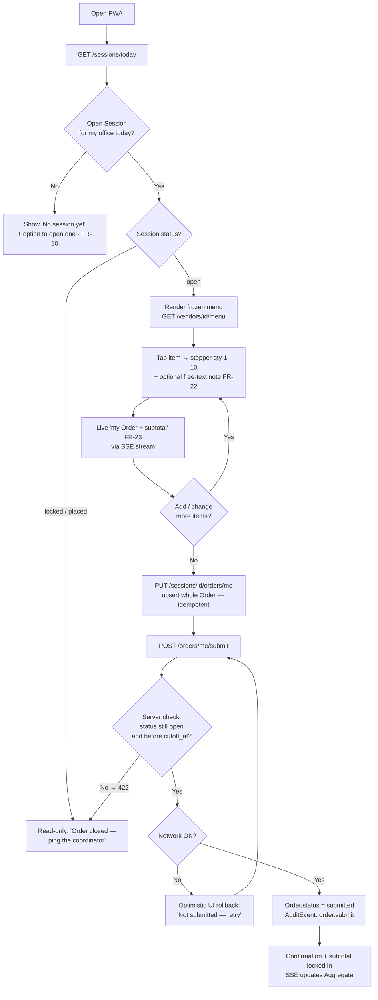

---

### (b) Editing an Order before Cutoff

**Persona:** Mariam or Tarek changing their mind. There is **exactly one Order per user per Session** (`unique(session_id, user_id)`), so editing is never an append — it is a full **upsert** through the same `PUT /sessions/{id}/orders/me`. No `/order-items` CRUD exists by design. The gate is always server-side: is the Session still `open` and are we before `cutoff_at`? **After Cutoff → blocked (422)**, late-add becomes the Coordinator's manual call. Two-device concurrency resolves last-write-wins with an "updated 2s ago" marker — per-person isolation makes this a non-issue.

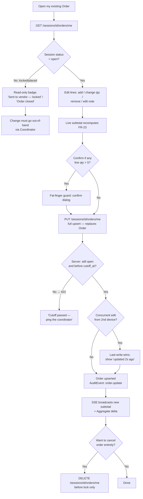

---

### (c) Coordinator reviewing & aggregating

**Persona:** Tarek "The Reluctant Coordinator" — dormant for weeks, re-learning every time, so this must be near-zero effort. **The mission is that he touches nothing but "Place" (§4.2, Day-1 acceptance test).** While the Session is `open` he can watch the live Aggregate (`GET /sessions/{id}/aggregate`, coordinator-only) and grand total (FR-32) update over SSE. His only legitimate in-flight actions: mark an item sold-out (FR-61, "swap or drop" to affected users), set the `delivery_fee` (FR-33), or **close early** (FR-13). Everything else — roll-up, per-person Tally, totals — is automatic.

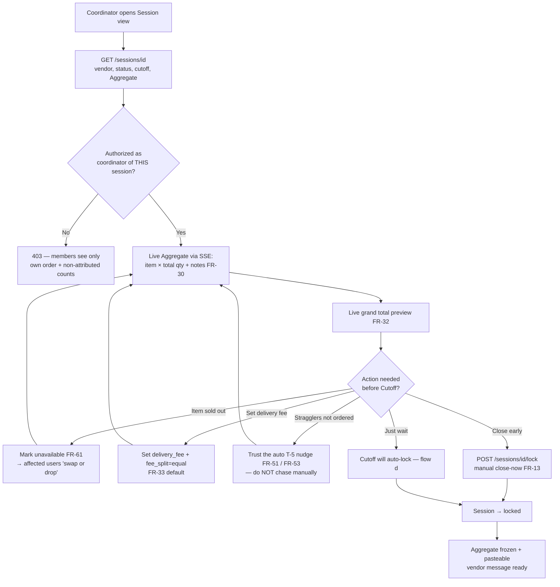

---

### (d) Closing orders / Cutoff reached

**The auto-lock is the heart of deleting the Coordinator role (§4.2, R2).** A worker fires at `cutoff_at` (or the Coordinator triggers FR-13) and atomically locks the Session — an edit at T-0 is deterministically in or out (§10). On lock the system snapshots `amount_due` per Order into a Payment row (one-to-one), produces the Aggregate + per-person Tally (FR-30/31), and notifies (FR-52). **Zero orders → auto-cancel. One order → send but warn (vendor minimum).** Placing is out-of-band; any allowlisted **Sender** can press Place, so an absent Coordinator is never a single point of failure (R2, keystone-failure edge case).

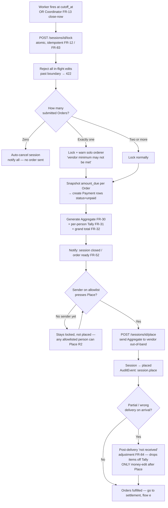

---

### (e) Payment / settlement reconciliation

**Persona:** Karim "The Settle-Up Skeptic" (slow payer, wants accurate balances, no public shaming) and the Coordinator confirming receipt. **Core stance: we track settlement, we never move money (§4.1, FR-47 = Won't).** This is the **two-step settlement**: payer self-claims `mark-paid` (FR-40/42 — a timestamped claim, not proof), then the Coordinator `confirms` receipt (FR-40). Disputes are **never arbitrated** — the timestamped claim plus a transparent Ledger (FR-41) kills ~90% of them (R3). Reminders are **impersonal automated nudges** (FR-55) so no colleague personally duns another. Coordinator may `waive` a debt; nobody is blocked from future ordering over an unpaid balance (too punitive — edge case).

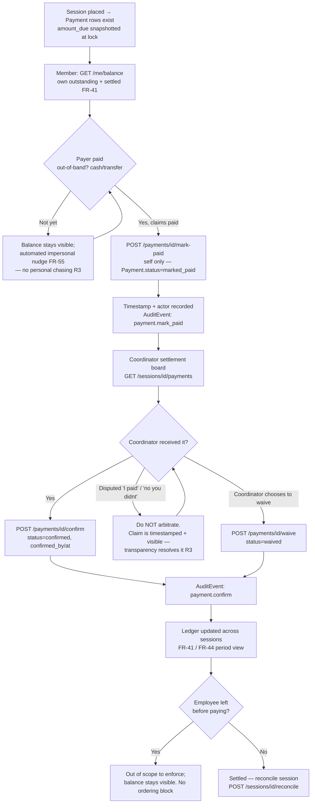

---

## 10. Data Model

All money fields are `numeric(10,2)` — never float. All money arithmetic is server-side. Snapshots (`name_snapshot`, `unit_price_snapshot`, `amount_due`) are non-negotiable: they freeze money against later menu/price edits so totals stay correct and reproducible.

### Office

Scopes Sessions to a physical office; its `timezone` drives the office-local "today" and all Cutoff math.

| Field | Type | Notes |
|---|---|---|
| `id` | uuid PK | |
| `name` | text | |
| `timezone` | text | IANA zone (e.g. `Africa/Cairo`). **Critical** — drives `service_date` and `cutoff_at`. |
| `default_cutoff_time` | time | Local time; default Cutoff when opening a Session. |
| `created_at` | timestamptz | |

**Relationships:** 1—N `OrderSession`; 1—N `User` (default office).

### User

Shadow profile of an SSO identity. JIT-provisioned on first OIDC login.

| Field | Type | Notes |
|---|---|---|
| `id` | uuid PK | |
| `sso_subject` | text | OIDC `sub`. **Unique.** |
| `email` | citext | **Unique.** |
| `display_name` | text | Shown on orders (FR-02). |
| `role` | enum(`member`,`coordinator`,`admin`) | Standing privileges. Coordinator-**on-session** is separate (see `OrderSession.coordinator_id`). |
| `default_office_id` | uuid FK→Office | |
| `is_active` | bool | |
| `created_at` / `updated_at` | timestamptz | |

**Relationships:** 1—N `Order`; 1—N `Payment` (as payer); 0—N `OrderSession` (as coordinator).

### Vendor

The restaurant. Admin-curated; vendors never log in, have no API, no portal (§7).

| Field | Type | Notes |
|---|---|---|
| `id` | uuid PK | |
| `name` | text | |
| `phone` | text | Where the Aggregate is sent, out-of-band. |
| `is_active` | bool | |
| `min_order_total` | numeric(10,2) | Nullable. Drives the solo-orderer warning (§11 edge cases). |
| `notes` | text | |

**Relationships:** 1—N `MenuCategory`; 1—N `MenuItem`; 1—N `OrderSession`.

### MenuCategory

Groups MenuItems for the ordering screen's UX.

| Field | Type | Notes |
|---|---|---|
| `id` | uuid PK | |
| `vendor_id` | uuid FK→Vendor | |
| `name` | text | |
| `sort_order` | int | Render order. |

**Relationships:** N—1 `Vendor`; 1—N `MenuItem`.

### MenuItem

A purchasable item with a current price. Near-static, admin-curated (FR-60/FR-62).

| Field | Type | Notes |
|---|---|---|
| `id` | uuid PK | |
| `vendor_id` | uuid FK→Vendor | |
| `category_id` | uuid FK→MenuCategory | Nullable. |
| `name` | text | |
| `price` | numeric(10,2) | Current price. **Snapshotted** into `OrderItem` at order time. |
| `is_available` | bool | Sold-out toggle (FR-61). |
| `options_schema` | jsonb | Nullable. Lightweight modifiers (FR-25, V2). **Not** a relational option tree. |
| `sort_order` | int | |

**Relationships:** N—1 `Vendor`; N—1 `MenuCategory`; referenced (snapshotted) by `OrderItem`.
**Rule:** Price may change over time; `OrderItem` snapshots price at order time, so historical Tallies never drift.

### OrderSession *(the spine)*

One daily ordering window per (office, vendor, service-date). Everything hangs off it.

| Field | Type | Notes |
|---|---|---|
| `id` | uuid PK | |
| `office_id` | uuid FK→Office | |
| `vendor_id` | uuid FK→Vendor | |
| `service_date` | date | Office-local. Part of the uniqueness key. |
| `status` | enum(`open`,`locked`,`placed`,`reconciled`,`cancelled`) | The lifecycle (FR-14). |
| `coordinator_id` | uuid FK→User | The per-session owner — a role on the Session, not a job title (§3). |
| `cutoff_at` | timestamptz | Hard auto-lock instant (FR-12). |
| `placed_at` | timestamptz | Nullable. Set when Sender Places. |
| `delivery_fee` | numeric(10,2) | Default `0` (FR-33). |
| `fee_split` | enum(`equal`,`proportional`,`none`) | Default `equal` (FR-34; only `equal` ships in MVP). |
| `notes` | text | |
| `created_at` / `updated_at` | timestamptz | |

**Constraint:** `unique(office_id, vendor_id, service_date)` — kills duplicate Sessions at the schema level (FR-11).
**Relationships:** N—1 `Office`; N—1 `Vendor`; 1—N `Order`; 1—N `Payment` (via Orders).

### Order

One user's basket in a Session. The dedup boundary — exactly one per user per Session, edited via upsert, never appended.

| Field | Type | Notes |
|---|---|---|
| `id` | uuid PK | |
| `session_id` | uuid FK→OrderSession | |
| `user_id` | uuid FK→User | |
| `status` | enum(`draft`,`submitted`,`cancelled`) | |
| `subtotal` | numeric(10,2) | Sum of `OrderItem.line_total`. Server-computed. |
| `fee_share` | numeric(10,2) | Default `0`. This Order's slice of `delivery_fee`. Stored per-order so totals are explainable. |
| `total` | numeric(10,2) | `subtotal + fee_share`. Snapshotted into `Payment.amount_due` at lock. |
| `submitted_at` | timestamptz | Nullable. |
| `created_at` / `updated_at` | timestamptz | |

**Constraint:** `unique(session_id, user_id) where status != 'cancelled'` — one live Order per user per Session (FR-11 dedup). Makes duplicate submissions structurally impossible.
**Relationships:** N—1 `OrderSession`; N—1 `User`; 1—N `OrderItem`; 1—1 `Payment`.

### OrderItem

A line in an Order with frozen price. Snapshots survive menu/price edits.

| Field | Type | Notes |
|---|---|---|
| `id` | uuid PK | |
| `order_id` | uuid FK→Order | |
| `menu_item_id` | uuid FK→MenuItem | Reference for provenance; **not** trusted for price. |
| `name_snapshot` | text | Frozen item name at order time. |
| `unit_price_snapshot` | numeric(10,2) | Frozen price at order time. |
| `quantity` | int | `≥ 1`, sane max (1–10); confirm if > 5 (§11 fat-finger). |
| `selected_options` | jsonb | Nullable (FR-25, V2). |
| `note` | text | Nullable. Free-text dietary note (FR-22); rides to the Aggregate. **No allergen taxonomy** (§4.8). |
| `line_total` | numeric(10,2) | `= unit_price_snapshot × quantity`. Server-computed. |

**Relationships:** N—1 `Order`; references `MenuItem`.
**Rule:** Snapshots are the money-correctness backbone — once written, a later price edit can never change a past Tally.

### Payment *(settlement record — NOT a transaction processor)*

Tracks a debt and its settlement state. **No money ever moves** (§4.1). Two-step: payer `mark_paid` → coordinator `confirm`.

| Field | Type | Notes |
|---|---|---|
| `id` | uuid PK | |
| `order_id` | uuid FK→Order | **Unique** (1—1 with Order). |
| `session_id` | uuid FK→OrderSession | Denormalized for the settlement board. |
| `payer_id` | uuid FK→User | Denormalized. |
| `amount_due` | numeric(10,2) | `= Order.total` **snapshotted at lock**. Frozen — never recomputed except FR-84. |
| `status` | enum(`unpaid`,`marked_paid`,`confirmed`,`waived`) | |
| `method` | enum(`cash`,`bank_transfer`,`wallet`,`other`) | Nullable. **Informational only** (FR-43, V2). |
| `marked_paid_at` | timestamptz | Nullable. Self-serve claim timestamp (FR-40/FR-42). |
| `confirmed_by` | uuid FK→User | Nullable. The Coordinator who confirmed. |
| `confirmed_at` | timestamptz | Nullable. |

**Relationships:** 1—1 `Order`; N—1 `OrderSession`; N—1 `User` (payer).
**Rule:** "Mark Paid" is a timestamped *claim by whom*, not proof. Two-step settlement gives non-repudiation without a payment rail. The app is source of truth for *what was owed*, never for *whether cash changed hands* (§4.4).

### AuditEvent *(append-only — money-trust backbone)*

Immutable trail of every state transition and money-affecting action.

| Field | Type | Notes |
|---|---|---|
| `id` | bigint PK | Sequence. |
| `actor_id` | uuid FK→User | Who did it. |
| `action` | text | e.g. `order.submit`, `session.lock`, `payment.confirm`, `item.price_change`. |
| `entity_type` | text | |
| `entity_id` | uuid | |
| `before` | jsonb | Pre-state. |
| `after` | jsonb | Post-state diff. |
| `created_at` | timestamptz | |
| `request_id` | text | Correlates a request across rows. |

**Rule:** INSERT-only at the DB-grant level — **no UPDATE, no DELETE**. Every `submit`, `lock`, `place`, `mark-paid`, `confirm`, `waive`, `price_change` writes one row.

> **Notification:** No table at MVP (§7). Notifications are fire-and-forget Slack/email webhooks. Deferred schema if ever needed: `id, user_id, type, payload jsonb, sent_at, read_at`.

### Key indexes & constraints

| Purpose | Definition |
|---|---|
| One Session per office/vendor/day | `unique(OrderSession.office_id, vendor_id, service_date)` |
| One live Order per user per Session | `unique(Order.session_id, user_id) where status != 'cancelled'` |
| One Payment per Order | `unique(Payment.order_id)` |
| SSO identity uniqueness | `unique(User.sso_subject)`, `unique(User.email)` |
| Hot path — `GET /sessions/today` | index `(OrderSession.office_id, service_date, status)` |
| Settlement board | index `(Payment.session_id, status)` |
| Personal balance (`GET /me/balance`) | index `(Payment.payer_id, status)` |
| Audit lookup | index `(AuditEvent.entity_type, entity_id)`; append-only grant (no UPDATE/DELETE) |
| Menu render | index `(MenuItem.vendor_id, category_id, sort_order)` |

### Relationships (narrative)

- An **Office** has many **OrderSessions** and is the default home for many **Users**.
- A **Vendor** owns a near-static catalog (**MenuCategory** → **MenuItem**) and supplies many **OrderSessions**.
- An **OrderSession** is the spine: it binds one Office + one Vendor + one `service_date`, is owned by one **User** as `coordinator_id`, and contains many **Orders**.
- Each **Order** belongs to one **User**, holds many **OrderItems** (each snapshotting a **MenuItem**), and has exactly one **Payment**.
- Every money-affecting transition emits an append-only **AuditEvent**.

### ER diagram

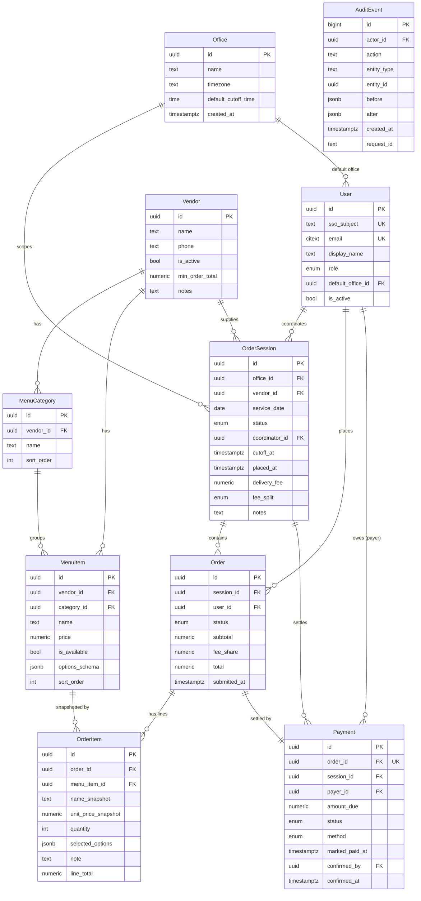

## 11. API Design

REST over `/api/v1`, JSON only. Auth is the company SSO/OIDC session as an **HttpOnly/Secure/SameSite=Lax cookie**; mobile/PWA clients that prefer a header may send the same session as `Authorization: Bearer <token>`. Object-level authz runs server-side on **every** endpoint — a `member` never sees another person's itemized Order or who-owes-what. Every mutation emits an `AuditEvent`. Field names are identical to §10.

**Authz tiers (from §10 NFR):**
- **Member** — own Order, own cost, own balance, the menu, non-attributed Aggregate counts.
- **Coordinator (per Session)** — all Orders, full Aggregate, settlement board — *only for Sessions they coordinate.*
- **Admin** — Vendor/MenuItem/Audit. Not auto-granted to read arbitrary personal Orders.

**Conventions:**
- `401` unauthenticated · `403` wrong tier / not your Session · `404` hidden-as-404 for objects you may not see · `409` constraint conflict (duplicate Session) · `422` business-rule violation (past Cutoff, locked).
- All `numeric(10,2)` money is serialized as a **decimal string** (`"32.50"`), never a float.

### Identity / bootstrap

| Method | Path | Tier | Purpose |
|---|---|---|---|
| `GET` | `/me` | member | Current user + `role` + `default_office_id` |
| `GET` | `/offices` | member | List offices |
| `GET` | `/offices/{id}` | member | One office (incl. `timezone`, `default_cutoff_time`) |

### Vendors & Menu *(admin-curated)*

| Method | Path | Tier | Purpose |
|---|---|---|---|
| `GET` | `/vendors` | member | Active vendors |
| `POST` | `/vendors` | admin | Create vendor |
| `PATCH` | `/vendors/{id}` | admin | Edit vendor |
| `GET` | `/vendors/{id}/menu` | member | Categories + items in one call — the ordering screen's catalog |
| `POST` | `/vendors/{id}/menu-items` | admin | Add MenuItem |
| `PATCH` | `/menu-items/{id}` | admin | Edit MenuItem (`price`, `is_available` sold-out toggle) — emits `item.price_change` |
| `DELETE` | `/menu-items/{id}` | admin | Soft-delete |

### Sessions *(the daily flow)*

| Method | Path | Tier | Purpose |
|---|---|---|---|
| `GET` | `/sessions/today` | member | **Most-hit endpoint.** Today's Session for my office |
| `GET` | `/sessions?office_id=&date=&status=` | member | List/filter Sessions |
| `GET` | `/sessions/{id}` | member | Full Session: vendor, status, cutoff, **my** Order (Aggregate only if coordinator) |
| `POST` | `/sessions` | member | Open a Session — `409` if duplicate (surfaces the unique constraint) |
| `POST` | `/sessions/{id}/lock` | coordinator | Idempotent manual "close now" (FR-13) |
| `POST` | `/sessions/{id}/place` | sender | Mark locked order as sent to vendor |
| `POST` | `/sessions/{id}/reconcile` | coordinator | Close out settlement for the Session |
| `POST` | `/sessions/{id}/cancel` | coordinator | Void all Orders, notify all (only before Place) |
| `GET` | `/sessions/{id}/aggregate` | coordinator | The Aggregate + pasteable vendor message |
| `GET` | `/sessions/{id}/orders` | coordinator | All Orders in the Session |
| `GET` | `/sessions/{id}/payments` | coordinator | The settlement board |
| `GET` | `/sessions/{id}/stream` | member | **SSE** delta channel (order/aggregate/status) for the AM window |

### Orders *(per-user basket)*

| Method | Path | Tier | Purpose |
|---|---|---|---|
| `GET` | `/sessions/{id}/orders/me` | member | My Order (lazy `draft` or `404`) |
| `PUT` | `/sessions/{id}/orders/me` | member | **Upsert whole Order** — idempotent, enforces one-per-user |
| `POST` | `/sessions/{id}/orders/me/submit` | member | `draft` → `submitted` (`422` if past Cutoff/locked) |
| `DELETE` | `/sessions/{id}/orders/me` | member | Cancel before lock |

> **No `/order-items` CRUD.** Item edits go through the whole-Order `PUT` upsert. There is no append path — that is how duplicates become structurally impossible.

### Payments / Settlement

| Method | Path | Tier | Purpose |
|---|---|---|---|
| `GET` | `/payments?session_id=&status=` | member/coordinator | Coordinator sees the board; member sees **own only** |
| `POST` | `/payments/{id}/mark-paid` | member (self) | Self-serve "I paid" claim (FR-40/FR-42) |
| `POST` | `/payments/{id}/confirm` | coordinator | Confirm receipt — step 2 of two-step settlement |
| `POST` | `/payments/{id}/waive` | coordinator | Waive a debt |
| `GET` | `/me/balance?range=` | member | My outstanding/settled across Sessions |
| `POST` | `/sessions/{id}/orders/{order_id}/not-received` | coordinator | FR-84 — drop undelivered items from the Tally (the only money-edit after Place) |

### Audit

| Method | Path | Tier | Purpose |
|---|---|---|---|
| `GET` | `/audit?entity_type=&entity_id=` | admin/coordinator | Read-only trail |

---

### Key endpoint examples

#### 1. `PUT /sessions/{id}/orders/me` — upsert my Order *(idempotent)*

The heart of the product: the median user, Mariam, hits this once and is done in <15s. The client sends the **whole** Order; the server replaces the item set, recomputes money server-side, and upserts the single per-user Order row. Safe under double-tap/retry — **last-write-wins** on the one record, so a network retry never creates a second Order. Send an `Idempotency-Key` to make a retried submit provably a no-op.

**Request**
```json
PUT /api/v1/sessions/2f9c.../orders/me
Idempotency-Key: 4b1e-usual-0608

{
  "items": [
    { "menu_item_id": "a11c...", "quantity": 1, "note": "oat milk" },
    { "menu_item_id": "b22d...", "quantity": 2, "note": "" }
  ]
}
```

**Response** `200 OK` *(server snapshots names/prices and computes every total)*
```json
{
  "id": "ord_77a1...",
  "session_id": "2f9c...",
  "user_id": "usr_mariam...",
  "status": "draft",
  "items": [
    {
      "id": "oi_01...",
      "menu_item_id": "a11c...",
      "name_snapshot": "Foul Sandwich",
      "unit_price_snapshot": "20.00",
      "quantity": 1,
      "note": "oat milk",
      "line_total": "20.00"
    },
    {
      "id": "oi_02...",
      "menu_item_id": "b22d...",
      "name_snapshot": "Falafel Sandwich",
      "unit_price_snapshot": "12.50",
      "quantity": 2,
      "note": "",
      "line_total": "25.00"
    }
  ],
  "subtotal": "45.00",
  "fee_share": "5.00",
  "total": "50.00",
  "updated_at": "2026-06-08T07:06:11Z"
}
```
> `422` if the Session is already `locked`/`placed`. `name_snapshot`/`unit_price_snapshot` are taken from the live `MenuItem` at write time and frozen — the client's prices are never trusted.

#### 2. `POST /sessions` — open a Session *(duplicate-safe)*

**Request**
```json
POST /api/v1/sessions

{
  "office_id": "off_cairo...",
  "vendor_id": "ven_tahrir...",
  "service_date": "2026-06-08",
  "cutoff_at": "2026-06-08T07:30:00Z",
  "delivery_fee": "30.00"
}
```

**Response** `201 Created`
```json
{
  "id": "2f9c...",
  "office_id": "off_cairo...",
  "vendor_id": "ven_tahrir...",
  "service_date": "2026-06-08",
  "status": "open",
  "coordinator_id": "usr_tarek...",
  "cutoff_at": "2026-06-08T07:30:00Z",
  "delivery_fee": "30.00",
  "fee_split": "equal"
}
```
> `409 Conflict` if a Session already exists for this `(office_id, vendor_id, service_date)` — the `unique` constraint surfaced as an API error, with the existing Session id in the body so the client can redirect to it instead of creating a duplicate.

#### 3. `GET /sessions/{id}/aggregate` — the Aggregate *(coordinator-only)*

The kitchen-facing roll-up plus a pasteable WhatsApp message. Zero manual math — this is what makes the Coordinator role disappear.

**Response** `200 OK`
```json
{
  "session_id": "2f9c...",
  "vendor": { "name": "Tahrir Foul", "phone": "+20100..." },
  "status": "locked",
  "lines": [
    { "name_snapshot": "Foul Sandwich", "total_quantity": 14, "notes": ["oat milk", "no salt"] },
    { "name_snapshot": "Falafel Sandwich", "total_quantity": 22, "notes": [] }
  ],
  "delivery_fee": "30.00",
  "grand_total": "642.50",
  "pasteable": "Tahrir Foul order:\n14x Foul Sandwich (notes: oat milk, no salt)\n22x Falafel Sandwich\nDelivery: 30.00\nTotal: 642.50"
}
```
> `403` for non-coordinators. Members get only non-attributed counts via `/sessions/{id}`, never the named breakdown.

#### 4. `POST /payments/{id}/mark-paid` — self-serve claim

Step 1 of two-step settlement. A timestamped *claim by whom* — not proof, not a money movement (§4.1).

**Request**
```json
POST /api/v1/payments/pay_88b2.../mark-paid

{ "method": "bank_transfer" }
```

**Response** `200 OK`
```json
{
  "id": "pay_88b2...",
  "order_id": "ord_77a1...",
  "payer_id": "usr_mariam...",
  "amount_due": "50.00",
  "status": "marked_paid",
  "method": "bank_transfer",
  "marked_paid_at": "2026-06-08T09:12:40Z",
  "confirmed_by": null,
  "confirmed_at": null
}
```
> Self-only: a member may `mark-paid` **only** their own Payment (`403` otherwise). The Coordinator later `POST .../confirm` to reach `confirmed`. Both actions are rate-limited and audited.

#### 5. `POST /sessions/{id}/orders/{order_id}/not-received` — post-delivery adjustment (FR-84)

The **only** money-edit permitted after `place`. The Coordinator drops undelivered items; the server recomputes that Order's `total` and re-snapshots the linked `Payment.amount_due`, writing an `AuditEvent`.

**Request**
```json
POST /api/v1/sessions/2f9c.../orders/ord_77a1.../not-received

{ "order_item_ids": ["oi_02..."], "reason": "kitchen ran out of falafel" }
```

**Response** `200 OK`
```json
{
  "order_id": "ord_77a1...",
  "removed_item_ids": ["oi_02..."],
  "subtotal": "20.00",
  "fee_share": "5.00",
  "total": "25.00",
  "payment": { "id": "pay_88b2...", "amount_due": "25.00", "status": "unpaid" }
}
```
> Allowed only when Session `status` is `placed`. Any other money-edit after Place is `422`.

### Idempotency, concurrency & status codes

- **Order submit/upsert is idempotent.** `PUT /orders/me` is a whole-record upsert keyed on `unique(session_id, user_id)`; replaying it (double-tap, flaky-wifi retry) converges to the same single Order. An optional `Idempotency-Key` header makes a retry a provable no-op. The client uses **optimistic UI + retry**; the server **never returns a false success** — an unconfirmed write at Cutoff is treated as *not ordered*.
- **Lock is idempotent and atomic.** `POST /sessions/{id}/lock` is safe to call twice; the auto-lock worker and a manual "close now" converge on the same `locked` state. An edit racing the Cutoff is deterministically in or out at the lock boundary (FR-83).
- **`409` is a feature, not an error.** `POST /sessions` returns `409` with the existing Session id on a duplicate `(office_id, vendor_id, service_date)` — the client redirects rather than retries.
- **`422` for business rules:** submit after Cutoff, edit after `place` (except `not-received`), or cancel after `place`. The hard Cutoff is server-enforced; the UI shows *"Order closed — ping the coordinator."*
- **SSE for the AM spike:** `GET /sessions/{id}/stream` pushes `order`, `aggregate`, and `status` deltas (<1s end-to-end) so ~100 concurrent clients see live state without polling.

---

## 12. Admin & Operations

*Who keeps MorningCart running, and exactly what they touch. The north star (§4.2): admin/operator touch-time trends toward zero. Every runbook step below either configures the system once or recovers from an exception — never daily manual aggregation, arithmetic, or chasing.*

---

### 12.1 Admin roles & who owns what

There are exactly **two standing roles** plus one **per-session role**. We do not build complex RBAC (§7) — tens of trusting colleagues need an allowlist and an admin, not approval workflows.

| Role | Entity source | Who holds it | Owns |
|---|---|---|---|
| **Admin** | `User.role = admin` | Salma "The Operator" (office manager); 1–2 backups | Vendors, menu (items/categories/availability/prices), Office config (`timezone`, `default_cutoff_time`), recurring-session schedule, audit read access |
| **Coordinator** (per-session) | `OrderSession.coordinator_id` | Whoever opens the Session or is on rotation (e.g., Tarek) | Operational control of **their** Session only: `lock`/`place`/`cancel`, Aggregate, settlement board, `confirm`/`waive`, FR-84 not-received adjustment |
| **Member** | `User.role = member` | Everyone else (Mariam, Karim) | Own Order, own cost, own balance, the menu |

**Hard rules:**
- **Admin ≠ omniscient.** Per §10, an Admin is **not** auto-granted to read arbitrary personal Orders or the settlement board unless they also coordinate that Session. Least privilege. Salma sees money detail only for Sessions she runs.
- **Coordinator is a Session field, not a job title (§3).** Granting it is a one-line write to `OrderSession.coordinator_id`, not a permission grant. The product mission is to shrink this role toward zero, not staff it.
- **Sender allowlist ≠ Coordinator.** `Place` can be performed by the Coordinator or anyone on a small per-office allowlist (§4.2, R2). This is the SPOF kill switch: if Tarek is out, anyone allowlisted Places. (MVP: allowlist = `{coordinator, admins}`; a first-class allowlist field is V3 alongside FR-03.)
- **Admin UI at MVP is Django Admin (§7, §12).** No custom admin surface ships in week 1. Salma does all CRUD below in Django Admin against the canonical entities.

---

### 12.2 Vendor management

Vendors are an **external constraint, not an integration** (§4.7). They never log in. Admin curates the `Vendor` record; the app produces a pasteable artifact and the human sends it out-of-band.

| Field (`Vendor`) | Operator guidance |
|---|---|
| `name` | Display name on Sessions. |
| `phone` | Where the order is actually sent. **The single most operationally important field** — if wrong, the Aggregate goes nowhere. |
| `is_active` | Soft on/off. **Never hard-delete a vendor** — historical Sessions/OrderItems reference it via snapshots. Deactivate instead; it drops from the new-Session vendor picker but history stays intact. |
| `min_order_total` | Drives the solo/under-minimum warning (§11 edge case). Nullable. |
| `notes` | Free text — delivery quirks, "closed Fridays," cash-only, etc. |

**Operator runbook — adding/changing a vendor:**
1. `POST /vendors` (admin) or Django Admin → create with `name`, `phone`, optional `min_order_total`.
2. Build its menu (§12.3) before opening any Session against it.
3. To retire a vendor: set `is_active = false`. Do not delete. Open Sessions on that vendor are unaffected (snapshots); it simply disappears from future pickers.

Multiple vendors in the catalog is **V2 (FR-63)**; choosing one vendor per Session. A vendor self-serve portal / API is **never built (FR-65, §7)**.

---

### 12.3 Menu management (items, categories, availability)

Menus are **admin-curated and near-static** (§4.7). The data model is deliberately shallow: `Vendor → MenuCategory → MenuItem`. No relational option tree (§8).

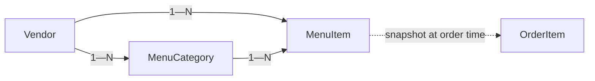

**Categories (`MenuCategory`):** `name` + `sort_order`. Purely UX grouping ("Hot Drinks," "Sandwiches") to keep the ordering screen scannable for Mariam's <15s order (R4). Optional — `MenuItem.category_id` is nullable.

**Items (`MenuItem`):**

| Field | Operator action | MVP? |
|---|---|---|
| `name` | The label Mariam taps. | FR-60 |
| `price` `numeric(10,2)` | Current price. **Never a float.** See §12.4 for change semantics. | FR-60 |
| `is_available` | The **sold-out toggle** (FR-61). Hide an item without deleting it. | FR-61 |
| `category_id` | Optional grouping. | FR-60 |
| `sort_order` | Display order within category. | FR-60 |
| `options_schema` (jsonb) | Lightweight modifiers (size, add-ons). **V2 (FR-25)** — leave null at MVP. | V2 |

**Availability — two distinct mechanisms, do not confuse them:**

| Mechanism | Scope | Owner | When |
|---|---|---|---|
| `MenuItem.is_available = false` | **Catalog-wide**, all future Sessions | Admin | Item permanently/indefinitely off-menu |
| Coordinator marks unavailable **for a session** | **This Session only** (§11: "Item sold out") | Coordinator | Vendor is out today; affected users get "swap or drop" |

The catalog toggle is the durable one. The per-Session sold-out is the Coordinator's tactical move on the day and does **not** mutate the catalog.

**Soft delete only.** `DELETE /menu-items/{id}` is soft (§9). A removed item still exists for every historical `OrderItem` that snapshotted it. Hard deletion would orphan nothing (snapshots are self-contained) but is still disallowed to preserve the menu's auditability.

---

### 12.4 Pricing updates — how price changes interact with sessions

This is the section most likely to be gotten wrong, so be explicit. The governing rule (§4.6, §6, §8, §11): **prices freeze at Session open; OrderItem snapshots `unit_price_snapshot` at order time; `amount_due` snapshots at lock.** A price edit is just a write to `MenuItem.price` and never reaches back into existing money.

| Session state at moment of price edit | Effect of editing `MenuItem.price` |
|---|---|
| **No open Session** (catalog edit) | New price applies to the **next** Session opened against that vendor. Clean. |
| **Session OPEN** | **Ignored for that Session.** Per §11 "Vendor price change mid-session → Ignored. Prices frozen at Session open." Orders already snapshotted keep their snapshot; new Orders in that Session also use the frozen-at-open price, **not** the new catalog price. Reconcile next day. |
| **Session LOCKED / PLACED** | No effect. `amount_due` is frozen at lock; the Tally is immutable money. |
| **Historical (`reconciled`)** | No effect, ever. Snapshots are permanent. |

**Why this is correct, not lazy:** the alternative — repricing an in-flight Session — silently changes what a colleague owes after they ordered. That is exactly the trust-erosion failure (R3) the product exists to prevent. We snapshot at the schema level so money cannot drift (§4.6).

**Every price change is audited.** `MenuItem.price` edits emit an `item.price_change` `AuditEvent` with `before`/`after` (§8, §10). Salma's monthly reconciliation can see precisely when and by whom a price moved.

**Operator runbook — price update:**
1. Edit `MenuItem.price` in Django Admin (or `PATCH /menu-items/{id}`).
2. Confirm no surprise: it affects the **next** Session only. To force a price into *today's* breakfast, you must edit **before** opening the Session.
3. Done. No backfill, no recompute, no touching existing Orders or Tallies.

---

### 12.5 Session management (scheduling, cutoffs, cancel/reopen, holidays)

**Default cutoff time.** Each `Office` carries `default_cutoff_time` (office-local) and an IANA `timezone` (§8 — `timezone` is **critical**; it drives "today" and all Cutoff math). New Sessions inherit `default_cutoff_time`; the Coordinator may override `cutoff_at` per Session at open.

**Scheduling recurring daily sessions (FR-15, V2 — auto-open is *not* in the 1-week MVP cut, §12 MVP).**
- At MVP, **a human opens the Session** (`POST /sessions`, FR-10) — any user, typically Salma or the day's Tarek. This is deliberate: "Manual start beats clever calendar logic" (§11).
- At V2, the async worker (Celery/RQ/Django-Q, §10) auto-opens a Session on a per-office **weekday** schedule at a configured time, pre-filling vendor + `cutoff_at` from `default_cutoff_time`. This is the direct mechanism for **deleting the Coordinator role (§4.2, R2):** no human is required to open.
- The `unique(office_id, vendor_id, service_date)` constraint (FR-11, §8) guarantees the scheduler and a human cannot both create the same Session — second insert gets a `409` (§9). Idempotent by construction.

**Cutoff / auto-lock.** The worker auto-locks at `cutoff_at` (FR-12, FR-83). This is the heart of "zero coordinator burden" — no human is the deadline (Tarek's top frustration, §5). `POST /sessions/{id}/lock` is idempotent; an edit at T-0 is deterministically in or out (§10).

**Cancel & reopen:**

| Action | Endpoint / Feature | Rules |
|---|---|---|
| **Manual close now** | `POST /sessions/{id}/lock` (FR-13) | Coordinator locks early. Idempotent. |
| **Cancel** | `POST /sessions/{id}/cancel` | All Orders voided, everyone notified, no Tally (§11). **Cannot cancel after `placed`** — use FR-84 instead. |
| **Reopen for 5 min grace** | FR-16, **V2 (Could)** | Short post-lock grace window, Coordinator-triggered. **Not in MVP.** At MVP, post-lock late orders go through the manual late-add escape hatch (§11, R7) owned by the Sender — no automatic reopen. |
| **Auto-cancel on zero orders** | worker, at Cutoff | If a Session locks with zero Orders → auto-cancel + notify, no order sent (§11). |
| **Solo order** | warn, do not cancel | One Order at Cutoff → send it but warn the solo orderer re: `min_order_total` (§11). |

**Holidays & weekends (§11):**
- **No weekend/holiday auto-session by default.** The V2 recurring scheduler runs **weekdays only**; weekend/holiday auto-open is **opt-in only**. "Manual start beats clever calendar logic" (§11).
- There is **no holiday calendar entity** at MVP (YAGNI, §7). If the office is closed on a normally-scheduled weekday (national holiday), the operator simply **does not open** the Session (MVP) or **skips** that day's auto-open (V2 — pause the schedule or skip the date). No order is sent if no Session exists; nothing to clean up.
- Per-office local time means a multi-office rollout (V3, FR-04) handles divergent holidays naturally — each Office's `timezone` and schedule are independent.

---

### 12.6 The Operator's runbook (Salma "The Operator")

Salma is a **power user, low frequency, high stakes** (§5). Adoption depends on her. Her job is upkeep + exception handling, **not** daily coordination. If she is doing daily arithmetic or chasing payments, **we failed (§4.2).**

**Weekly (≈10–15 min, Monday upkeep):**
1. **Menu/price upkeep** — apply vendor price changes for the week in Django Admin (§12.4). Reorder/re-categorize if the vendor changed offerings.
2. **Availability sweep** — toggle `is_available` for anything the vendor has dropped/added.
3. **Vendor health** — confirm `phone` is current; update `notes` for known closures.
4. **(V2) Schedule check** — confirm the recurring auto-open schedule and `default_cutoff_time` are right for the week; skip dates for known holidays.

**Daily — MVP (target: <60 seconds, often zero):**
1. A human opens today's Session (Salma, or the rotating Tarek). One tap: vendor + inherited cutoff.
2. **Then nothing.** Orders flow in; the worker auto-locks at Cutoff; the app emits the Aggregate + Tally automatically. The Sender taps `Place`. Salma is not in the loop unless something breaks.

**Daily — V2+ (target: zero touches):**
1. Worker auto-opens the Session on schedule. Salma touches nothing. The Coordinator role is, by design, **gone** for the median day (§2, §4.2).

**Exception handling (the only reasons Salma is pulled in):**

| Trigger | Salma's action |
|---|---|
| Item sold out today | Coordinator marks unavailable for the Session; users get "swap or drop." If permanent, Salma sets catalog `is_available = false`. |
| Wrong/missing delivery | Coordinator applies FR-84 not-received adjustment — the **only** money-edit after `Place` (§11). |
| Coordinator/Sender absent | Anyone on the Sender allowlist Places (R2). Salma is fallback, not requirement. |
| Vendor price moved mid-week | Edit catalog price; it applies to the **next** Session, not today's (§12.4). |
| Payment dispute | **Do not arbitrate (§4.4, R3, §11).** Point both parties at the transparent `Mark Paid` claim (timestamp + actor). Visibility resolves ~90%. |

**Monthly (reconciliation):**
1. `GET /me/balance` and the per-Session settlement boards for Sessions she coordinated; cross-check `confirmed` Payments.
2. Spend report per person/period is **FR-73 (V2)**; payroll-deduction CSV is **FR-46 (Future)**. At MVP, reconciliation reads the Ledger + AuditEvent trail directly.
3. **Money never moves in MorningCart (§4.1).** Salma's "reconciliation" is reading a self-settling ledger and confirming claims — not collecting cash through the app. That stays out-of-band, by design.

**Acceptance for this role:** on a normal day Salma touches **nothing but (at MVP) the one-tap Session open**; the Sender touches **nothing but `Place`** (§12 Day-1 acceptance test). Any day where Salma does manual aggregation, arithmetic, or dunning is a product defect, not an operational reality.

---

## 13. Analytics

*Analytics exists to prove one thesis: the **Coordinator role trends toward zero** and **submit beats WhatsApp**. Every KPI below maps to a stance in §4 or a risk in §11. We are not building a data warehouse — these run off the `AuditEvent` append-only stream (§8) plus a handful of derived facts. No vanity metrics, no engagement dashboards; this is internal infra, not a consumer app.*

### 13.1 KPI Table

| Metric | Definition / Formula | Target | Why it matters |
|---|---|---|---|
| **Submit time-to-order** | Median wall-clock from `order.first_edit` (first `PUT /orders/me`) to `order.submit`, per user per Session | **p50 < 15s**, p90 < 30s | The R4 adoption kill-switch. If submitting is slower than typing in WhatsApp, the tool is dead. This is the single most important number. (§11 R4, §12 acceptance test) |
| **Ordering completion rate** | `submitted Orders ÷ Orders with ≥1 edit (draft started)` per Session | **> 95%** | Measures abandonment: people who started an Order but never crossed `submit` before Cutoff. A low rate means the submit step or Cutoff timing is broken. |
| **On-time-before-Cutoff rate** | `Orders submitted at ≤ (cutoff_at − 60s) ÷ all submitted Orders` | **> 98%** | Validates the hard Cutoff (FR-12) isn't catching people off guard. Chronic last-second submits → the T-minus reminder (FR-51) is mistimed or ignored. |
| **Participation rate** | `users with a submitted Order ÷ eligible eaters that day` (eligible = `Presence`-in once FR-18 ships; until then, rolling-30d active orderers in the office) | **> 70%** on active days | Adoption breadth. Are we capturing the whole team or just the early adopters? Falling participation = silent return to WhatsApp. |
| **Coordinator-minutes saved** | `baseline_manual_minutes − measured_coordinator_touch_time`, where touch-time = Σ active seconds the `coordinator_id` spends in coordinator-only surfaces (aggregate, settlement board, lock/place actions) per Session; baseline = pre-launch survey (assume ~20 min/session) | **Touch-time < 2 min/Session; ≥ 18 min saved/day** | The mission metric (§4.2). Coordinator role must shrink toward zero. If Tarek still spends 15 min, **we failed.** |
| **Orders per Session** | `count(submitted Orders) per Session`; report mean + distribution | Trend up, then stable at team size; flag Sessions with `< 2` (vendor-minimum risk, §11 solo-order edge) | Health + sizing signal. Sub-2 triggers the solo-orderer warning; drops vs. trailing-7d average flag a coordinator/notification failure. |
| **Order error rate** | `(Sessions with ≥1 post-Place "not received" adjustment (FR-84) + post-lock late-add toggles + sold-out swaps) ÷ Placed Sessions` | **< 5%** of Placed Sessions | Correctness proxy (§4.6). High rate = menu drift, stale prices, or vendor-side variance (R6). Distinguishes *our* bugs (Tally/aggregate wrong) from *vendor* variance (wrong delivery). Tag each adjustment with cause. |
| **Settlement completion rate** | `Payments reaching status=confirmed (or waived) ÷ Payments created`, measured at T+7d and T+30d after Session | **> 80% @ 7d, > 95% @ 30d** | The reconciliation pain we exist to kill (§4.4). Karim's metric. Persistent unpaid tails = the ledger isn't driving real-world settlement; consider FR-55 nudges / FR-45 deep-links. **Track-only — this never measures money moved, only claim/confirm state.** |
| **Mark-Paid → Confirm lag** | Median hours from `payment.mark-paid` to `payment.confirm` | **< 24h** | Exposes a one-sided ledger: payers claiming but Coordinators never confirming (or vice versa). A growing lag erodes trust (R3) even when the headline settlement rate looks fine. |
| **Repeat-usage / habit rate** | `users with ≥1 submitted Order on ≥4 of the last 5 active days ÷ active orderers` | **> 60%** (Mariam cohort) | The passive-median-user thesis (§4.3, persona #1). A high stick rate proves the daily ritual landed. Once FR-26 ships, also track `% of Orders created via "repeat my usual"`. |
| **Vendor accuracy** | `1 − (line items flagged not-received/wrong via FR-84 ÷ total line items Placed)`, per vendor, trailing 30d | **> 97%** per active vendor | Operator metric (Salma). Surfaces unreliable vendors for the rotation decision (R6). Feeds FR-74 vendor-reliability analytics in V3. Pure vendor signal — separate from *our* Tally correctness. |
| **Popular items** | `Σ OrderItem.quantity grouped by menu_item_id`, trailing 30d, ranked per vendor | Top-N leaderboard (informational) | Drives menu curation and sold-out prioritization for Salma; seeds FR-26 "usual" defaults and FR-72 favorites. No ML — people order the same thing daily (§7). |

### 13.2 Events to Instrument

All metrics derive from the append-only `AuditEvent` stream (§8) plus three lightweight client timing beacons. **No separate analytics DB at MVP** — query `AuditEvent` directly; roll up nightly into a derived `session_metrics` view if query cost grows.

**Already emitted as `AuditEvent` (server-side, free — §10 auditability):**

| Event `action` | Powers |
|---|---|
| `session.open` | Orders/Session denominator, Session inventory |
| `session.lock` | Cutoff boundary, on-time rate, completion rate |
| `session.place` | Order error rate denominator, vendor accuracy denominator |
| `session.cancel` | Excludes dead Sessions (zero-order auto-cancel) from rates |
| `order.submit` | Participation, orders/Session, on-time rate, repeat/habit rate |
| `order.cancel` | Abandonment, completion rate |
| `payment.mark-paid` | Settlement rate, mark-paid→confirm lag |
| `payment.confirm` / `payment.waive` | Settlement completion, confirm lag |
| `item.price_change` | Error-cause attribution (price drift) |
| `session.late_add` (manual toggle, §11) | Order error rate |
| `item.sold_out` + downstream swap/drop | Order error rate, sold-out attribution |
| `order.not_received` (FR-84) | Order error rate, vendor accuracy (carry line-item cause tag) |

**New client beacons required (the only net-new instrumentation):**

- `order.first_edit` — timestamp of the first `PUT /orders/me` for a (Session, user). Paired with `order.submit` → **submit time-to-order**. The one metric `AuditEvent` alone can't give us (it has the submit, not the *start*).
- `order.draft_started` — fired when a user opens the ordering surface with intent (first item tap). Denominator for **ordering completion rate**; distinguishes "started but bailed" from "never showed."
- `coordinator.surface_active` — heartbeat (≤1 per 15s, deduped) while `coordinator_id` is active on aggregate/settlement/place surfaces. Sums to **coordinator touch-time**. Without this we can only guess at the mission metric.

**Instrumentation rules:**
- Beacons are **fire-and-forget**, batched, and **never block** the order path (§11 R4 — nothing slows submit). Drop-on-failure; analytics is not money-critical.
- Money KPIs (settlement, error rate) read **only** server-side `AuditEvent` — never client beacons — so the trust backbone stays authoritative (§4.6, §10).
- Respect §10 authz: aggregate analytics are office-scoped and **non-attributed** to members. Per-person breakdowns (spend, habit) are visible to the user themselves, to Salma (admin) in aggregate, and never expose one colleague's itemized orders to another (R3, privacy default).
- Cohort by `Office` (timezone-correct `service_date`) so a 9am spike in Cairo isn't blended with one in Dubai.

---

## 14. Risks & Edge Cases

This section expands the master list in §11 into a working register. Likelihood and Impact are rated **Low / Med / High** for a single company of tens-to-low-hundreds of trusting colleagues — *not* a public marketplace. The bias throughout is the bible's: **correctness over features, track-only money, zero coordinator burden.** Every mitigation maps to a canonical feature ID, entity/field, or §4 stance. We do not re-litigate the big stances; we operationalize them.

### How to read this register

- **Likelihood** = how often this happens in normal daily operation for one office.
- **Impact** = blast radius if unmitigated (money correctness > missed breakfast > annoyance).
- **Product handling** = the *shipped* behavior, anchored to a feature ID / entity / §-stance. No "we should consider" — these are decisions.
- A risk being "accepted" is a decision, not a gap. We explicitly refuse to build fraud-proofing, payment rails, or allergen engines.

---

### 14.1 Product / User-Facing Risks

These threaten the core loop (§12): a fast, correct, coordinator-free order-and-settle ritual. Adoption (R4) and trust (R3) live here — they kill the product faster than any bug.

| # | Scenario | Likelihood | Impact | Product handling / mitigation |
|---|---|---|---|---|
| P1 | **Submit after Cutoff** (someone taps "submit" at T+30s) | High | Med | Hard lock at `cutoff_at` (FR-12). `POST /orders/me/submit` returns **422** past cutoff. Late submitter sees *"Order closed — ping the Coordinator."* Manual late-add is the **Sender's** call via the close/lock escape hatch (FR-13 path), never silent acceptance. `Order.submitted_at` is the arbiter, not client clock. |
| P2 | **Adoption failure — team stays on WhatsApp** (R4) | High | **High** | The existential risk. Submit must beat WhatsApp: **<15s, ≤2 taps** to add an item (§10, FR-23). Optimize for **Mariam** — one-tap "repeat my usual" (FR-26, V2) and default-to-last-order. If it's slower than the thread it replaces, it's dead. Tracked as a product success metric, not a feature. |
| P3 | **Payment dispute — "I paid" / "no you didn't"** (R3) | Med | Med-High | **We do not arbitrate** (§4.4). Two-step settlement: payer `mark-paid` (timestamped claim, by whom — `Payment.marked_paid_at`, FR-40/FR-42) → Coordinator `confirm` (FR-40, `confirmed_by`/`confirmed_at`). Transparent balances + non-repudiation kill ~90% of disputes. The app is source of truth for *owed*, never for *cash received*. |
| P4 | **Awkward dunning — colleague personally chasing colleague** (Karim's frustration) | Med | Med | Tool sends **impersonal automated** balance nudges (FR-55, V3); `GET /me/balance` is private to the user (§10 authz). No public shaming, no "Karim owes $45" broadcast. Skeptic settles in a batch; we never make a human the deadline. |
| P5 | **Off-by-one / fat-finger quantity** ("10 sandwiches" not 1) | Med | Med | Quantity **stepper**, sane max **1–10** (`OrderItem.quantity` int ≥1). **Confirm prompt if >5** of one item. Live `subtotal` (FR-23) self-catches — a $40 line jumps out. No free-text qty entry. |
| P6 | **Ordering for a guest / multiple items for self** | Med | Low | N OrderItems per Order; optional **"for: [name]"** free-text label; **all charged to the submitter** (FR-24, V2; edge §11). **No guest accounts** — guests are line items, not Users. Keeps the ledger one-payer-per-order (`Payment.payer_id`). |
| P7 | **Dietary / allergy request** ("no nuts," "oat milk") | High | **High** (if mishandled) | **Free-text per-item note only** (FR-22, §4.8). Note rides verbatim to the Aggregate (FR-30). **No allergen taxonomy** — it's liability theater software can't make safe. UI states plainly: *not a medical/allergen-safe system.* Honesty about what we can guarantee beats a false-safety structured engine. |
| P8 | **Solo orderer at Cutoff** (one Order in the session) | Med | Low-Med | **Send it, but warn** the solo orderer that `Vendor.min_order_total` may not be met (edge §11). **Do not auto-cancel** — their call whether to proceed or ping others. Surface the minimum in the lock confirmation. |
| P9 | **Item sold out mid-session** | Med | Med | Coordinator marks `MenuItem.is_available = false` (FR-61). Affected users get **"swap or drop"** before lock. **No live stock** — vendor owns inventory (§4.7); this is a manual toggle, not a sync. |
| P10 | **Mariam forgets to order** (passive median user goes hungry) | Med | Low | Batched **"deadline approaching"** reminder (FR-51) + targeted **"you haven't ordered" nudge** (FR-53, V2) to non-orderers only. We nudge, we don't auto-order on her behalf — that would create phantom debt. |
| P11 | **User wants to cancel their order before lock** | Low | Low | `DELETE /sessions/{id}/orders/me` while session `open`. `Order.status → cancelled`; the `unique(session,user) where status != 'cancelled'` partial constraint lets them re-order cleanly. |

---

### 14.2 Operational Risks

These threaten the daily *running* of the ritual — the things that make breakfast not show up, or recreate the coordinator burden we exist to delete (R2, R7).

| # | Scenario | Likelihood | Impact | Product handling / mitigation |
|---|---|---|---|---|
| O1 | **Coordinator absent — keystone failure** (R2) | Med | **High** | **The SPOF we refuse to recreate in software** (§4.2). Sessions auto-open on schedule (FR-15, V2) and **auto-lock at Cutoff** (FR-12) with no required human. **Any allowlisted Sender** can Place (FR-10 "any user" open; Sender allowlist). Aggregate is automatic (FR-30). If a human must chase or do math, **we failed** the mission. |
| O2 | **Zero orders at Cutoff** | Low-Med | Low | **Auto-cancel** the session, notify all, **send nothing** (edge §11). `OrderSession.status → cancelled`. No tally, no phantom vendor call. |
| O3 | **Session cancelled** (vendor flakes, office closed) | Low | Med | `POST /sessions/{id}/cancel` → all Orders voided, everyone notified (FR-52 path), **no Tally generated** (edge §11). **Cannot cancel after Place** — once sent to vendor, money is owed; use the not-received adjustment (O5) instead. |
| O4 | **Vendor closed / no-show / doesn't answer the phone** (R6) | Med | Med-High | Vendor is an **external constraint, not an integration** (§4.7). Before Place: Sender cancels or switches (manual). After Place: nothing was delivered → **post-delivery "not received" adjustment** (FR-84) zeroes the affected lines. We surface `Vendor.phone`; we never promise vendor availability. (Reliability trends → FR-74 team analytics, V3.) |
| O5 | **Partial / wrong delivery** (3 of 5 sandwiches arrive) | Med | Med | **Post-delivery "not received" adjustment (FR-84)** — the **ONLY** money-edit permitted after Place (§4.6, edge §11). Coordinator drops undelivered OrderItems from the Tally; `amount_due` recomputes server-side; every drop writes an AuditEvent. No re-opening the session. |
| O6 | **Order modified after vendor confirmation / Place** | Med | Med | **Blocked.** Status badge *"Sent to vendor — locked."* `PUT /orders/me` rejected once `status = placed`. Genuine changes happen **out-of-band** with the vendor (§4.7). The single exception is FR-84 (O5). |
| O7 | **Refund / money-back request** (item wrong, customer unhappy) | Low | Low-Med | **We never move money** (§4.1), so there is no refund *rail* — there is a **ledger correction**. If undelivered/wrong: FR-84 drops the line, reducing `amount_due`. If already settled: balance goes **credit**, carried forward in the Ledger (FR-41). No chargebacks, no PSP, no escrow (§7). |
| O8 | **Vendor price change mid-session** (R6) | Med | Low | **Ignored.** Prices freeze at Session open — `OrderItem.unit_price_snapshot` (§4.6, §8). The Aggregate/Tally use snapshots, not live `MenuItem.price`. Reconcile the delta next day via menu update (FR-62, V2). Money never drifts under a user mid-session. |
| O9 | **Salma's menu/price upkeep drifts** (stale prices, the Operator persona) | Med | Med | MVP: **Django Admin** menu CRUD (FR-60); V2 menu management UI (FR-62). Snapshots (§8) mean stale prices only affect *future* sessions, never lock in a wrong charge retroactively. `item.price_change` is audited (FR-82). Adoption hinges on this being low-toil for Salma. |
| O10 | **Late-add escape hatch abused** (Coordinator reopens for friends) | Low | Low | "Reopen for 5 min" grace (FR-16, V2/Could) is **coordinator-triggered, time-boxed, audited**. Manual late-add is the Sender's explicit, logged call (AuditEvent). Visibility is the control; we don't build approval workflows for tens of colleagues (§7). |
| O11 | **Notification spam during the AM spike** (R9) | Low-Med | Low | **Batched** notifications only: open (FR-50), T-5 reminder (FR-51), closed/sent (FR-52). **No in-app notification center** at MVP (§7) — fire-and-forget Slack/email webhook. Idempotent submit absorbs the retry storm. |

---

### 14.3 Business Risks

These threaten whether the tool is *worth building/keeping* — scope traps (R1), trust capital (R3), and social dynamics around money among colleagues.

| # | Scenario | Likelihood | Impact | Product handling / mitigation |
|---|---|---|---|---|
| B1 | **Scope creep into payment rails** (R1) | Med | **Critical** | **The single biggest trap in the brief** (§4.1, §7). We **never** hold/move/process money — FR-47 is **Won't, any tier.** Building it drags in PCI/PSP/KYC/chargeback liability for a $4 sandwich. Track-only ledger kills ~90% of pain at ~10% of cost. Revisit trigger is narrow: *only* if the team demands automated collection **after** the ledger is proven **and** a non-custodial rail exists. The most we'll ever do is a **deep-link** to an external request rail (FR-45, V3) — **no funds held.** |
| B2 | **Employee leaves before paying** (outstanding balance walks out the door) | Low | Med | **Out of scope to enforce** (edge §11). Running balance **stays visible** in the Ledger (FR-41). **No "block ordering until paid"** — too punitive for a trust-based social ledger (§4.4). Finance reconciles via balance view (FR-44, V2) / payroll-deduction CSV (FR-46, Future) if the company chooses. We surface; we don't collect. |
| B3 | **Trust erosion via money friction** (R3) | Med | **High** | The app is source of truth for *what was ordered and owed*, **not** whether cash changed hands (§4.4). Transparent, private-by-default balances + impersonal nudges (FR-55) mean **no colleague dunns another**. We **never arbitrate disputes** (P3). Goodwill is the real currency; we protect it by under-claiming. |
| B4 | **Coordinator-role recreated as a standing job** (mission failure) | Med | **High** | Success metric: **coordinator touch-time → zero** (§4.2). Coordinator is a **per-session role, not a title** (§3 glossary). Day-1 acceptance test: *Coordinator touched nothing but "Place."* If "breakfast coordinator" becomes a person again, the product has failed its thesis (§2), regardless of feature count. |
| B5 | **Over-engineering vendor/menu/inventory** (R8) | Med | Med | **Static admin-curated menu, no live inventory** (§4.7, §7). No vendor portal, no vendor API (FR-65 Won't), no stock sync. Sold-out is a manual toggle (FR-61). Export beats integration **until a vendor asks** — and they won't. |
| B6 | **Solo/small sessions miss vendor minimum repeatedly** (vendor relationship strain) | Low | Low-Med | Surface `Vendor.min_order_total` at lock (P8). Persistent shortfalls are an **Operator (Salma) decision** — change vendor, change Cutoff, consolidate — informed by V3 analytics (FR-74). Product surfaces the signal; it doesn't auto-negotiate. |
| B7 | **Fairness disputes on fees / shared items / rounding remainder** | Low-Med | Med | **Show the math** (§11). Default **equal-per-head** fee split (FR-33/FR-34); deterministic remainder ownership — leftover cent assigned to session creator, **never silently dropped** (FR-35, V2). `fee_share` stored **per Order** so every total is explainable and reproducible (§10). Shared-item fair-split is FR-36 (V3) — not MVP. |
| B8 | **Tax handling demanded by finance** | Low | Low | **Deferred** — FR-37 (V3, Could), only if the vendor actually invoices tax. Single company, single currency at MVP; **no multi-currency/i18n** (§7). YAGNI until a real invoice forces it. |

---

### 14.4 Technical Risks

These threaten **correctness and the 9am spike** — the only load window that matters (§10). Money-drift and lost-write risks are zero-tolerance; we close them at the **schema level** (§4.6), not in app code.

| # | Scenario | Likelihood | Impact | Product handling / mitigation |
|---|---|---|---|---|
| T1 | **Duplicate submissions** (double-tap, two devices, retry storm) | High | Med | **Structurally impossible** (§4.6). **One editable Order per user** via `PUT /orders/me` **upsert** + `unique(session_id, user_id) where status != 'cancelled'`. Never append. Idempotent under double-tap/retry; **last-write-wins** on the single record (§10). |
| T2 | **Concurrent edits from two devices** (same user) | Med | Low | **Last-write-wins** on the single per-user Order; UI shows *"updated 2s ago."* Per-person isolation makes **cross-user** concurrency a non-issue (edge §11). No locks, no merge conflicts — the data model removes the problem. |
| T3 | **Network failure mid-submit** (flaky office wifi) | Med | Med | **Optimistic UI + explicit retry** — *"Not submitted — retry"* (§10, edge §11). **Never a false success.** Unconfirmed = **not ordered** at the deadline. Idempotent `PUT`/`submit` make retry safe (no duplicate). No offline-first sync engine (§7) — retry over wifi is enough. |
| T4 | **Race at the lock boundary** (edit at T-0) | Med | **High** | **Atomic session lock** at `cutoff_at` (FR-83). An edit at T-0 is **deterministically in or out** — no lost/late writes (§10). `amount_due` snapshots at lock (`Payment.amount_due` = `order.total`). The lock is the single serialization point; the worker (Celery/RQ/Django-Q) owns it. |
| T5 | **Money drift** (price/menu edit changes a locked charge) | Low | **Critical** | **Snapshot everything money-touching** (§4.6). `OrderItem.name_snapshot` + `unit_price_snapshot`; `line_total = unit_price × qty`; `amount_due` frozen at lock. Money is **`numeric(10,2)`, never float**; all arithmetic **server-side**. Menu edits **cannot** reach back into a locked Session. |
| T6 | **9am concurrency spike overwhelms the system** | Med | Med | Sized for it (§10): ~200 employees / 15-min window → peak ~50–80 concurrent, ~30–50 req/s. **Target 100 req/s with 2 web workers.** SSE for live sync (~100 connections, FR-81); Redis pub/sub **only if >1 worker.** Reads p95 <200ms, Aggregate p95 <400ms (cached, invalidate on order change). **No autoscale theater.** |
| T7 | **SSE / live-sync connection drops mid-window** | Med | Low | Near-real-time SSE deltas (FR-81); on drop, client reconnects and re-fetches `GET /sessions/{id}`. State is server-authoritative; SSE is an accelerator, not the source of truth. SSE delta delivery target **<1s** (§10). |
| T8 | **Ordering-window outage** (system down at 9am) | Low | **High** | **99.9% availability SLO is window-scoped**: office-local **07:00–11:00** (§10). A 20-min outage at 9am is a **P1**; at 9pm it's noise. Single region, managed Postgres with **PITR**. Best-effort outside the window — we don't pay for 24/7 nines on a breakfast tool. |
| T9 | **Authz leak — member sees others' orders or who-owes-what** | Low | **High** | **Default private** (§10). Object-level authz on **every** endpoint. **Member:** own order/cost/balance + menu + non-attributed aggregate counts only. **Coordinator:** full Aggregate + settlement board **for sessions they coordinate only.** **Admin ≠ auto-read personal orders** (least privilege). Breakfast + balances are socially sensitive. |
| T10 | **Audit gap — a money action with no trail** | Low | **High** | **Append-only AuditEvent** (FR-82, §8), **INSERT-only at the DB-grant level** — no UPDATE/DELETE. Every `submit`/`lock`/`place`/`mark-paid`/`confirm`/`waive`/`price_change` writes actor + before/after diff + `request_id`. This is the **money-trust backbone**; without it, two-step settlement (P3) has no teeth. |
| T11 | **Timezone / DST error misfires Cutoff or "today"** | Med | Med | `Office.timezone` (IANA) is **critical** — drives "today" and Cutoff math (§8). `service_date` is **office-local**; `cutoff_at` is `timestamptz`. The `unique(office, vendor, service_date)` constraint is computed in office-local time. Get this wrong and the whole spine misfires — hence it's a first-class field, not derived from server time. |
| T12 | **Weekend / holiday auto-session fires when nobody's in** | Low | Low | **No weekend/holiday auto-session by default** — **opt-in only** (edge §11). Recurring auto-open (FR-15, V2) respects an office weekday schedule. **Manual start beats clever calendar logic** — we don't model a holiday API. |
| T13 | **Duplicate Session for the same day/vendor** | Med | Med | **`unique(office_id, vendor_id, service_date)`** (§8, FR-11). `POST /sessions` returns **409** surfacing the constraint. Duplicate sessions are **impossible at the schema level**, not policed in app code (§4.6). |

---

### 14.5 Risk posture summary

```mermaid
quadrantChart
    title Risk register — likelihood vs impact
    x-axis Low Likelihood --> High Likelihood
    y-axis Low Impact --> High Impact
    quadrant-1 Defend hard (high/high)
    quadrant-2 Design out at schema level
    quadrant-3 Accept / monitor
    quadrant-4 Absorb operationally
    Adoption vs WhatsApp: [0.85, 0.92]
    Coordinator SPOF: [0.5, 0.85]
    Scope creep into payments: [0.5, 0.97]
    Money drift: [0.2, 0.95]
    Lock-boundary race: [0.5, 0.88]
    AM concurrency spike: [0.6, 0.55]
    Duplicate submissions: [0.9, 0.45]
    Dietary/allergy: [0.75, 0.8]
    Authz leak: [0.2, 0.82]
    Network fail mid-submit: [0.55, 0.5]
    Employee leaves unpaid: [0.25, 0.45]
    Vendor no-show: [0.45, 0.6]
```

**The three we defend hardest (existential):**

1. **Adoption vs WhatsApp (P2 / R4)** — if submit isn't faster than the thread it replaces (<15s, ≤2 taps), the tool is dead. Everything else is moot.
2. **Scope creep into payments (B1 / R1)** — the defining over-engineering trap. FR-47 is **Won't, forever.** Track-only or bust.
3. **Coordinator-role recreation (B4 / O1 / R2)** — the mission *is* deleting this role. If a human still chases stragglers or does math, the product failed regardless of polish.

**The class we design *out* rather than mitigate:** money-correctness and dedup risks (T1, T5, T13) are killed by **three DB constraints + snapshots** (§4.6) — not app logic, not vigilance. Correctness is a schema property, not a runtime hope.

**What we deliberately accept (decisions, not gaps):** unpaid leavers (B2), refunds-as-ledger-corrections (O7), free-text-only dietary notes (P7), best-effort availability outside 07:00–11:00 (T8), and never arbitrating disputes (P3/B3). Each is a conscious refusal to over-build for a trust-based, tens-of-colleagues internal tool.

---

## 15. Feature Prioritization

This is the bible's canonical feature list (§6) rendered under MoSCoW buckets. **MoSCoW is scoped relative to each feature's own tier** — a "Must" is a must-have *for the tier it lands in*, not a claim that it ships in week 1. The 1-week MVP cut is defined separately in §12; this section governs what each tier *means*. IDs, names, tiers, and classes are reproduced exactly from §6 — do not re-litigate here.

### Must Have

> Non-negotiable per their tier. The MVP Musts *are* the core loop from §12 — without all of them, MorningCart fails its day-1 acceptance test (sub-15s order, correct Aggregate + Tally, zero coordinator math). The two non-MVP Musts (FR-03, FR-62) are gating for their own later tiers.

| ID | Feature | One-line description | Tier |
|---|---|---|---|
| FR-01 | Simple auth / SSO login | Users identifiable via company SSO (OIDC) or workspace email | MVP |
| FR-02 | Employee directory | Auto-populated; name shown on orders | MVP |
| FR-10 | Create a Session | Open a Session (office, vendor, Cutoff) — any user | MVP |
| FR-11 | One active Session per office/vendor/day | Unique constraint prevents duplicate sessions | MVP |
| FR-12 | Hard Cutoff auto-lock | Session auto-locks at Cutoff; no late edits | MVP |
| FR-14 | Session status visible to all | Open / Closing soon / Locked / Placed | MVP |
| FR-20 | Add items to my Order | Pick from the Session menu | MVP |
| FR-21 | Edit/remove my items before Cutoff | Mutate own Order while Open | MVP |
| FR-23 | Live "my Order + subtotal" | See my running subtotal as I add | MVP |
| FR-30 | Auto-aggregate kitchen order | Item × total qty + notes (the Aggregate) | MVP |
| FR-31 | Deterministic per-person Tally | Itemized cost per person + grand total | MVP |
| FR-40 | Manual "Mark Paid" per person | Payer claim, timestamp + actor | MVP |
| FR-41 | Per-person running Ledger/Balance | Debt ledger per person | MVP |
| FR-50 | Session-open notification | Notify the group a session opened | MVP |
| FR-51 | "Deadline approaching" reminder | T-minus reminder before Cutoff | MVP |
| FR-60 | Pre-loaded menu with prices | Manual entry, single vendor | MVP |
| FR-80 | Mobile-first responsive PWA | No native app | MVP |
| FR-81 | Near-real-time session sync | Live state during AM concurrency (SSE) | MVP |
| FR-83 | Concurrency-safe deadline edits | No lost/late writes at lock boundary | MVP |
| FR-03 | Lightweight roles | admin, vendor-liaison standing roles | V3 |
| FR-62 | Menu management UI (CRUD) | Admin edits items/prices | V2 |

### Should Have

> Important and high-leverage, but the tier still functions without them. These sharpen the median experience (Mariam's passivity, Salma's upkeep, Karim's reconciliation) and harden trust — but each can slip to the next iteration without breaking its tier's core loop.

| ID | Feature | One-line description | Tier |
|---|---|---|---|
| FR-13 | Manual "close now" override | Coordinator can lock early | MVP |
| FR-22 | Per-item free-text note | "no sugar," "oat milk" — rides to Aggregate | MVP |
| FR-32 | Live grand-total preview | Running grand total as orders arrive | MVP |
| FR-33 | Delivery/service fee field | Per-session fee | MVP |
| FR-42 | Self-serve "I paid" toggle | Payer marks own, not just coordinator | MVP |
| FR-52 | Session-closed / order-sent confirmation | Confirm lock/placed | MVP |
| FR-61 | Mark items unavailable / sold out | Hide item for a session | MVP |
| FR-82 | Audit trail of changes | Who changed what, when (append-only) | MVP |
| FR-84 | Post-delivery "not received" adjustment | Coordinator drops undelivered items from tally — the ONLY money-edit after Place | MVP |
| FR-15 | Recurring/templated auto-open | Auto-open on weekday schedule | V2 |
| FR-18 | Daily Presence (in/out) | Opt-in/out of eating today; default from habit | V2 |
| FR-25 | Structured item modifiers/options | Size, add-ons via lightweight options | V2 |
| FR-26 | One-tap "repeat my usual" / favorites | Reorder saved usual order | V2 |
| FR-34 | Fee allocation policy | Equal-per-head (default) vs proportional | V2 |
| FR-35 | Rounding & remainder policy | Deterministic leftover-cent ownership | V2 |
| FR-44 | Period balance view | "This week you owe the pool $X" | V2 |
| FR-53 | Personalized "you haven't ordered" nudge | Targeted reminder to non-orderers | V2 |
| FR-71 | Personal order history | My past orders | V2 |
| FR-72 | Favorites / saved usual orders | Save a usual | V2 |
| FR-73 | Spend report per person/period | Personal spend reporting | V2 |
| FR-04 | Per-office/team scoping | Sessions & directory scoped by office | V3 |
| FR-17 | Multiple concurrent sessions/vendors per day | Parallel sessions per office | V3 |
| FR-54 | Slack/Teams notification integration | Route notifications to chat | V3 |
| FR-63 | Multiple vendors in catalog | Choose one per session | V2 |
| FR-64 | Vendor contact + export order | WhatsApp/print/PDF pasteable artifact | V3 |

### Could Have

> Genuinely nice, genuinely deferrable. Edge-case ergonomics (guests, splits) and finance niceties that serve narrow personas (a Karim batch-settle, a tax-charging vendor). We ship these only once their tier's Musts and Shoulds are solid — never ahead of them.

| ID | Feature | One-line description | Tier |
|---|---|---|---|
| FR-70 | Past sessions list (read-only) | History browse | MVP |
| FR-16 | "Reopen for 5 min" grace window | Short post-lock grace, coordinator-triggered | V2 |
| FR-24 | "Order for someone else" / guest line | Guest line item, charged to submitter | V2 |
| FR-27 | "Repeat yesterday's whole session order" | Coordinator-level repeat | V2 |
| FR-43 | Settlement-method tag | cash/transfer/payroll — metadata only | V2 |
| FR-28 | Group/split shared item | One platter split N ways, fair-split math | V3 |
| FR-36 | Fair-split math for shared items | Split-item cost engine | V3 |
| FR-37 | Tax handling | If vendor invoices tax | V3 |
| FR-45 | Deep-link to external payment-request rail | Prefilled Instapay/Venmo/UPI link — no funds held | V3 |
| FR-55 | Settlement reminder ("you owe $X") | Impersonal automated balance nudge | V3 |
| FR-74 | Team analytics | Popular items, spend trends, vendor reliability | V3 |
| FR-46 | Payroll-deduction CSV export | For finance | Future |
| FR-75 | Accounting/finance export | General finance export | Future |

### Won't Have (now)

> This is where the product earns its discipline. The hard `Won't` is **FR-47, in-app payments** — the single biggest trap in the brief (§4.1, §7). The rest are deferred to `Future` or scoped out entirely because they import disproportionate cost, liability, or maintenance for a tens-of-people internal ritual. Every line below is a deliberate "no," not an oversight.

**Permanent `Won't` (any tier) — the line we will not cross:**

| ID | Feature | Why never |
|---|---|---|
| FR-47 | In-app payment processing / wallet / card | PCI + PSP + KYC + refund/chargeback liability for a $4 sandwich among trusting colleagues. The Tally + two-step `Mark Paid`→`Confirm` ledger kills ~90% of the pain at ~10% of the cost. **We track settlement; we never move money.** Revisit *only* if the team explicitly demands automated collection after the ledger is proven, AND a non-custodial rail exists where we never touch funds. |
| FR-65 | Vendor-facing confirmation / API | One company, a handful of phone/WhatsApp-only vendors with no API and no login. A clean pasteable Aggregate artifact (FR-64) beats a portal nobody logs into. Export > integration until a vendor actually asks. |

**`Future` tier — real value, deliberately not scheduled yet:**

| ID | Feature | Why not now |
|---|---|---|
| FR-46 | Payroll-deduction CSV export | Useful to finance (Karim), but presupposes a proven ledger and a payroll integration agreement. No demand signal yet. |
| FR-75 | Accounting/finance export | General finance export is month-end convenience, not core loop. Build when the monthly reconciliation volume justifies it, not before. |

**Scoped out entirely (per §7) — not on any roadmap:**

- **Native iOS/Android apps** — a 90-second daily internal task does not justify app-store overhead or an install/login tax. The mobile-first PWA (FR-80) covers it.
- **Vendor marketplace / vendor self-serve portal** — one company, known vendors. Manual menu entry beats a portal nobody logs into.
- **Live inventory / stock management** — not our domain; the vendor owns stock. Static menu + sold-out toggle (FR-61) is enough.
- **Allergen taxonomy / structured dietary engine** — liability theater; software can't make it safe enough to trust. The free-text note (FR-22) is honest about what we can guarantee.
- **Ratings / reviews / social feed / gamification** — it's a 90-second internal ritual, not a consumer app.
- **Complex RBAC / approval workflows / budgets** — tens of trusting colleagues. A Sender allowlist + admin role (FR-03) is enough.
- **ML "you might like" recommendations** — people order the same thing daily; "repeat usual" (FR-26) beats any model. Optimize for Mariam, not a recommender.
- **Multi-currency / i18n at MVP** — single company, single currency. Add when a second-currency office demands it.
- **In-app notification center** — fire-and-forget Slack/email webhook; no Notification table at MVP.
- **Multi-tenant / multi-company abstraction** — one company, one tenant. YAGNI.
- **Custom admin UI at MVP** — Django Admin handles vendor/menu CRUD for free until FR-62 lands in V2.
- **Offline-first / PWA sync engine** — office wifi exists; optimistic UI + retry over near-real-time SSE sync (FR-81) is enough.

---

## 16. Engineering Recommendations

*Boring, fast-to-ship, correctness-first. Every choice below is in service of the §12 1-Week MVP Cut and the §10 NFR targets. When in doubt, we pick the option that lets us delete code, not add it.*

### 16.1 Architecture — one deployable monolith, no services

**Decision: a single Django + DRF monolith serving a React PWA. No microservices, no event bus, no separate auth service.**

The entire domain is one bounded context (`OrderSession` and the entities hanging off it per §8). The load is ~30–50 req/s peaking at 100 (§10) — three orders of magnitude below where a monolith strains. Splitting this into services would buy us nothing but network hops, distributed transactions across the `Order → Payment` boundary (which §8 makes a 1—1 in-process FK), and an on-call rotation no internal breakfast tool deserves.

The only thing that runs *outside* the request/response path is the **async worker** (§10): auto-lock at `cutoff_at`, fire-and-forget notifications (FR-50/51/52), and the settlement summary. That is a job queue, not a service boundary.

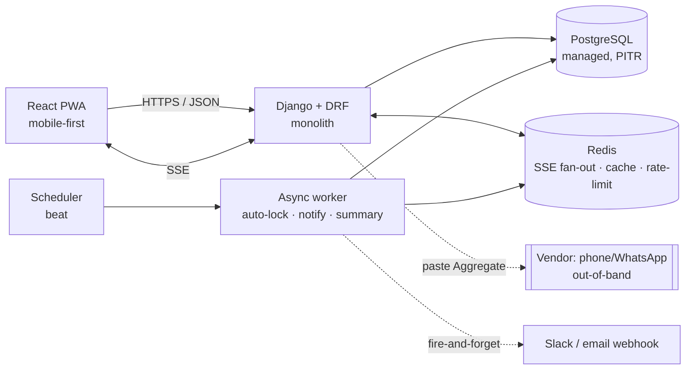

Three processes, one codebase, one deploy artifact: **web** (gunicorn/uvicorn), **worker** (Celery or Django-Q), **beat** (scheduler). Redis is optional at launch with a single web worker (§10) — start with one worker and the in-process path, add Redis pub/sub the moment we run a second web process for SSE fan-out.

### 16.2 Backend stack

| Concern | Choice | Why |
|---|---|---|
| Language/framework | **Python 3.12 + Django 5 + DRF** | §10 mandate. Django Admin gives FR-60/61/62 menu+vendor CRUD for free (§7 "Custom admin UI at MVP" is explicitly not built). |
| API | **DRF, REST, JSON, `/api/v1`** | Matches §9 verbatim. Cookie-session auth, not JWT. |
| Async/jobs | **Celery + Redis broker** (Django-Q acceptable if we want to drop a dependency) | Auto-lock, notifications, summaries. ETA tasks for `cutoff_at` auto-lock (FR-12). |
| Scheduler | **Celery beat** | T-minus reminders (FR-51); V2 recurring auto-open (FR-15) lands here later. |
| Real-time | **SSE via `django-eventstream` or a thin DRF streaming view**, Redis pub/sub fan-out | §9 `GET /sessions/{id}/stream`, §10 SSE <1s. SSE not WebSockets — traffic is server→client deltas; we never need full duplex. |
| Money | **`decimal.Decimal` end-to-end, `numeric(10,2)` columns** | §8/§10 — never float. All arithmetic server-side; fee split computed and stored per-order. |
| Auth | **OIDC Auth-Code + PKCE** via `mozilla-django-oidc` (or `authlib`) → HttpOnly/Secure/SameSite=Lax session cookie | §10 security model. JIT-provision User on first login (`sso_subject` = OIDC `sub`). |
| Validation/serialization | DRF serializers; **server is the only source of truth for `line_total`, `subtotal`, `fee_share`, `total`, `amount_due`** | Client-sent money is never trusted; snapshots per §8. |

**Two backend invariants worth calling out explicitly, because they kill whole classes of bugs at the schema/transaction level (§6 stance 6):**

1. **The order write path is one idempotent upsert.** `PUT /sessions/{id}/orders/me` replaces the whole basket inside a single transaction, recomputes all money fields server-side, and is safe under double-tap/retry (§10 idempotency). There is deliberately **no `/order-items` CRUD** (§9) — fewer endpoints, no partial-write races.
2. **Lock is an atomic, idempotent state transition.** `POST /sessions/{id}/lock` does `SELECT … FOR UPDATE` on the session, flips `open → locked`, and snapshots `Payment.amount_due = order.total` for every submitted order in the same transaction. An edit landing at T-0 is deterministically in or out (§10, §11 "concurrent edits at lock boundary"). The auto-lock worker calls the *same* code path.

### 16.3 Frontend stack — mobile-first PWA

| Concern | Choice | Why |
|---|---|---|
| Framework | **React + Vite + TypeScript** | §10 stack. Vite for fast builds; TS because money UIs should not ship `undefined`. |
| App type | **PWA, installable, no native** | FR-80; §7 "Native apps not built." Web App Manifest + a *minimal* service worker (asset cache + install only — **not** offline-first; §7 "Offline-first sync engine not built"). |
| Data layer | **TanStack Query** for fetches/mutations + **native `EventSource`** for the SSE delta channel | Optimistic UI on the order `PUT` with rollback-on-error (§10 "optimistic UI + retry; never a false success"). SSE patches the session/aggregate cache live (FR-81). |
| State | Query cache + minimal local component state; **no Redux** | Per-person isolation (§11) means there's almost no shared client state to manage. |
| Styling/UI | Tailwind + a small headless component set (Radix or Headless UI) | Fast to ship; gives us **WCAG 2.1 AA** primitives — labeled controls, focus management, screen-reader names on the quantity steppers (§10 a11y). |
| Money formatting | `Intl.NumberFormat`, single office currency | §7 "Multi-currency not at MVP." Display only — the number of record always comes from the server. |

**Frontend non-negotiables tied to the bible:**
- **≤2 taps to add an item, Submit < 15s** (FR-04 a11y target; R4; §12 acceptance test). The ordering screen loads vendor menu in one call (`GET /vendors/{id}/menu`, §9) and renders Mariam's path — open → tap → done — with zero modals in the way.
- **No color-only state.** Paid/unpaid and session status render as **icon + text** (§10 a11y), e.g. `Locked`, `Sent`.
- **Optimistic submit with explicit failure.** Network drop shows "Not submitted — retry," never a false success (§11).
- Session status (`Open / Closing soon / Locked / Placed`, FR-14) and live grand total (FR-32) are SSE-driven, not polled.

### 16.4 Database design

**Engine: PostgreSQL.** Non-negotiable for this product. We need: `numeric(10,2)` exact money (§8), partial unique indexes (the one-order-per-user constraint), `jsonb` for `options_schema`/`selected_options`/audit diffs, `citext` for email, `timestamptz` for `cutoff_at`, and `SELECT … FOR UPDATE` for the atomic lock. SQLite/MySQL each miss at least one of these cleanly. Managed Postgres with PITR (§10).

Tables map 1:1 to §8 entities — `Office, User, Vendor, MenuCategory, MenuItem, OrderSession, Order, OrderItem, Payment, AuditEvent`. No new tables, no notification table at MVP (§8). The three structural constraints from §6 stance 6 are the backbone:

```sql
-- FR-11: one active Session per (office, vendor, service-date) — kills duplicate sessions
ALTER TABLE order_session
  ADD CONSTRAINT uq_session_office_vendor_date
  UNIQUE (office_id, vendor_id, service_date);

-- One Order per user per Session — duplicate submissions structurally impossible (§11)
CREATE UNIQUE INDEX uq_order_session_user
  ON "order" (session_id, user_id)
  WHERE status <> 'cancelled';
```

**Key indexes (driven by the §9 hot paths, not guesswork):**

| Index | Table | Columns | Serves |
|---|---|---|---|
| `uq_session_office_vendor_date` | `order_session` | `(office_id, vendor_id, service_date)` UNIQUE | `POST /sessions` 409-on-dup; `GET /sessions/today` |
| `uq_order_session_user` | `order` | `(session_id, user_id) WHERE status<>'cancelled'` partial UNIQUE | order upsert dedup |
| `ix_order_session` | `order` | `(session_id)` | Aggregate + Tally roll-up, settlement board |
| `ix_orderitem_order` | `order_item` | `(order_id)` | order render + Aggregate |
| `ix_payment_session_status` | `payment` | `(session_id, status)` | `GET /payments?session_id=&status=` board |
| `ix_payment_payer` | `payment` | `(payer_id, status)` | `GET /me/balance` ledger |
| `ix_session_office_date_status` | `order_session` | `(office_id, service_date, status)` | `GET /sessions?office_id=&date=&status=` |
| `ix_audit_entity` | `audit_event` | `(entity_type, entity_id, id)` | `GET /audit` |
| `ux_user_sso` / `ux_user_email` | `user` | `(sso_subject)`, `(email)` UNIQUE | OIDC login / JIT provision |

**Money & snapshot rules enforced in-DB and in-app:**
- `OrderItem.unit_price_snapshot` / `name_snapshot` frozen at order time; `Payment.amount_due` frozen at lock (§8). Menu/price edits never mutate placed money.
- `AuditEvent` is **INSERT-only at the DB-grant level** — `REVOKE UPDATE, DELETE` on the table from the app role (§8). This is the money-trust backbone; application code cannot rewrite history even with a bug.
- `Office.timezone` (IANA) drives `service_date` and `cutoff_at` math — all "today"/Cutoff computation is office-local (§8, §11 timezone edge case).

The Aggregate (FR-30) and Tally (FR-31) are **computed read-models**, cached in Redis and invalidated on any order change (§10 Aggregate p95 <400ms). They are derivations of `Order`/`OrderItem`, never a stored source of truth.

### 16.5 Deployment

| Concern | Choice | Why |
|---|---|---|
| Packaging | **One Docker image**, three commands (web / worker / beat) | Single artifact, single version. §10 containerized. |
| Hosting | **Single-region managed container platform** (Fly.io / Render / ECS Fargate / a small k8s namespace — pick what the company already runs) + **managed Postgres with PITR** + managed Redis | §10 single region, no autoscale theater. Managed DB so nobody babysits backups. |
| Web server | gunicorn (uvicorn worker) behind the platform's TLS-terminating LB; **2 web workers** target 100 req/s | §10 capacity target — no overprovisioning. |
| CI/CD | **GitHub Actions** → lint (`ruff`) + typecheck (`mypy`/`tsc`) + `pytest` + `vitest` → build image → migrate → deploy. Trunk-based, deploy on merge to `main`. | Fast feedback; migrations gated in CI. |
| Migrations | Django migrations run as a **release step before** the new web image takes traffic; all money/constraint changes are additive + backward-compatible | Zero-downtime; the §8 constraints ship as real migrations, not docs. |
| Environments | **`dev` → `staging` → `prod`**, identical images, config via env vars only (12-factor); secrets in the platform secret store | No config drift; prod parity. |
| SSO | Company **OIDC IdP** (Google Workspace / Okta / Azure AD) via Auth-Code + PKCE; redirect URIs registered per env; JIT-provision on first login | §10 SSO; no separate password store to own. |
| Backups/DR | Managed Postgres **PITR + daily automated snapshot**; restore drill once before go-live | §10 PITR. AuditEvent + PITR = reconstructable money history. |
| Observability | Structured JSON logs with `request_id` (the same id stamped on `AuditEvent`), error tracking (Sentry), uptime check on `GET /sessions/today` | Tie the **99.9% ordering-window SLO (07:00–11:00)** to a synthetic check that pages during the window and is best-effort otherwise (§10). |
| Rate limiting | Redis-backed throttle on `mark-paid` / `confirm` and the order `PUT` | §10 security; absorbs the 9am spike (R9) alongside idempotent submit. |

### 16.6 Build vs. buy / don't-build

| Decision | Call | Rationale |
|---|---|---|
| Identity | **Buy (company OIDC IdP)** | Never build auth. JIT-provision a shadow `User` (§8). |
| Admin / menu CRUD | **Buy (Django Admin)** for MVP | FR-60/61/62; §7 explicitly defers a custom admin UI. Salma "The Operator" manages vendor/menu/price here. |
| Notifications | **Buy (Slack/email webhook, fire-and-forget)** | §8 no notification table at MVP; FR-50/51/52. No in-app notification center (§7). |
| Hosting / Postgres / Redis | **Buy (managed)** | PITR, failover, and patching are not our problem to hand-roll. |
| **Payments** | **DO NOT BUILD — FR-47 is `Won't`, any tier** | The defining over-engineering trap (§4.1, §7, R1). We track settlement (`Mark Paid` → `Confirm`); **we never move money.** No PSP, no wallet, no card-on-file. |
| Vendor integration | **Don't build (FR-65 `Won't`)** | Vendors are phone/WhatsApp-only (§4.7). We emit a pasteable Aggregate, not an API. |
| Allergen engine | **Don't build** | Free-text note (FR-22) only; structured allergen taxonomy is liability theater (§4.8, R5). |
| Real-time transport | **Build thin (SSE), don't buy** | One streaming endpoint + Redis pub/sub. No Pusher/Ably for an internal tool. |

### 16.7 Rough MVP effort estimate

Scope = exactly the §12 1-Week MVP Cut. Team assumed: **2 engineers (1 backend-leaning, 1 frontend-leaning) + part-time Salma for menu/vendor data.** The "1-week" framing is the aggressive happy path with a focused pair; the realistic band is **~2 weeks** including a11y and the lock-boundary hardening.

| Workstream | Scope | Est. (eng-days) |
|---|---|---|
| Project skeleton + CI/CD + OIDC login | Docker, GH Actions, OIDC, `GET /me`, JIT provision (FR-01/02) | 1.5 |
| Data model + migrations + the 3 constraints | All §8 entities, partial unique indexes, audit INSERT-only grant | 1.5 |
| Sessions: open / status / hard Cutoff auto-lock / close-now | FR-10/11/12/13/14; atomic lock + worker ETA task | 2.0 |
| Menu via Django Admin + sold-out toggle | FR-60/61 (config + data entry, mostly Salma) | 0.5 |
| Order upsert + items + note + live subtotal | FR-20/21/22/23; the idempotent `PUT` path | 2.0 |
| Aggregate + Tally + delivery fee + equal split + grand total | FR-30/31/32/33; cached read-models | 1.5 |
| Settlement: Mark Paid + self-serve + ledger | FR-40/41/42; two-step settlement record | 1.5 |
| Notifications (open / T-minus / closed) webhook | FR-50/51/52; Celery beat + worker | 1.0 |
| PWA shell + SSE sync + optimistic submit + a11y AA | FR-80/81/82/83; the whole mobile UX | 3.0 |
| Post-delivery "not received" adjustment | FR-84 — the only money-edit after Place | 0.5 |
| Past sessions read-only list | FR-70 | 0.5 |
| Hardening: lock-boundary concurrency, restore drill, acceptance test | §12 Day-1 acceptance: Submit <15s, correct Aggregate+Tally, coordinator touches only "Place" | 1.5 |
| **Total** | | **~17 eng-days (~2 calendar weeks for a pair)** |

**Definition of done = the §12 Day-1 acceptance test passes:** a submitter edits an Order in **under 15 seconds**, and at Cutoff the Sender gets a **correct vendor Aggregate + correct per-person Tally with zero manual math**, having touched nothing but **Place**. If the coordinator does mental arithmetic or chases a straggler by hand, we have not shipped MVP (§4.2).

---

## 17. Critical Product Review

The bible is unusually disciplined — the "no payments, no native app, delete-the-coordinator" trinity is correct and I'd defend it. But discipline on the *right* axis can hide over-build on others. Below I attack the proposal on its own terms, using its own IDs.

### 17.1 Riskiest assumptions (and how to validate each for ~$0)

| # | Assumption baked into the bible | Why it might be wrong | Cheapest validation |
|---|---|---|---|
| **A1** | **"Submit must beat WhatsApp at <15s" is achievable on a fresh PWA (R4, §12 acceptance test).** | The 15s clock starts *before* the app opens: notification → tap → PWA cold-load → SSO cookie check → render menu → tap item → submit. On flaky office wifi (which §10 itself admits exists) the cold path alone can eat 10s. WhatsApp is already open and warm. We may be comparing a warm channel to a cold one and losing. | Stopwatch test on a clickable Figma/HTML prototype with 5 real employees, on the actual office wifi, measured from *notification arrival* — not from an already-open app. If median > 15s, FR-26 "repeat usual" stops being V2 and becomes MVP-critical. |
| **A2** | **The Coordinator role can be driven to zero (§4.2, R2).** | "Place" is inherently out-of-band (FR-07 stance: vendor is phone/WhatsApp-only). *Someone* still copies the Aggregate into WhatsApp, fronts cash, fields "the order's wrong," and runs the not-received adjustment (FR-84). We've automated aggregation and arithmetic — real wins — but a human is still load-bearing at Place and at delivery. The metric "coordinator touch-time → zero" is structurally unreachable while vendors have no API (FR-65 = Won't). | Shadow 3 real mornings *today*, manually. Time-log every coordinator action and bucket it: aggregation/math (we kill this) vs. place/chase/dispute (we don't). If the killable bucket is <50% of touch-time, the headline thesis is oversold and we should re-message to "halve the burden," not "delete the role." |
| **A3** | **People will adopt a separate settlement ritual: Mark Paid → Confirm two-step (FR-40/FR-42 + Confirm).** | Karim "the Settle-Up Skeptic" settles *monthly in a batch* and "cares about totals, not daily detail." A daily/weekly two-step handshake per session is friction he has no incentive to complete. If Confirm lags, the Ledger (FR-41) silently drifts from reality and becomes the *new* untrusted spreadsheet — re-creating the exact pain we're killing. | Run the ledger as a **read-only Google Sheet for one week** with a real group. Watch whether anyone bothers to mark/confirm without an app nudge. If they don't, the problem is *social*, not *tooling*, and FR-40/42's two-step is over-built — a single "balance is visible to all" may be the whole fix. |
| **A4** | **Daily concurrency justifies SSE + Redis fan-out (FR-81, NFR §10).** | 50–80 concurrent users for 15 minutes is not a real-time problem. The only data a member needs live is *their own order* (per-user isolated — the bible says so) and a status badge. The "live grand total" (FR-32) and live Aggregate are **coordinator-only** surfaces — one viewer. We are paying SSE + Redis pub/sub complexity to live-update a screen one person looks at. | Build MVP with **5–10s polling** on the session-status and coordinator-aggregate endpoints. If p95 still hits §10 targets (it will), SSE/Redis is deferred infrastructure, not MVP. |

### 17.2 Over-engineered for the stated scope

Even inside an already-lean MVP cut, these are heavier than "tens-to-low-hundreds of trusting colleagues" warrant:

- **FR-81 / FR-83 (SSE near-real-time sync + concurrency-safe deadline edits).** Tagged `Must` for MVP. Per A4, polling covers it. `unique(session,user)` (Order constraint) already makes cross-user concurrency a non-issue — the bible says so in §11 ("per-person isolation makes cross-user concurrency a non-issue"), which directly undercuts the need for an SSE channel at MVP. **Demote to V2.**
- **FR-82 (append-only AuditEvent) as a `Must` for week 1.** A full `before/after` jsonb diff trail with INSERT-only DB grants is fintech-grade rigor for a $4 sandwich ledger among people who trust each other (§context, §4.4). The *money-trust* it buys is real, but at MVP a simple `updated_at` + the two-step claim already gives non-repudiation. **Keep the AuditEvent on `submit/lock/confirm`; drop the generic jsonb-diff engine until V2.**
- **The two-step settlement itself (FR-40 → Confirm).** Per A3, "Confirm" may be ceremony nobody performs. MVP could ship **Mark Paid (self-claim, visible to all)** only, and add Confirm *if* disputes actually appear. The bible's own §11 says visibility "kills ~90% of disputes" — so Confirm is engineering for the 10% before we've seen the 90%.
- **FR-35 rounding/remainder policy as a designed feature.** Correct to *have* a rule; over-built to surface "show the math" UI. Pick "leftover cent → session creator," hard-code it, done.

The §7 not-build list is genuinely excellent and I'd change nothing in it — the FR-47 payments stance, allergen-taxonomy refusal (FR-05/FR-08), and vendor-portal refusal (FR-65) are the three traps most teams fall into, and they're correctly fenced off.

### 17.3 The simplest version that still delivers value

Strip MVP to the **arithmetic + dedup** core, because that's where 90% of the pain lives (lost orders, wrong quantities, manual cost math — the literal pain points):

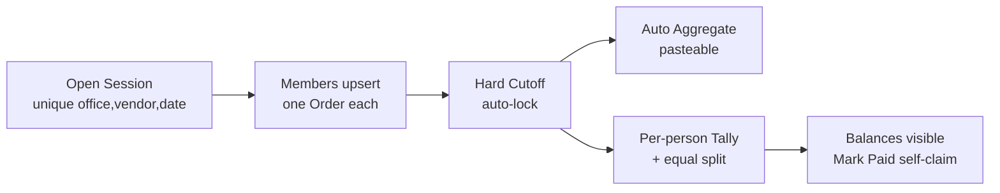

Keep only: **FR-01, FR-02, FR-10, FR-11, FR-12, FR-14, FR-20, FR-21, FR-22, FR-23, FR-30, FR-31, FR-32, FR-33, FR-40, FR-41, FR-50, FR-51, FR-52, FR-60, FR-61, FR-80, FR-84.** Drop from week 1: **FR-13 (manual close), FR-42 (self-toggle is folded into FR-40), FR-70 (history), FR-81/FR-82/FR-83 (real-time + full audit), FR-35.** That's the source of truth for *what was ordered and owed*, computed to the cent, with zero arithmetic — the exact value proposition, minus the infrastructure tax.

### 17.4 What I'd actually launch in 1 week — and whether an app is justified yet

**Honest answer: I would not build the full app in week 1. I'd build the thinnest thing that proves the riskiest assumptions (A1, A2, A3) before committing engineering.**

Two buildable cuts, in order of preference:

**Cut A — "Structured form + auto-Tally" (1–2 days, no real backend):**
- A daily **structured form** (Google Form / Airtable / a single static page) pinned in the existing WhatsApp/Slack channel: name + items from a fixed menu list with prices. This *is* the `unique(session,user)` dedup boundary and the frozen menu (FR-11, FR-60) — implemented in a spreadsheet.
- A sheet formula / 30-line script produces the **Aggregate** (item × qty, pasteable) and **per-person Tally** with equal-split fee (FR-30, FR-31, FR-33). Zero manual math.
- The **Ledger** is a visible-to-all tab; "Mark Paid" is a checkbox (FR-40/41).
- This kills lost-orders, duplicates, wrong-quantities, and manual cost math — **the four headline pain points — this week, for ~$0.** It does *not* solve cold-start speed, hard auto-lock (FR-12), or notifications (FR-50/51). That's the point: it tells us whether the remaining pain is worth a real app.

**Cut B — Thin real PWA (5–7 days, if Cut A proves demand):** exactly the §17.3 list, polling instead of SSE, Django Admin for menu (already the bible's plan), one async worker only for the Cutoff auto-lock (FR-12) — because *auto-lock* and *the speed of one-tap submit* are the only two things a form genuinely can't do. Everything else, the form already proved or disproved.

**Is a full app justified yet?** Not on day one. The app earns its existence only on three things a form can't deliver: **(1) hard server-enforced Cutoff auto-lock (FR-12)**, **(2) sub-15s warm one-tap submit (R4)**, and **(3) automated, impersonal nudges (FR-50/51) so no human is the deadline.** If Cut A shows the team is happy with a form + manual lock, *the app is over-engineering the solution* and we ship the form. Build the app to win on those three axes specifically — not because "an internal tool should be an app."

### 17.5 PM verdict

**Conditional ship — but sequence the validation, not the app.** Ship **Cut A this week** behind one real breakfast group; it's near-free and directly retires assumptions A1–A3. If, after a week, the team is still fighting cold-start speed and the human-deadline problem, green-light **Cut B** — the §17.3 thin PWA, with **SSE/Redis (FR-81), full AuditEvent (FR-82), and two-step Confirm explicitly deferred to V2** until usage proves they're needed. The strategic stance is right and the not-build list is exemplary; the only real over-build is treating MVP infrastructure (real-time sync, audit-diff engine, two-step settlement) as `Must` before a single morning has been observed in software. **The single biggest risk to watch is A2/R2 dressed up as a win:** if "delete the Coordinator" is structurally impossible while Place stays out-of-band (FR-65 = Won't forever), we will ship a correct ledger, declare victory on a metric we can't move, and quietly leave Tarek doing the same 15-minute chase he does today — just with prettier math. Measure coordinator *touch-time* from day one, or we won't notice we lost.
