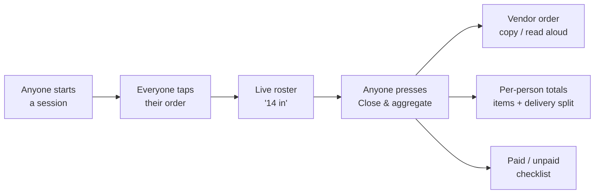

<div align="center">

# MorningCart 🌅

**Internal group-breakfast ordering for one office — built to delete the "breakfast coordinator" role, not tool it.**

`Django + Django Ninja` · `React + Vite + Tailwind` · `PostgreSQL` · `TypeScript` · `Python`

</div>

---

## Table of contents

- [What it is](#what-it-is)
- [Why it exists](#why-it-exists)
- [Features](#features)
- [How a morning works](#how-a-morning-works)
- [Architecture](#architecture)
- [The money invariant (the crown jewel)](#the-money-invariant-the-crown-jewel)
- [Tech stack](#tech-stack)
- [Project structure](#project-structure)
- [Data model](#data-model)
- [API reference](#api-reference)
- [Identity & security](#identity--security)
- [Getting started (Docker)](#getting-started-docker)
- [Local development](#local-development)
- [Testing & verification](#testing--verification)
- [Design decisions & non-goals](#design-decisions--non-goals)
- [Roadmap](#roadmap)
- [License](#license)

---

## What it is

Every weekday a team orders breakfast together. Today that means a scramble across WhatsApp,
Slack, phone, and hallway shouts; one rotating volunteer collects everyone's order, does the
per-person arithmetic by hand, and chases the money.

**MorningCart** replaces that with a 90-second ritual. Each weekday one shared **session**
opens for a restaurant against a fixed, price-stable menu. Everyone taps their order (one
order per person — editing replaces it, duplicates are structurally impossible). When most
people are in, **anyone** presses **Close & aggregate** and the app instantly produces:

1. **One pasteable vendor order** — every item rolled up by quantity with notes preserved
   (`Foul ×12 — 2× no oil`), ready to send on WhatsApp or read aloud over the phone.
2. **Per-person totals** — each person's items **plus a fair share of the fixed delivery
   fee**, shown transparently and computed to the exact piaster.
3. **A paid / unpaid checklist** — the only "payment" surface there is.

## Why it exists

The pain in group breakfast isn't the food — it's **coordination and arithmetic**. So
MorningCart optimizes for the passive majority (be done in seconds), makes the coordinator
role *assumable by anyone instantly* (it rotates; the tool is the expertise), and tracks
money without ever moving it. It is internal tooling for colleagues who trust each other:
warm, fast, and quietly correct — not a flashy food-delivery app, not a sterile CRUD tool.

## Features

- 📋 **Tap-to-order** from a fixed, structured menu (qty, per-item notes, order-on-behalf).
- 👥 **Live roster** — see who's in, everyone's orders visible (small trusting group).
- 🧮 **Automatic aggregation** — the rolled-up vendor order in one tap.
- 💸 **Fair delivery split** — fixed per restaurant, divided across submitters, exact to the piaster.
- ✅ **Paid/unpaid tracking** — a checklist, never a payment processor.
- 🔁 **One order per person** — DB-enforced upsert; no duplicates.
- 🗓️ **One open session per restaurant per day** — partial unique index + handler guard.
- 🛠️ **Light admin** — restaurants, menus, prices, delivery fees.
- 📱 **Mobile-first**, accessible (WCAG AA), warm "morning counter" design.

## How a morning works



## Architecture

A small npm-workspace monorepo. The web reverse-proxies `/api` (Vite in dev, nginx in prod)
so the auth cookie is always same-origin.

```
Browser ──▶ web (React SPA, nginx)
                │  /api/*  (reverse proxy)
                ▼
            api (Django + Ninja, gunicorn) ──▶ PostgreSQL
```

| Path | Role | Stack |
|---|---|---|
| `api/` | JSON API + persistence + the money authority | **Django 5.2 + django-ninja**, psycopg, gunicorn |
| `web/` | Mobile-first single-page app | React 18 + Vite + Tailwind + TanStack Query + Framer Motion |
| `shared/` | Domain types + money logic **for the web** | TypeScript (tsup build, fast-check tests) |

## The money invariant (the crown jewel)

Money is carried as **integer piasters** everywhere (1 EGP = 100) and formatted only at the
UI edge, so nothing ever drifts. The delivery fee is split across submitters **exactly**:

```
delivery_split(fee, n):
    base = fee // n
    remainder = fee - base*n          # 0 .. n-1
    return [base + (1 if i < remainder else 0) for i in range(n)]   # sums to fee EXACTLY
```

Each person owes `their items (from snapshotted unit prices) + their delivery share`. The
guarantee the whole product rests on:

> **Σ(per-person totals) == itemsGrandTotal + deliveryFee**, to the piaster.

An order-on-behalf line (`forName`) adds items to the submitter's bill but **never adds a
delivery head**.

This logic is the **server's authority**, in pure Python at `api/breakfast/domain.py` (no
Django deps). The web has a parallel TypeScript implementation in `shared/`. **Both are
property-tested to the same invariant** — `hypothesis` on the server, `fast-check` on the web
(including a multi-thousand-run fuzz of the split). The dual implementation is a deliberate
trade-off of single-sourcing for letting a Python backend serve a TypeScript frontend.

## Tech stack

**Backend** — Django 5.2, [Django Ninja](https://django-ninja.dev/) (Pydantic-validated,
auto OpenAPI at `/api/docs`), PostgreSQL, gunicorn, signed-cookie identity, `hypothesis`
property tests.
**Frontend** — React 18, Vite, TypeScript, Tailwind CSS, TanStack Query (polling + optimistic
updates), Framer Motion.
**Infra** — Docker Compose (Postgres + api + nginx-served web), reverse-proxied same-origin.

## Project structure

```
.
├── api/                      # Django backend
│   ├── morningcart/          #   project (settings, urls, wsgi)
│   └── breakfast/            #   app
│       ├── models.py         #     Restaurant, MenuItem, Session, Order, OrderLine
│       ├── domain.py         #     pure money/aggregation logic (property-tested)
│       ├── api.py            #     all Ninja routes + schemas
│       ├── auth.py           #     signed-cookie identity seam
│       ├── data.py           #     seed data (menus, fixtures)
│       ├── tests/            #     hypothesis property tests
│       └── management/commands/seed.py
├── web/                      # React SPA
│   └── src/{api,components,screens,lib}
├── shared/                   # TS domain + money logic (web)  — fast-check tested
├── docker-compose.yml
└── package.json              # npm workspaces: shared, web
```

## Data model

Money fields are integer piasters.

| Model | Key fields | Notes |
|---|---|---|
| **Restaurant** | `name, arabic, delivery_fee, active` | has many MenuItem / Session |
| **MenuItem** | `restaurant, name, arabic, price, kind, available, sort_order` | `kind` ∈ plate/drink/extra (display only) |
| **Session** | `restaurant, started_by, status, service_date, delivery_fee, closed_at` | partial unique: one **open** per restaurant per day; `delivery_fee` **snapshotted at start** so later restaurant edits never rewrite a settlement |
| **Order** | `session, person, paid` | **unique (session, person)** → upsert |
| **OrderLine** | `order, menu_item, qty, note, for_name, unit_price` | `unit_price` snapshotted at add time |

Close results are **derived** (recomputed from orders), never stored as truth — only
`status`, `closed_at`, and the per-order `paid` flags persist.

## API reference

All under `/api`. Mutations and order/session reads require the identity cookie. JSON bodies;
errors return `{ "error": "..." }`. Interactive docs at `/api/docs`.

| Method | Path | Purpose |
|---|---|---|
| `GET` | `/health` | liveness |
| `GET` | `/auth/me` · `/colleagues` | current user · the name list |
| `POST` | `/auth/login` · `/auth/logout` | sign in (whitelisted name) · sign out |
| `GET` | `/restaurants` | restaurants + menus |
| `POST`/`PATCH` | `/restaurants[/{id}]` | create / edit restaurant (setup) |
| `POST`/`PATCH`/`DELETE` | `/restaurants/{id}/items[/{itemId}]` | menu items (setup) |
| `GET` | `/sessions/open?restaurantId=` | today's open session (404 if none) |
| `GET` | `/sessions/current` | today's session, **open or closed** — keeps the settlement reachable for everyone (poll target) |
| `POST` | `/sessions` | start breakfast (one session per morning; joins the existing one if already started) |
| `GET` | `/sessions/{id}` | roster + all orders |
| `PUT`/`DELETE` | `/sessions/{id}/order` | upsert / cancel my order (locked rows — concurrent edits can't duplicate or race a close) |
| `DELETE` | `/sessions/{id}` | cancel an **empty** open session (wrong restaurant, nobody's eating) |
| `POST` | `/sessions/{id}/close` | close & aggregate (any user, idempotent; refuses an empty table) |
| `GET` | `/sessions/{id}/result` | aggregate + per-person totals (uses the session's **fee snapshot**) |
| `PATCH` | `/orders/{id}` | toggle `paid` |

## Identity & security

- **Open login**: type any name, get a **signed cookie** (`django.core.signing`,
  `HttpOnly`, `SameSite=Strict`; set `COOKIE_SECURE=true` behind HTTPS). Whitespace is
  normalized and Arabic names work end-to-end. If `COLLEAGUES` in `breakfast/data.py` is
  non-empty, names are whitelisted against it instead.
- **Trust model**: this is internal tooling for colleagues who trust each other. Anyone
  can edit menus, close the session, or tick the paid checklist (whoever fronts the cash
  marks people paid) — *deliberately* not permissioned. Don't expose it to the internet.
- A thin `current_user` / `set_user` **seam** in `breakfast/auth.py` — swap for OIDC/SSO
  without touching any route.
- Order/session reads and all mutations require the cookie; `/restaurants` and `/colleagues`
  stay public for the login screen.
- `COOKIE_SECRET` is **required when `DEBUG=false`** — the API refuses to boot without it
  (no silent insecure fallback), and Docker compose additionally fails loudly if unset.
- The Django ORM is fully parameterized — no raw SQL, no injection surface. Invalid input
  (over-length names, unknown item kinds, out-of-range quantities) returns a JSON `422`,
  never an HTML 500.

## Admin — the back office

The **Django admin** lives at **`/admin`** (real auth — username/password, sessions, CSRF —
fully separate from the app's pick-your-name cookie). It covers everything the app keeps
simple on purpose:

- **Restaurants & menus** — bulk edits, inline menu editing, EGP-formatted prices,
  availability/sort toggles from the list, soft-delete **and restore**, guarded against
  deleting a restaurant mid-breakfast.
- **Sessions** — money columns (items / delivery / grand total from the fee snapshot),
  open/closed badges, date drill-down, inline orders, and guarded bulk actions:
  close (skips empty), reopen (override), delete empty.
- **Orders** — search by person/item/on-behalf name, toggle paid from the list, edit lines.
- **People** — the app has no user table (people are names on orders), so a SQL view
  aggregates them: mornings, orders, **unpaid count**, items total, last seen, with a
  one-click jump to their orders.

```bash
# local: create the superuser once, then http://localhost:4000/admin
cd api && .venv/bin/python manage.py createsuperuser

# docker: set both and the entrypoint creates/updates it on every boot
ADMIN_USERNAME=boss ADMIN_PASSWORD=... COOKIE_SECRET=... docker compose up --build
```

Static files are served by whitenoise straight from gunicorn; in the compose stack nginx
proxies `/admin/` and `/static/`, so the admin is at `http://localhost:8080/admin` too
(the login endpoint is **rate-limited in nginx** — Django ships no brute-force protection).
Behind an HTTPS tunnel set `CSRF_TRUSTED_ORIGINS=https://your-host` and `COOKIE_SECURE=true`.
The JSON API is untouched by all this — ninja views stay CSRF-exempt at the middleware
level (the `mc_user` cookie keeps its SameSite=Strict posture). Note the two logins are
independent: signing out of the app doesn't sign you out of `/admin` and vice versa.

## Getting started (Docker)

```bash
git clone https://github.com/zeyadesperado/morningcart && cd morningcart
COOKIE_SECRET=$(openssl rand -hex 32) docker compose up --build
# → web at http://localhost:8080   (api is internal, reverse-proxied at /api)
```

`db` is Postgres; `api` runs migrations and seeds demo data on first boot
(`SEED_ON_BOOT=true` — the seed is a **no-op when data exists**, so restarts never wipe
your real orders; wipe explicitly with `docker compose exec api python manage.py seed --force`);
`web` is nginx serving the built SPA and proxying `/api/`. All env vars are documented
in [`.env.example`](.env.example).

## Local development

Prerequisites: Python ≥ 3.11, Node ≥ 20, PostgreSQL ≥ 14. **Backend** (from `api/`):

```bash
createdb morningcart                                            # once
python -m venv .venv && .venv/bin/pip install -r requirements.txt
export DATABASE_URL="postgresql://user@localhost/morningcart"   # your DB
export COOKIE_SECRET="$(openssl rand -hex 32)"
.venv/bin/python manage.py migrate
.venv/bin/python manage.py seed        # demo data; no-op if data exists (--force to reset)
.venv/bin/python manage.py runserver 4000
```

**Frontend** (from repo root — proxies `/api` → `localhost:4000`):

```bash
npm install && npm run build:shared && npm run dev:web   # → http://localhost:5173
```

## Share it with the team

The right link to drop in the group chat is the **Docker stack behind HTTPS** — never the
Vite dev server:

```bash
COOKIE_SECRET=$(openssl rand -hex 32) docker compose up --build -d   # web on :8080
cloudflared tunnel --url http://localhost:8080                       # or Caddy/any HTTPS host
```

Set `COOKIE_SECURE=true` in the api environment once you're behind HTTPS. The app is
installable — *Add to Home Screen* gives everyone a proper app icon. Anyone with the link
can join (`noindex` keeps it out of search engines; the URL is the only access control,
so treat it like a group-chat invite). After deploying, point the `og:image` URL in
`web/index.html` at your real host so the WhatsApp link preview shows the icon.

## Testing & verification

```bash
# server money invariant — hypothesis property tests, no DB needed
cd api && .venv/bin/python -m unittest breakfast.tests.test_domain -v

# API endpoint tests — auth, validation, session lifecycle, fee snapshots (needs Postgres)
cd api && .venv/bin/python manage.py test breakfast.tests.test_api

# web money invariant (fast-check, incl. price-snapshot parity) + full typecheck
npm run test:shared && npm run typecheck
```

All of the above runs on every push via **GitHub Actions** ([.github/workflows/ci.yml](.github/workflows/ci.yml)):
an `api` job (property + endpoint tests against a Postgres service) and a `web` job
(typecheck, fast-check, production build).

## Design decisions & non-goals

Deliberately **not** built, to keep the tool honest and small:

- ❌ **No payments** — no checkout, cards, wallet, or processor. `paid` is a boolean toggle.
- ❌ **No timer / auto-lock / scheduler** — closing is a manual, soft, any-user action.
- ❌ **No AI / free-text aggregation** — a fixed structured menu makes rollups exact.
- ❌ **No** notifications service, real-time sockets, multi-office, or per-user order hiding.

The product was scoped from a deeper PRD down to this MVP by interviewing the actual team —
the guiding principle throughout: *solve the real problem (coordination + arithmetic), build
nothing else.*

## Roadmap

Validated-need ideas for later: saved "usuals", scheduled auto-open, push reminders,
period balances for batch settlers, SSO, and multi-office.

## License

[MIT](LICENSE).
